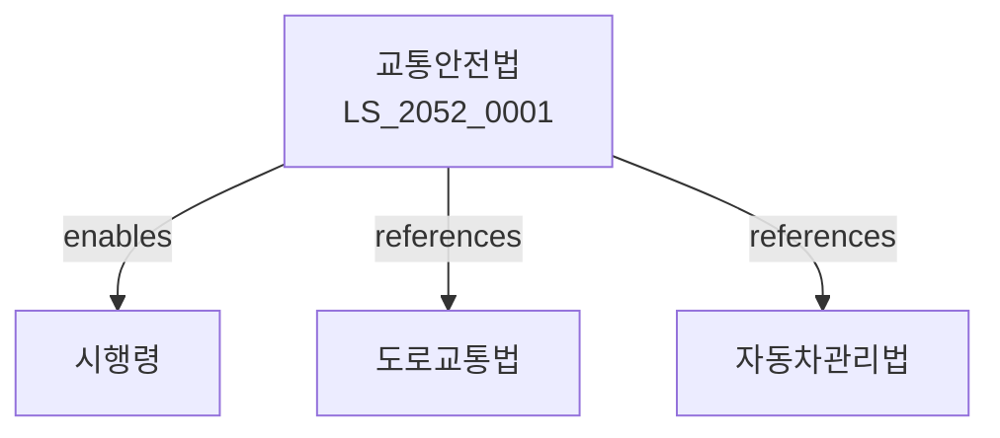

# 교통안전법

> [법률 제20149호, 2024. 1. 9., 일부개정]

---

---

## 제1장 총칙
### 제1조 (목적)
이 법은 교통사고의 예방과 교통안전시설의 설치ㆍ관리에 관한 사항을 정함으로써 교통안전을 확보함을 목적으로 한다.

### 제2조 (정의)
이 법에서 사용하는 용어의 뜻은 다음과 같다.

1. "교통안전"이란 교통사고의 예방과 교통질서의 유지를 말한다.
2. "교통안전시설"이란 교통안전을 위하여 설치하는 시설을 말한다.
3. "교통사고"란 교통수단의 운행과 관련하여 발생하는 사고를 말한다.
4. "교통안전교육"이란 교통안전의식을 높이기 위한 교육을 말한다.

---

## 제2장 교통안전계획
### 第5条(교통안전기본계획)
국가는 교통안전기본계획을 수립하여야 한다.
### 第6条(시행계획)
관계 기관은 시행계획을 수립하여야 한다.
### 第7条(통계)
국가는 교통사고 통계를 작성하여야 한다.
### 第8条(조사)
교통사고의 원인을 조사하여야 한다.

---

## 제3장 교통안전시설
### 第15条(설치의무)
국가와 지방자치단체는 교통안전시설을 설치하여야 한다.
### 第16条(설치기준)
교통안전시설의 설치기준은 국토교통부령으로 정한다.
### 第17条(신호기)
도로에는 신호기를 설치할 수 있다.
### 第18条(안전표지)
도로에는 안전표지를 설치하여야 한다.

---

## 제4장 교통안전교육
### 第25条(교육대상)
운전자는 교통안전교육을 이수하여야 한다.
### 第26条(교육내용)
교통안전교육의 내용은 국토교통부령으로 정한다.
### 第27条(교육기관)
교통안전교육은 지정기관에서 실시한다.
### 第28条(교육비용)
교통안전교육의 비용은 수강자가 부담한다.

---

## 제5장 교통안전진흥공단
### 第35条(설립)
교통안전진흥을 위하여 교통안전공단을 둔다.
### 第36条(업무)
교통안전공단은 다음 각 호의 업무를 수행한다.

1. 교통안전 조사ㆍ연구
2. 교통안전교육
3. 교통안전시설의 설치 지원
### 第37条(임원)
교통안전공단에 임원을 둔다.
### 第38条(재원)
교통안전공단의 재원은 정부출연금 등으로 한다.

---

## 제6장 교통사고 분석
### 第45条(사고분석)
교통사고는 원인별로 분석하여야 한다.
### 第46条(위험요인)
교통사고 위험요인을 분석하여야 한다.
### 第47条(개선대책)
위험요인에 대한 개선대책을 수립한다.
### 第48条(평가)
개선대책의 효과를 평가한다.

---

## 제7장 감독
### 第55条(감독)
국토교통부장관은 교통안전사업을 감독한다.
### 第56条(보고 및 검사)
국토교통부장관은 필요한 경우 보고를 명하거나 검사할 수 있다.
### 第57条(시정명령)
위법한 사항에 대하여는 시정을 명할 수 있다.
### 第58条(과태료)
다음 각 호의 어느 하나에 해당하는 자에게는 과태료를 부과한다.

1. 교통안전교육을 이수하지 아니한 자
2. 보고를 하지 아니한 자

---

## 제8장 벌칙
### 第65条(벌칙)
다음 각 호의 어느 하나에 해당하는 자는 1년 이하의 징역 또는 1천만원 이하의 벌금에 처한다.

1. 허위로 교육을 실시한 자
2. 보고를 거짓으로 한 자
### 第66条(과태료)
다음 각 호의 어느 하나에 해당하는 자에게는 500만원 이하의 과태료를 부과한다.

1. 교육을 이수하지 아니한 자
2. 검사를 거부한 자

---

## 관계 그래프

**상위 법령**
- [[헌법]] 제12조 (신체의 자유)
- [[도로교통법]]

**관련 법령**
- [[자동차관리법]]
- [[자동차손해배상법]]
- [[도로법]]
- [[재난 및 안전관리 기본법]]

**하위 법령**
- [[교통안전법 시행령]]
