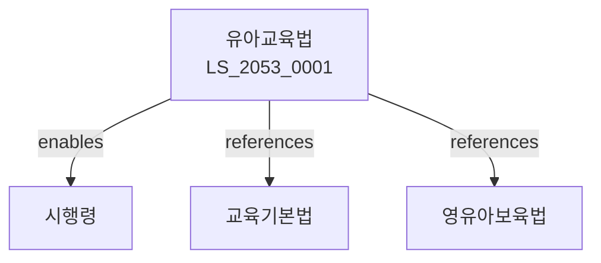

# 유아교육법

> [법률 제20148호, 2024. 1. 9., 일부개정]

---

---

## 제1장 총칙
### 제1조 (목적)
이 법은 유아교육의 이념과 목표를 정하고 유아교육기관의 설치ㆍ운영 등에 관한 사항을 규정함으로써 유아의 조화로운 발달을 도모함을 목적으로 한다.

### 제2조 (정의)
이 법에서 사용하는 용어의 뜻은 다음과 같다.

1. "유아"란 만 3세부터 만 5세까지의 어린이를 말한다.
2. "유아교육"이란 유아의 성장과 발달을 돕는 교육을 말한다.
3. "유치원"이란 유아교육을 실시하는 학교를 말한다.
4. "원장"이란 유치원을 대표하고 관리하는 자를 말한다.

---

## 제2장 유아교육의 이념과 목표
### 第5条(유아교육의 이념)
유아교육은 유아의 인격을 존중하고 창의성을 기르는 것을 이념으로 한다.
### 第6条(유아교육의 목표)
유아교육은 다음 각 호의 목표를 추구한다.

1. 유아의 신체적 발달
2. 유아의 정서적 안정
3. 유아의 사회성 발달
4. 유아의 인지적 발달
5. 유아의 언어 발달
### 第7条(교육과정)
유아교육의 교육과정은 교육부령으로 정한다.
### 第8条(수업연한)
유치원의 수업연한은 3년으로 한다.

---

## 제3장 유치원의 설치
### 第15条(설치자)
유치원은 국가ㆍ지방자치단체 또는 개인이 설치할 수 있다.
### 第16条(설치인가)
유치원의 설치는 관할 교육감의 인가를 받아야 한다.
### 第17条(설치기준)
유치원의 설치기준은 대통령령으로 정한다.
### 第18条(폐원)
유치원의 폐원은 관할 교육감에게 신고하여야 한다.

---

## 제4장 유치원의 운영
### 第25条(수업일수)
유치원의 수업일수는 매 학년 180일 이상으로 한다.
### 第26条(편제)
유치원은 만 3세반ㆍ만 4세반ㆍ만 5세반으로 편성한다.
### 第27条(학급규모)
학급규모는 교육부령으로 정한다.
### 第28条(수강료)
유치원의 수강료는 교육감의 승인을 받아야 한다.

---

## 제5장 교직원
### 第35条(교직원의 종류)
유치원에 원장ㆍ교감ㆍ교사 및 기타 직원을 둔다.
### 第36条(자격)
유치원 교원은 자격증을 소지하여야 한다.
### 第37条(임용)
원장은 설치자가 임용한다.
### 第38条(연수)
교원은 정기적으로 연수를 받아야 한다.

---

## 제6장 감독
### 第42条(감독)
교육감은 유치원을 감독한다.
### 第43条(시정명령)
위법한 사항에 대하여는 시정을 명할 수 있다.
### 第44条(행정처분)
중대한 위반사유가 있는 경우 인가를 취소할 수 있다.
### 第45条(과태료)
다음 각 호의 어느 하나에 해당하는 자에게는 과태료를 부과한다。

1. 인가 없이 유치원을 설치한 자
2. 보고를 하지 아니한 자

---

## 관계 그래프

**상위 법령**
- [[헌법]] 제31조 (교육받을 권리)
- [[교육기본법]]

**관련 법령**
- [[초중등교육법]]
- [[영유아보육법]]
- [[유아교육진흥법]]
- [[아동복지법]]

**하위 법령**
- [[유아교육법 시행령]]
