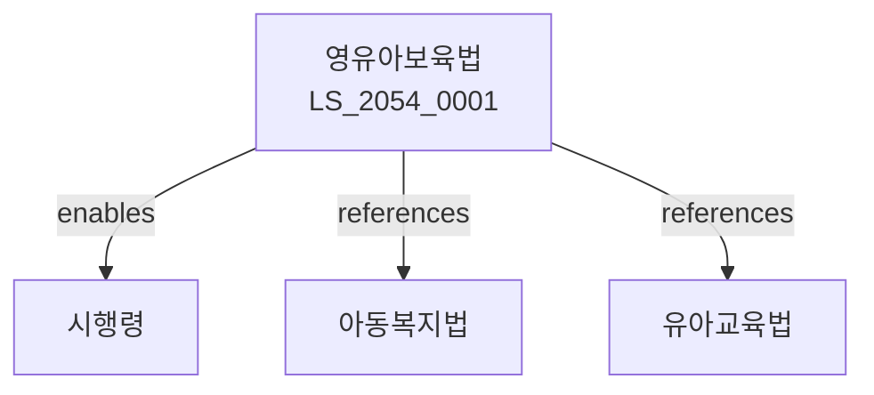

# 영유아보육법

> [법률 제20147호, 2024. 1. 9., 일부개정]

---

---

## 제1장 총칙
### 제1조 (목적)
이 법은 영유아의 건강한 성장과 발달을 도모하고 보호자의 경제적ㆍ사회적 활동을 원활히 하기 위하여 영유아보육에 관한 사항을 정함을 목적으로 한다。

### 제2조 (정의)
이 법에서 사용하는 용어의 뜻은 다음과 같다。

1. "영유아"란 만 6세 미만의 아동을 말한다。
2. "보육"이란 영유아의 보호와 교육을 말한다。
3. "어린이집"이란 영유아를 보육하는 시설을 말한다。
4. "보육교직원"이란 어린이집에서 보육을 담당하는 자를 말한다。

---

## 제2장 보육의 기본원칙
### 第5条(보육의 원칙)
보육은 영유아의 인격을 존중하고 건전하게 성장하도록 한다。
### 第6条(보육의 내용)
보육의 내용은 다음 각 호와 같다。

1. 영유아의 생활지도
2. 영유아의 건강관리
3. 영유아의 안전관리
4. 영유아의 부모 상담
### 第7条(보육시간)
보육시간은 보호자의 필요에 따라 정한다。
### 第8条(보육료)
보육료는 보건복지부령으로 정한다。

---

## 제3장 어린이집의 설치
### 第15条(종류)
어린이집은 국공립ㆍ사회복지법인ㆍ법인단체ㆍ가정 어린이집으로 구분한다。
### 第16条(설치신고)
어린이집의 설치는 관할 시장ㆍ군수에게 신고하여야 한다。
### 第17条(설치기준)
어린이집의 설치기준은 보건복지부령으로 정한다。
### 第18条(폐지)
어린이집의 폐지는 관할 시장ㆍ군수에게 신고하여야 한다。

---

## 제4장 보육교직원
### 第25条(자격)
보육교사는 자격증을 소지하여야 한다。
### 第26条(배치기준)
영유아 일정수마다 보육교사를 배치하여야 한다。
### 第27条(연수)
보육교직원은 정기적으로 연수를 받아야 한다。
### 第28条(신원증명)
보육교직원은 신원증명서를 제출하여야 한다。

---

## 제5장 보육비용
### 第35条(보육료 지원)
국가와 지방자치단체는 보육료를 지원할 수 있다。
### 第36条(우선보육)
저소득층 자녀는 우선적으로 보육한다。
### 第37条(보육급식)
어린이집은 급식을 제공하여야 한다。
### 第38条(예산)
어린이집 운영에 필요한 예산은 설치자가 부담한다。

---

## 제6장 감독
### 第45条(감독)
시장ㆍ군수는 어린이집을 감독한다。
### 第46条(평가)
어린이집에 대하여 정기적으로 평가를 실시한다。
### 第47条(시정명령)
위법한 사항에 대하여는 시정을 명할 수 있다。
### 第48条(폐쇄명령)
중대한 위반사유가 있는 경우 폐쇄를 명할 수 있다。

---

## 제7장 벌칙
### 第52条(벌칙)
다음 각 호의 어느 하나에 해당하는 자는 2년 이하의 징역 또는 2천만원 이하의 벌금에 처한다。

1. 신고 없이 어린이집을 운영한 자
2. 허위로 보조금을 받은 자
### 第53条(과태료)
다음 각 호의 어느 하나에 해당하는 자에게는 1천만원 이하의 과태료를 부과한다。

1. 보고를 하지 아니한 자
2. 검사를 거부한 자

---

## 관계 그래프

**상위 법령**
- [[헌법]] 제34조 (사회보장)
- [[아동복지법]]

**관련 법령**
- [[유아교육법]]
- [[아동복지법]]
- [[국민기초생활 보장법]]
- [[한부모가족지원법]]

**하위 법령**
- [[영유아보육법 시행령]]
