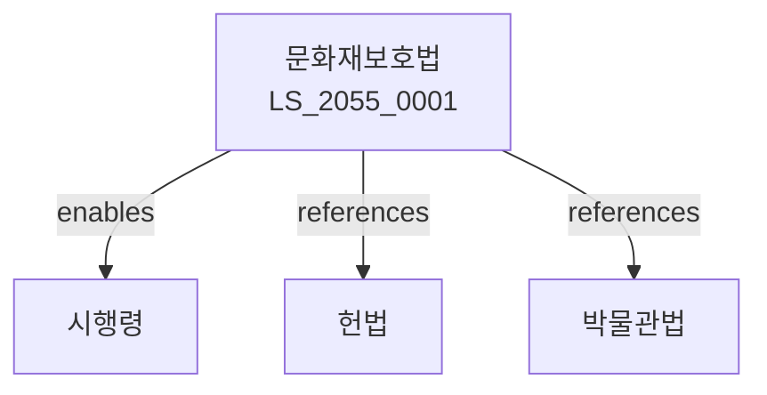

# 문화재보호법

> [법률 제20146호, 2024. 1. 9., 일부개정]

---

---

## 제1장 총칙
### 제1조 (목적)
이 법은 문화재를 보존ㆍ관리하고 그 활용을 도모함으로써 민족문화의 향상과 국민문화의 발전에 이바지함을 목적으로 한다。

### 제2조 (정의)
이 법에서 사용하는 용어의 뜻은 다음과 같다。

1. "문화재"란 역사적ㆍ예술적 가치가 있는 유형ㆍ무형의 자료를 말한다。
2. "지정문화재"란 국가 또는 지방자치단체가 지정한 문화재를 말한다。
3. "비지정문화재"란 지정되지 아니한 문화재로서 보존할 가치가 있는 것을 말한다。
4. "보호구역"이란 문화재 보호를 위하여 지정하는 구역을 말한다。

---

## 제2장 문화재의 지정
### 第5条(국가지정문화재)
문화재청장은 국가지정문화재를 지정할 수 있다。
### 第6条(지정기준)
국가지정문화재의 지정기준은 대통령령으로 정한다。
### 第7条(시도지정문화재)
시ㆍ도지사는 시도지정문화재를 지정할 수 있다。
### 第8条(지정해제)
지정사유가 소멸한 경우 지정을 해제할 수 있다。

---

## 제3장 문화재의 관리
### 第15条(관리자)
지정문화재에는 관리자를 두어야 한다。
### 第16条(관리비용)
지정문화재의 관리비용은 관리자가 부담한다。
### 第17条(수리)
지정문화재의 수리는 문화재청장의 허가를 받아야 한다。
### 第18条(현상변경)
지정문화재의 현상변경은 허가를 받아야 한다。

---

## 제4장 문화재의 보호
### 第25条(보호구역)
문화재 보호를 위하여 보호구역을 지정할 수 있다。
### 第26条(행위제한)
보호구역 내에서의 행위를 제한할 수 있다。
### 第27条(매매제한)
국가지정문화재의 매매는 신고하여야 한다。
### 第28条(반출제한)
국가지정문화재의 국외반출은 허가를 받아야 한다。

---

## 제5장 무형문화재
### 第35条(무형문화재의 지정)
무형문화재는 국가지정문화재로 지정할 수 있다。
### 第36条(보유자)
무형문화재의 보유자를 인정할 수 있다。
### 第37条(보유자의 의무)
보유자는 무형문화재를 보존하고 전승하여야 한다。
### 第38条(전수교육)
무형문화재의 전수교육을 실시할 수 있다。

---

## 제6장 매장문화재
### 第45条(매장문화재의 발굴)
매장문화재의 발굴은 문화재청장의 허가를 받아야 한다。
### 第46条(발굴보고)
발굴결과를 문화재청장에게 보고하여야 한다。
### 第47条(발굴물의 귀속)
발굴된 문화재는 국가에 귀속한다。
### 第48条(보존조치)
발굴 현장에 대하여 보존조치를 할 수 있다。

---

## 제7장 문화재위원회
### 第55条(설치)
문화재청에 문화재위원회를 둔다。
### 第56条(기능)
문화재위원회는 문화재의 지정ㆍ보존 등에 관한 사항을 심의한다。
### 第57条(조직)
문화재위원회의 조직은 대통령령으로 정한다。
### 第58条(전문위원)
문화재위원회에 전문위원을 둘 수 있다。

---

## 제8장 벌칙
### 第65条(벌칙)
다음 각 호의 어느 하나에 해당하는 자는 3년 이하의 징역 또는 3천만원 이하의 벌금에 처한다。

1. 허가 없이 발굴한 자
2. 문화재를 반출한 자
### 第66条(과태료)
다음 각 호의 어느 하나에 해당하는 자에게는 2천만원 이하의 과태료를 부과한다。

1. 보고를 하지 아니한 자
2. 검사를 거부한 자

---

## 관계 그래프

**상위 법령**
- [[헌법]] 제9조 (전통문화 계승)
- [[문화기본법]]

**관련 법령**
- [[박물관법]]
- [[도서관법]]
- [[건축법]]
- [[자연환경보전법]]

**하위 법령**
- [[문화재보호법 시행령]]
