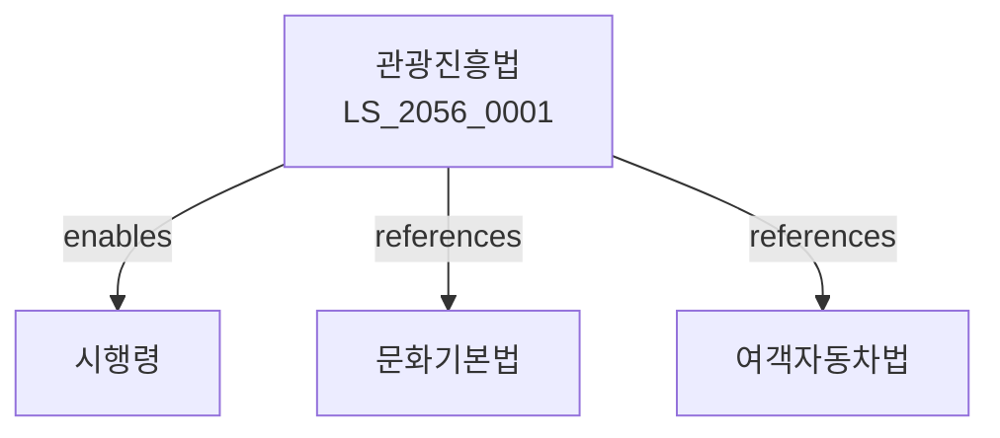

# 관광진흥법

> [법률 제20145호, 2024. 1. 9., 일부개정]

---

---

## 제1장 총칙
### 제1조 (목적)
이 법은 관광사업을 육성하고 관광객의 편의를 도모함으로써 국민경제의 발전과 국제친선에 이바지함을 목적으로 한다。

### 제2조 (정의)
이 법에서 사용하는 용어의 뜻은 다음과 같다。

1. "관광"이란 여가를 이용하여 여행하는 활동을 말한다。
2. "관광사업"이란 관광객을 위하여 시설을 제공하거나 용역을 제공하는 사업을 말한다。
3. "여행업"이란 관광객의 여행을 알선하는 업무를 말한다。
4. "관광숙박업"이란 관광객에게 숙박시설을 제공하는 업무를 말한다。

---

## 제2장 관광진흥계획
### 第5条(관광진흥기본계획)
문화체육관광부장관은 관광진흥기본계획을 수립하여야 한다。
### 第6条(시행계획)
관계 기관은 시행계획을 수립하여야 한다。
### 第7条(관광자원조사)
관광자원에 대한 조사를 실시하여야 한다。
### 第8条(관광통계)
관광통계를 작성하여야 한다。

---

## 제3장 관광사업
### 第15条(여행업 등록)
여행업은 등록하여야 한다。
### 第16条(등록요건)
여행업자는 자본금 등을 갖추어야 한다。
### 第17条(관광숙박업 등록)
관광숙박업은 등록하여야 한다。
### 第18条(등록취소)
위법한 행위에 대하여는 등록을 취소할 수 있다。

---

## 제4장 관광지 및 관광단지
### 第25条(관광지 지정)
관광지를 지정할 수 있다。
### 第26条(관광단지 지정)
관광단지를 지정할 수 있다。
### 第27条(개발사업)
관광지ㆍ관광단지의 개발사업을 시행할 수 있다。
### 第28条(지원)
국가는 관광지ㆍ관광단지 개발을 지원할 수 있다。

---

## 제5장 관광객의 보호
### 第35条(여행자보험)
여행업자는 여행자보험에 가입하여야 한다。
### 第36条(표시의무)
관광사업자는 요금 등을 표시하여야 한다。
### 第37条(계약서 교부)
여행업자는 여행계약서를 교부하여야 한다。
### 第38条(피해구제)
관광객의 피해를 구제하기 위한 기구를 둔다。

---

## 제6장 카지노업
### 第45条(카지노업 허가)
카지노업은 허가를 받아야 한다。
### 第46条(허가요건)
카지노업자는 자본금 등을 갖추어야 한다。
### 第47条(영업제한)
카지노업의 영업에 제한을 둘 수 있다。
### 第48条(과징금)
위법한 행위에 대하여 과징금을 부과할 수 있다。

---

## 제7장 한국관광공사
### 第55条(설립)
관광진흥을 위하여 한국관광공사를 둔다。
### 第56条(업무)
한국관광공사는 다음 각 호의 업무를 수행한다。

1. 관광진흥 사업
2. 관광홍보
3. 관광인력 양성
### 第57条(임원)
한국관광공사에 임원을 둔다。
### 第58条(재원)
한국관광공사의 재원은 정부출연금 등으로 한다。

---

## 제8장 감독
### 第65条(감독)
문화체육관광부장관은 관광사업을 감독한다。
### 第66条(보고 및 검사)
필요한 경우 보고를 명하거나 검사할 수 있다。
### 第67条(시정명령)
위법한 사항에 대하여는 시정을 명할 수 있다。
### 第68条(영업정지)
중대한 위반사유가 있는 경우 영업정지를 명할 수 있다。

---

## 제9장 벌칙
### 第75条(벌칙)
다음 각 호의 어느 하나에 해당하는 자는 3년 이하의 징역 또는 3천만원 이하의 벌금에 처한다。

1. 등록 없이 여행업을 영위한 자
2. 허위로 광고한 자
### 第76条(과태료)
다음 각 호의 어느 하나에 해당하는 자에게는 2천만원 이하의 과태료를 부과한다。

1. 보고를 하지 아니한 자
2. 검사를 거부한 자

---

## 관계 그래프

**상위 법령**
- [[헌법]] 제119조 (경제자유)
- [[문화기본법]]

**관련 법령**
- [[여객자동차운수사업법]]
- [[항공사업법]]
- [[소비자기본법]]
- [[문화재보호법]]

**하위 법령**
- [[관광진흥법 시행령]]
