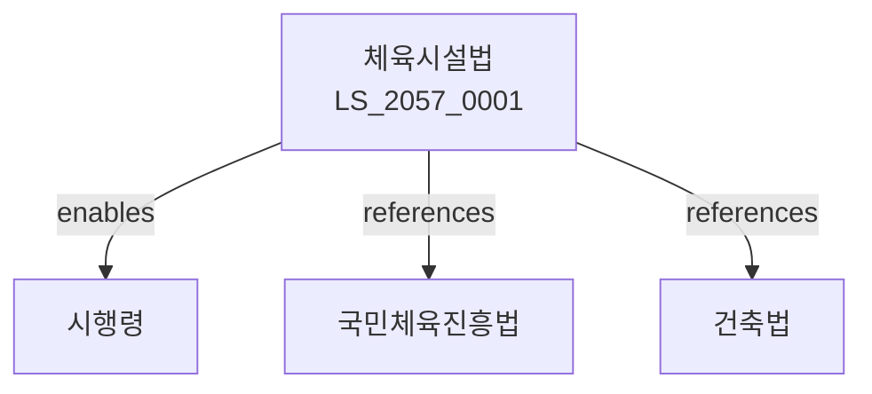

# 체육시설의 설치 및 이용에 관한 법률

> [법률 제20144호, 2024. 1. 9., 일부개정]

---

---

## 제1장 총칙
### 제1조 (목적)
이 법은 체육시설의 설치 및 이용에 관한 사항을 정함으로써 국민체육의 진흥과 국민건강의 증진에 이바지함을 목적으로 한다。

### 제2조 (정의)
이 법에서 사용하는 용어의 뜻은 다음과 같다。

1. "체육시설"이란 체육활동을 위한 시설을 말한다。
2. "체육시설업"이란 체육시설을 설치하여 이용하게 하는 업을 말한다。
3. "체육진흥시설"이란 국가 또는 지방자치단체가 설치하는 체육시설을 말한다。
4. "생활체육시설"이란 국민의 생활체육을 위한 시설을 말한다。

---

## 제2장 체육시설의 설치기준
### 第5条(설치기준)
체육시설의 설치기준은 문화체육관광부령으로 정한다。
### 第6条(안전기준)
체육시설은 안전기준에 적합하여야 한다。
### 第7条(편의시설)
체육시설에는 편의시설을 설치하여야 한다。
### 第8条(주차장)
일정규모 이상의 체육시설에는 주차장을 설치하여야 한다。

---

## 제3장 체육시설업
### 第15条(등록)
체육시설업은 등록하여야 한다。
### 第16条(등록요건)
체육시설업자는 시설ㆍ장비 등을 갖추어야 한다。
### 第17条(변경신고)
등록사항을 변경한 경우 신고하여야 한다。
### 第18条(영업정지)
위법한 행위에 대하여는 영업정지를 명할 수 있다。

---

## 제4장 체육진흥시설
### 第25条(설치계획)
국가는 체육진흥시설 설치계획을 수립하여야 한다。
### 第26条(설치주체)
체육진흥시설은 국가 또는 지방자치단체가 설치한다。
### 第27条(위탁운영)
체육진흥시설은 위탁하여 운영할 수 있다。
### 第28条(무료개방)
체육진흥시설은 국민에게 무료로 개방하는 것을 원칙으로 한다。

---

## 제5장 생활체육시설
### 第35条(설치권장)
국가는 생활체육시설의 설치를 권장한다。
### 第36条(설치지원)
국가는 생활체육시설 설치에 재정적 지원을 할 수 있다。
### 第37条(공동이용)
학교 등의 체육시설은 공동으로 이용할 수 있다。
### 第38条(이용시간)
생활체육시설의 이용시간을 확보하여야 한다。

---

## 제6장 안전관리
### 第45条(안전점검)
체육시설은 정기적으로 안전점검을 실시하여야 한다。
### 第46条(보험가입)
체육시설업자는 체육시설 이용자를 위한 보험에 가입하여야 한다。
### 第47条(응급조치)
체육시설에는 응급조치 기구를 비치하여야 한다。
### 第48条(안내표시)
체육시설의 이용방법 등을 안내표시하여야 한다。

---

## 제7장 감독
### 第52条(감독)
시장ㆍ군수는 체육시설을 감독한다。
### 第53条(보고 및 검사)
필요한 경우 보고를 명하거나 검사할 수 있다。
### 第54条(시정명령)
위법한 사항에 대하여는 시정을 명할 수 있다。
### 第55条(과태료)
다음 각 호의 어느 하나에 해당하는 자에게는 과태료를 부과한다。

1. 등록 없이 체육시설업을 영위한 자
2. 안전점검을 태만히 한 자

---

## 제8장 벌칙
### 第58条(벌칙)
다음 각 호의 어느 하나에 해당하는 자는 2년 이하의 징역 또는 2천만원 이하의 벌금에 처한다。

1. 허위로 등록한 자
2. 영업정지 기간 중 영업한 자
### 第59条(과태료)
다음 각 호의 어느 하나에 해당하는 자에게는 1천만원 이하의 과태료를 부과한다。

1. 보고를 하지 아니한 자
2. 검사를 거부한 자

---

## 관계 그래프

**상위 법령**
- [[헌법]] 제119조 (경제자유)
- [[국민체육진흥법]]

**관련 법령**
- [[건축법]]
- [[소방기본법]]
- [[장애인복지법]]
- [[체육시설의안전에관한법률]]

**하위 법령**
- [[체육시설법 시행령]]
