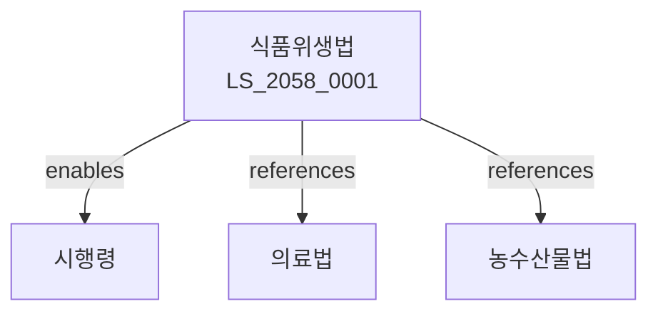

# 식품위생법

> [법률 제20143호, 2024. 1. 9., 일부개정]

---

---

## 제1장 총칙
### 제1조 (목적)
이 법은 식품으로 인한 위생상의 위해를 예방하고 식품의 품질을 향상함으로써 국민의 건강을 보호하고 국민의 식생활을 향상함을 목적으로 한다。

### 제2조 (정의)
이 법에서 사용하는 용어의 뜻은 다음과 같다。

1. "식품"이란 먹거나 마시는 것을 말한다。
2. "식품위생"이란 식품으로 인한 위해를 예방하는 것을 말한다。
3. "식품등"이란 식품ㆍ식품첨가물ㆍ기구ㆍ용기ㆍ포장을 말한다。
4. "영업"이란 식품의 제조ㆍ가공ㆍ조리ㆍ판매 등을 업으로 하는 것을 말한다。

---

## 제2장 식품 및 식품첨가물
### 第5条(식품의 기준 및 규격)
식품의 기준과 규격은 식약처장이 정한다。
### 第6条(유해식품)
유해한 식품을 판매하거나 취급하여서는 아니 된다。
### 第7条(병육미판매)
병육미를 판매하거나 판매할 목적으로 진열하여서는 아니 된다。
### 第8条(식품첨가물)
식품첨가물은 식약처장의 승인을 받아야 한다。

---

## 제3장 기구 및 용기ㆍ포장
### 第15条(기준 및 규격)
기구 및 용기ㆍ포장의 기준과 규격은 식약처장이 정한다。
### 第16条(유해한 기구등)
유해한 기구 및 용기ㆍ포장을 판매하거나 사용하여서는 아니 된다。
### 第17条(표시)
기구 및 용기ㆍ포장에는 표시하여야 한다。
### 第18条(검사)
기구 및 용기ㆍ포장은 검사를 받아야 한다。

---

## 제4장 영업
### 第25条(영업신고)
식품영업은 관할 시장ㆍ군수에게 신고하여야 한다。
### 第26条(시설기준)
영업자는 시설기준에 적합한 시설을 갖추어야 한다。
### 第27条(영업승계)
영업을 양도한 경우 승계신고를 하여야 한다。
### 第28条(영업정지)
위법한 행위에 대하여는 영업정지를 명할 수 있다。

---

## 제5장 식품접객업
### 第35条(식품접객업)
식품접객업은 신고하여야 한다。
### 第36条(위생등급)
식품접객업소에 대하여 위생등급을 지정할 수 있다。
### 第37条(위생교육)
식품접객업 종사자는 위생교육을 받아야 한다。
### 第38条(영업시간)
식품접객업의 영업시간을 제한할 수 있다。

---

## 제6장 검사 및 수입
### 第45条(식품등의 검사)
식품등은 검사를 받아야 한다。
### 第46条(수입신고)
식품등을 수입하려면 신고하여야 한다。
### 第47条(수입검사)
수입식품등은 검사를 받아야 한다。
### 第48条(반송등)
불합격 식품등은 반송하거나 폐기하여야 한다。

---

## 제7장 표시 및 광고
### 第55条(표시사항)
식품등에는 표시사항을 표시하여야 한다。
### 第56条(허위표시금지)
허위로 표시하여서는 아니 된다。
### 第57条(과대광고금지)
식품등을 과대하게 광고하여서는 아니 된다。
### 第58条(건강기능표시)
건강기능에 관한 표시는 승인을 받아야 한다。

---

## 제8장 감독
### 第65条(감독)
식약처장은 식품위생사업을 감독한다。
### 第66条(출입검사)
관계 공무원은 영업장에 출입하여 검사할 수 있다。
### 第67条(시정명령)
위법한 사항에 대하여는 시정을 명할 수 있다。
### 第68条(폐쇄조치)
중대한 위반사유가 있는 경우 폐쇄를 명할 수 있다。

---

## 제9장 벌칙
### 第75条(벌칙)
다음 각 호의 어느 하나에 해당하는 자는 5년 이하의 징역 또는 5천만원 이하의 벌금에 처한다。

1. 유해식품을 판매한 자
2. 허위로 광고한 자
### 第76条(과태료)
다음 각 호의 어느 하나에 해당하는 자에게는 2천만원 이하의 과태료를 부과한다。

1. 신고 없이 영업한 자
2. 보고를 하지 아니한 자

---

## 관계 그래프

**상위 법령**
- [[헌법]] 제36조 (국민건강)
- [[농수산물품질관리법]]

**관련 법령**
- [[의료법]]
- [[건강기능식품법]]
- [[축산물위생관리법]]
- [[수산물품질관리법]]

**하위 법령**
- [[식품위생법 시행령]]
