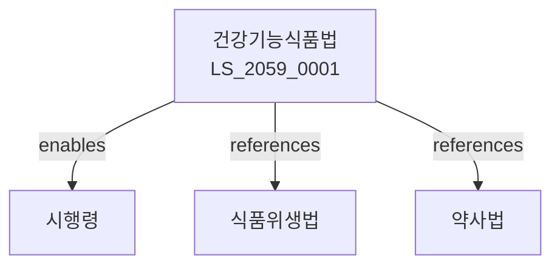

# 건강기능식품에 관한 법률

> [법률 제20142호, 2024. 1. 9., 일부개정]

---

---

## 제1장 총칙
### 제1조 (목적)
이 법은 건강기능식품의 안전성과 품질을 확보하고 그 제조ㆍ판매 등을 적정하게 관리함으로써 국민의 건강증진에 이바지함을 목적으로 한다。

### 제2조 (정의)
이 법에서 사용하는 용어의 뜻은 다음과 같다。

1. "건강기능식품"이란 인체에 유용한 기능을 가진 식품을 말한다。
2. "기능성"이란 인체의 구조나 기능에 영향을 주는 것을 말한다。
3. "제조업"이란 건강기능식품을 제조하는 업을 말한다。
4. "수입업"이란 건강기능식품을 수입하는 업을 말한다。

---

## 제2장 건강기능식품의 기준ㆍ규격
### 第5条(기준ㆍ규격)
건강기능식품의 기준과 규격은 식약처장이 정한다。
### 第6条(인정)
기능성에 관한 인정을 받아야 한다。
### 第7条(기능성표시)
인정받은 기능성만 표시할 수 있다。
### 第8条(개별인정)
새로운 기능성은 개별인정을 받아야 한다。

---

## 제3장 영업
### 第15条(등록)
건강기능식품 제조업은 등록하여야 한다。
### 第16条(등록요건)
제조업자는 시설ㆍ인력 등을 갖추어야 한다。
### 第17条(수입업 등록)
수입업은 등록하여야 한다。
### 第18条(결격사유)
다음 각 호의 자는 등록할 수 없다。

1. 파산선고를 받은 자
2. 금고 이상의 형을 선고받은 자

---

## 제4장 제조 및 품질관리
### 第25条(제조관리)
제조업자는 제조관리기준을 준수하여야 한다。
### 第26条(품질관리)
제조업자는 품질관리기준을 준수하여야 한다。
### 第27条(자가품질검사)
제조업자는 자가품질검사를 실시하여야 한다。
### 第28条(위탁제조)
위탁제조는 식약처장에게 신고하여야 한다。

---

## 제5장 표시 및 광고
### 第35条(표시사항)
건강기능식품에는 다음 각 호의 사항을 표시하여야 한다。

1. 제품명
2. 기능성 내용
3. 섭취량
4. 섭취 방법
5. 주의사항
### 第36条(허위표시금지)
허위로 표시하여서는 아니 된다。
### 第37条(과대광고금지)
과대하게 광고하여서는 아니 된다。
### 第38条(질병치료표시금지)
질병치료에 효능이 있는 것처럼 표시하여서는 아니 된다。

---

## 제6장 감독
### 第42条(감독)
식약처장은 건강기능식품사업을 감독한다。
### 第43条(출입검사)
관계 공무원은 영업장에 출입하여 검사할 수 있다。
### 第44条(시정명령)
위법한 사항에 대하여는 시정을 명할 수 있다。
### 第45条(영업정지)
중대한 위반사유가 있는 경우 영업정지를 명할 수 있다。

---

## 제7장 벌칙
### 第52条(벌칙)
다음 각 호의 어느 하나에 해당하는 자는 3년 이하의 징역 또는 3천만원 이하의 벌금에 처한다。

1. 등록 없이 제조업을 영위한 자
2. 허위로 기능성을 표시한 자
### 第53条(과태료)
다음 각 호의 어느 하나에 해당하는 자에게는 2천만원 이하의 과태료를 부과한다。

1. 표시사항을 표시하지 아니한 자
2. 보고를 하지 아니한 자

---

## 관계 그래프

**상위 법령**
- [[헌법]] 제36조 (국민건강)
- [[식품위생법]]

**관련 법령**
- [[약사법]]
- [[의료기기법]]
- [[의료법]]
- [[화장품법]]

**하위 법령**
- [[건강기능식품법 시행령]]
