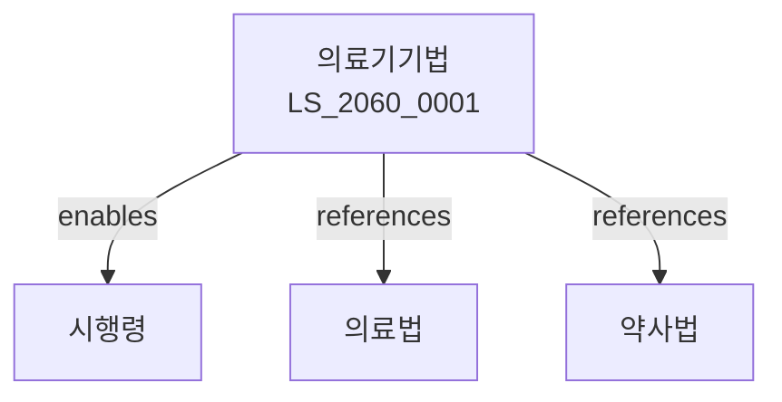

# 의료기기법

> [법률 제20141호, 2024. 1. 9., 일부개정]

---

---

## 제1장 총칙
### 제1조 (목적)
이 법은 의료기기의 품질ㆍ안전성 및 유효성을 확보하고 그 제조ㆍ수입ㆍ판매 등을 적정하게 관리함으로써 국민의 건강증진에 이바지함을 목적으로 한다。

### 제2조 (정의)
이 법에서 사용하는 용어의 뜻은 다음과 같다。

1. "의료기기"란 질병의 진단ㆍ치료ㆍ예방 등에 사용하는 기기를 말한다。
2. "제조업"이란 의료기기를 제조하는 업을 말한다。
3. "수입업"이란 의료기를 수입하는 업을 말한다。
4. "품목허가"란 의료기기의 품목에 대한 허가를 말한다。

---

## 제2장 의료기기의 분류
### 第5条(분류)
의료기기는 위험도에 따라 다음 각 호와 같이 분류한다。

1. 1등급: 낮은 위험도
2. 2등급: 중간 위험도
3. 3등급: 높은 위험도
4. 4등급: 매우 높은 위험도
### 第6条(분류결정)
의료기기의 분류는 식약처장이 결정한다。
### 第7条(분류변경)
분류의 변경은 신청할 수 있다。
### 第8条(분류기준)
분류기준은 식약처 고시로 정한다。

---

## 제3장 제조 및 품질관리
### 第15条(제조업 허가)
의료기기 제조업은 허가를 받아야 한다。
### 第16条(허가요건)
제조업자는 시설ㆍ인력 등을 갖추어야 한다。
### 第17条(GMP)
제조업자는 의료기기 제조 및 품질관리기준을 준수하여야 한다。
### 第18条(품질관리인)
제조업자는 품질관리인을 선임하여야 한다。

---

## 제4장 품목허가 및 인증
### 第25条(품목허가)
3등급 및 4등급 의료기기는 품목허가를 받아야 한다。
### 第26条(품목인증)
1등급 및 2등급 의료기기는 품목인증을 받아야 한다。
### 第27条(심사)
품목허가 및 인증은 심사를 거쳐야 한다。
### 第28条(변경허가)
허가사항을 변경하려면 허가를 받아야 한다。

---

## 제5장 수입 및 판매
### 第35条(수입업 허가)
의료기기 수입업은 허가를 받아야 한다。
### 第36条(수입신고)
의료기를 수입하려면 신고하여야 한다。
### 第37条(판매업 등록)
의료기기 판매업은 등록하여야 한다。
### 第38条(대리점)
외국제조자의 대리점을 둘 수 있다。

---

## 제6장 임상시험
### 第45条(임상시험)
새로운 의료기기는 임상시험을 실시할 수 있다。
### 第46条(승인)
임상시험은 승인을 받아야 한다。
### 第47条(시험기관)
임상시험은 의료기관에서 실시한다。
### 第48条(결과보고)
임상시험 결과를 보고하여야 한다。

---

## 제7장 광고 및 표시
### 第55条(표시사항)
의료기기에는 다음 각 호의 사항을 표시하여야 한다。

1. 제품명
2. 허가번호
3. 제조연월일
4. 사용방법
### 第56条(허위광고금지)
허위로 광고하여서는 아니 된다。
### 第57条(비교광고)
비교광고는 사실에 근거하여야 한다。
### 第58条(금지행위)
의료기기의 오용을 조장하는 행위를 하여서는 아니 된다。

---

## 제8장 감독
### 第62条(감독)
식약처장은 의료기기사업을 감독한다。
### 第63条(출입검사)
관계 공무원은 영업장에 출입하여 검사할 수 있다。
### 第64条(시정명령)
위법한 사항에 대하여는 시정을 명할 수 있다。
### 第65条(영업정지)
중대한 위반사유가 있는 경우 영업정지를 명할 수 있다。

---

## 제9장 벌칙
### 第72条(벌칙)
다음 각 호의 어느 하나에 해당하는 자는 5년 이하의 징역 또는 5천만원 이하의 벌금에 처한다。

1. 허가 없이 제조업을 영위한 자
2. 허가 없는 의료기기를 판매한 자
### 第73条(과태료)
다음 각 호의 어느 하나에 해당하는 자에게는 2천만원 이하의 과태료를 부과한다。

1. 표시사항을 표시하지 아니한 자
2. 보고를 하지 아니한 자

---

## 관계 그래프

**상위 법령**
- [[헌법]] 제36조 (국민건강)
- [[의료법]]

**관련 법령**
- [[약사법]]
- [[건강기능식품법]]
- [[화장품법]]
- [[전기용품안전관리법]]

**하위 법령**
- [[의료기기법 시행령]]
