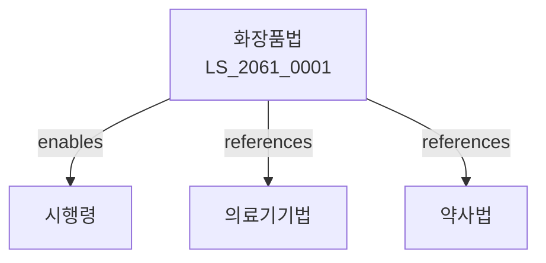

# 화장품법

> [법률 제20140호, 2024. 1. 9., 일부개정]

---

---

## 제1장 총칙
### 제1조 (목적)
이 법은 화장품의 품질ㆍ안전성을 확보하고 그 제조ㆍ수입ㆍ판매 등을 적정하게 관리함으로써 국민의 건강증진에 이바지함을 목적으로 한다。

### 제2조 (정의)
이 법에서 사용하는 용어의 뜻은 다음과 같다。

1. "화장품"이란 인체의 청결ㆍ미화 등을 목적으로 사용하는 것을 말한다。
2. "기능성화장품"이란 피부미백ㆍ주름개선 등의 기능이 있는 화장품을 말한다。
3. "제조업"이란 화장품을 제조하는 업을 말한다。
4. "책임판매업"이란 화장품을 판매하는 업을 말한다。

---

## 제2장 화장품의 성분
### 第5条(성분등록)
화장품에 사용하는 성분은 등록하여야 한다。
### 第6条(금지성분)
인체에 유해한 성분은 사용하여서는 아니 된다。
### 第7条(제한성분)
일정 농도 이상의 성분은 제한하여 사용한다。
### 第8条(성분공개)
화장품의 전성분을 공개하여야 한다。

---

## 제3장 제조 및 품질관리
### 第15条(제조업 등록)
화장품 제조업은 등록하여야 한다。
### 第16条(등록요건)
제조업자는 시설ㆍ인력 등을 갖추어야 한다。
### 第17条(ISO인증)
제조업자는 품질경영시스템 인증을 받아야 한다。
### 第18条(품질관리)
제조업자는 품질관리기준을 준수하여야 한다。

---

## 제4장 기능성화장품
### 第25条(기능성심사)
기능성화장품은 심사를 받아야 한다。
### 第26条(심사기준)
기능성심사의 기준은 식약처 고시로 정한다。
### 第27条(효능표시)
심사받은 효능만 표시할 수 있다。
### 第28条(변경신고)
기능성 내용을 변경하려면 신고하여야 한다。

---

## 제5장 책임판매업
### 第35条(책임판매업 등록)
화장품 책임판매업은 등록하여야 한다。
### 第36条(등록요건)
책임판매업자는 시설 등을 갖추어야 한다。
### 第37条(책임판매관리인)
책임판매업자는 책임판매관리인을 선임하여야 한다。
### 第38条(제조판매업)
제조업자가 판매하는 경우 책임판매업 등록을 면제한다。

---

## 제6장 표시 및 광고
### 第42条(표시사항)
화장품에는 다음 각 호의 사항을 표시하여야 한다。

1. 제품명
2. 제조업자
3. 전성분
4. 사용기간
### 第43条(허위표시금지)
허위로 표시하여서는 아니 된다。
### 第44条(과대광고금지)
과대하게 광고하여서는 아니 된다。
### 第45条(의약품표시금지)
의약품인 것처럼 표시하여서는 아니 된다。

---

## 제7장 감독
### 第48条(감독)
식약처장은 화장품사업을 감독한다。
### 第49条(출입검사)
관계 공무원은 영업장에 출입하여 검사할 수 있다。
### 第50条(시정명령)
위법한 사항에 대하여는 시정을 명할 수 있다。
### 第51条(영업정지)
중대한 위반사유가 있는 경우 영업정지를 명할 수 있다。

---

## 제8장 벌칙
### 第55条(벌칙)
다음 각 호의 어느 하나에 해당하는 자는 3년 이하의 징역 또는 3천만원 이하의 벌금에 처한다。

1. 등록 없이 제조업을 영위한 자
2. 금지성분을 사용한 자
### 第56条(과태료)
다음 각 호의 어느 하나에 해당하는 자에게는 1천만원 이하의 과태료를 부과한다。

1. 표시사항을 표시하지 아니한 자
2. 보고를 하지 아니한 자

---

## 관계 그래프

**상위 법령**
- [[헌법]] 제36조 (국민건강)
- [[의료기기법]]

**관련 법령**
- [[약사법]]
- [[건강기능식품법]]
- [[식품위생법]]
- [[전기용품안전관리법]]

**하위 법령**
- [[화장품법 시행령]]
