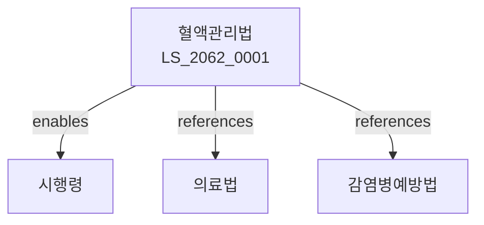

# 혈액관리법

> [법률 제20139호, 2024. 1. 9., 일부개정]

---

---

## 제1장 총칙
### 제1조 (목적)
이 법은 혈액의 수집ㆍ공급 및 관리에 관한 사항을 정함으로써 혈액의 안전성을 확보하고 국민의 건강을 보호함을 목적으로 한다。

### 제2조 (정의)
이 법에서 사용하는 용어의 뜻은 다음과 같다。

1. "혈액"이란 사람의 혈액을 말한다。
2. "혈액제제"란 혈액을 원료로 하여 제조한 제제를 말한다。
3. "헌혈"이란 혈액을 무상으로 제공하는 것을 말한다。
4. "수혈"이란 혈액을 환자에게 투여하는 것을 말한다。

---

## 제2장 헌혈
### 第5条(헌혈의 원칙)
헌혈은 자발적이고 무상으로 하여야 한다。
### 第6条(헌혈자의 자격)
헌혈자는 연령ㆍ체중 등의 요건을 갖추어야 한다。
### 第7条(헌혈의 절차)
헌혈의 절차는 보건복지부령으로 정한다。
### 第8条(헌혈증서)
헌혈자에게는 헌혈증서를 교부한다。

---

## 제3장 혈액원
### 第15条(혈액원 설치)
대한적십자사에 혈액원을 둔다。
### 第16条(업무)
혈액원은 다음 각 호의 업무를 수행한다。

1. 혈액의 수집
2. 혈액의 검사
3. 혈액의 보관
4. 혈액의 공급
### 第17条(혈액원장)
혈액원에 원장을 둔다。
### 第18条(직원)
혈액원에 필요한 직원을 둔다。

---

## 제4장 혈액의 검사
### 第25条(검사의무)
혈액은 검사를 실시하여야 한다。
### 第26条(검사항목)
혈액의 검사항목은 보건복지부령으로 정한다。
### 第27条(부적격혈액)
부적격 혈액은 폐기하여야 한다。
### 第28条(검사기록)
혈액검사 결과를 기록하여야 한다。

---

## 제5장 혈액의 공급
### 第35条(공급대상)
혈액은 의료기관에 공급한다。
### 第36条(공급절차)
혈액의 공급절차는 보건복지부령으로 정한다。
### 第37条(공급기록)
혈액 공급에 관한 기록을 유지하여야 한다。
### 第38条(혈액의 사용)
의료기관은 혈액을 적절하게 사용하여야 한다。

---

## 제6장 수혈
### 第45条(수혈의 적응)
수혈은 의학적 필요가 있는 경우에 한다。
### 第46条(수혈전 검사)
수혈 전에 환자의 혈액형 등을 확인하여야 한다。
### 第47条(수혈부작용)
수혈 부작용 발생 시 신고하여야 한다。
### 第48条(수혈기록)
수혈에 관한 기록을 유지하여야 한다。

---

## 제7장 혈액제제
### 第52条(제조허가)
혈액제제는 허가를 받아야 한다。
### 第53条(제조기준)
혈액제제의 제조기준은 보건복지부령으로 정한다。
### 第54条(검정)
혈액제제는 국립보건검역소의 검정을 받아야 한다。
### 第55条(수입)
혈액제제의 수입은 허가를 받아야 한다。

---

## 제8장 감독
### 第58条(감독)
보건복지부장관은 혈액관리사업을 감독한다。
### 第59条(보고 및 검사)
필요한 경우 보고를 명하거나 검사할 수 있다。
### 第60条(시정명령)
위법한 사항에 대하여는 시정을 명할 수 있다。
### 第61条(과태료)
다음 각 호의 어느 하나에 해당하는 자에게는 과태료를 부과한다。

1. 보고를 하지 아니한 자
2. 검사를 거부한 자

---

## 제9장 벌칙
### 第65条(벌칙)
다음 각 호의 어느 하나에 해당하는 자는 3년 이하의 징역 또는 3천만원 이하의 벌금에 처한다。

1. 허가 없이 혈액을 채혈한 자
2. 부적격 혈액을 공급한 자
### 第66条(과태료)
다음 각 호의 어느 하나에 해당하는 자에게는 2천만원 이하의 과태료를 부과한다。

1. 기록을 유지하지 아니한 자
2. 신고를 하지 아니한 자

---

## 관계 그래프

**상위 법령**
- [[헌법]] 제36조 (국민건강)
- [[의료법]]

**관련 법령**
- [[감염병예방법]]
- [[약사법]]
- [[의료기기법]]
- [[장기등이식에관한법률]]

**하위 법령**
- [[혈액관리법 시행령]]
