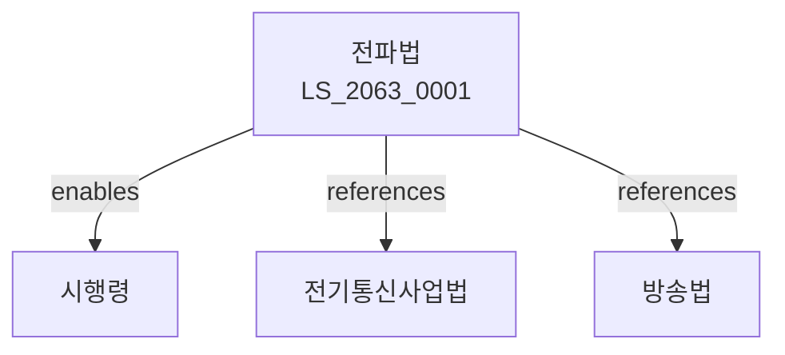

# 전파법

> [법률 제20138호, 2024. 1. 9., 일부개정]

---

---

## 제1장 총칙
### 제1조 (목적)
이 법은 전파의 효율적인 관리와 공정한 이용을 도모함으로써 공중복리의 증진에 이바지함을 목적으로 한다.

### 제2조 (정의)
이 법에서 사용하는 용어의 뜻은 다음과 같다.

1. "전파"란 3천GHz 이하의 주파수를 가진 전자파를 말한다.
2. "무선국"이란 무선설비를 운용하는 시설을 말한다.
3. "주파수"란 전파의 진동수를 말한다.
4. "무선설비"란 전파를 송수신하는 설비를 말한다.

---

## 제2장 주파수의 관리
### 第5条(주파수의 관리)
국가는 주파수를 효율적으로 관리하여야 한다.
### 第6条(주파수의 배분)
주파수의 배분은 과학기술정보통신부령으로 정한다.
### 第7条(주파수의 할당)
주파수는 무선국에 할당한다.
### 第8条(주파수의 변경)
할당된 주파수는 필요한 경우 변경할 수 있다.

---

## 제3장 무선국의 허가
### 第15条(무선국의 허가)
무선국의 설치는 허가를 받아야 한다.
### 第16条(허가요건)
무선국 허가는 기술적 요건을 갖추어야 한다.
### 第17条(허가절차)
무선국 허가는 과학기술정보통신부에 신청한다.
### 第18条(허가의 취소)
위법한 행위에 대하여는 허가를 취소할 수 있다.

---

## 제4장 무선설비
### 第25条(무선설비의 기준)
무선설비는 기술기준에 적합하여야 한다.
### 第26条(형식검정)
무선설비는 형식검정을 받아야 한다.
### 第27条(검사)
무선설비는 정기적으로 검사를 받아야 한다.
### 第28条(개조)
무선설비의 개조는 신고하여야 한다.

---

## 제5장 무선종사자
### 第35条(자격)
무선설비를 운용하려면 자격을 갖추어야 한다.
### 第36条(자격증)
무선종사자 자격증을 교부한다.
### 第37条(자격시험)
무선종사자 자격시험을 실시한다.
### 第38条(교육)
무선종사자는 정기적으로 교육을 받아야 한다.

---

## 제6장 전파의 이용
### 第45条(이용의 보호)
전파의 이용은 보호된다.
### 第46条(혼신방지)
전파의 혼신을 방지하여야 한다.
### 第47条(고압선 등)
고압선 등으로 인한 장해를 방지하여야 한다.
### 第48条(전파장해)
전파장해 발생 시 조치하여야 한다.

---

## 제7장 감독
### 第55条(감독)
과학기술정보통신부장관은 전파관리사업을 감독한다.
### 第56条(보고 및 검사)
필요한 경우 보고를 명하거나 검사할 수 있다.
### 第57条(시정명령)
위법한 사항에 대하여는 시정을 명할 수 있다.
### 第58条(운용정지)
중대한 위반사유가 있는 경우 운용정지를 명할 수 있다.

---

## 제8장 벌칙
### 第65条(벌칙)
다음 각 호의 어느 하나에 해당하는 자는 3년 이하의 징역 또는 3천만원 이하의 벌금에 처한다.

1. 허가 없이 무선국을 설치한 자
2. 허위로 형식검정을 받은 자
### 第66条(과태료)
다음 각 호의 어느 하나에 해당하는 자에게는 2천만원 이하의 과태료를 부과한다.

1. 신고 없이 무선설비를 개조한 자
2. 검사를 거부한 자

---

## 관계 그래프

**상위 법령**
- [[헌법]] 제18조 (통신의 자유)
- [[전기통신사업법]]

**관련 법령**
- [[방송법]]
- [[정보통신망법]]
- [[전기사업법]]
- [[방송통신위원회법]]

**하위 법령**
- [[전파법 시행령]]
