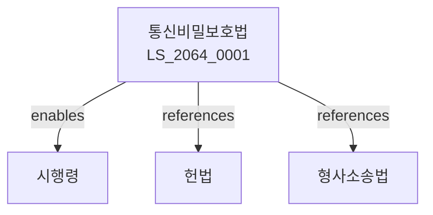

# 통신비밀보호법

> [법률 제20137호, 2024. 1. 9., 일부개정]

---

---

## 제1장 총칙
### 제1조 (목적)
이 법은 통신의 비밀을 보호함으로써 국민의 프라이버시를 보장하고 통신의 자유를 신장함을 목적으로 한다.

### 제2조 (정의)
이 법에서 사용하는 용어의 뜻은 다음과 같다.

1. "통신"이란 정보를 전달하는 행위를 말한다.
2. "통신비밀"이란 통신의 내용과 그 통신사실을 말한다.
3. "통신사실"이란 통신의 상대방, 시간, 장소 등을 말한다.
4. "전기통신사업자"란 전기통신사업을 영위하는 자를 말한다.

---

## 제2장 통신비밀의 보호
### 第5条(통신비밀의 보호)
누구든지 타인의 통신비밀을 침해하여서는 아니 된다.
### 第6条(개봉금지)
우편물은 수취인의 동의 없이 개봉하여서는 아니 된다。
### 第7条(도청금지)
누구든지 타인의 통신 내용을 도청하여서는 아니 된다。
### 第8条(비밀누설금지)
전기통신사업자는 통신비밀을 누설하여서는 아니 된다。

---

## 제3장 통신제한의 요건
### 第15条(통신제한의 요건)
통신의 제한은 다음 각 호의 경우에 한한다。

1. 형사소송법에 따른 압수수색
2. 국가안보를 위한 경우
3. 긴급한 범죄수사를 위한 경우
### 第16条(영장주의)
통신의 제한은 법관이 발부한 영장에 의한다。
### 第17条(긴급통신제한)
긴급한 경우 영장 없이 통신을 제한할 수 있다。
### 第18条(사후영장)
긴급통신제한 후 사후영장을 받아야 한다。

---

## 제4장 통신제한의 절차
### 第22条(통신제한의 신청)
수사기관은 통신제한을 신청할 수 있다。
### 第23条(영장의 발부)
법관은 신청을 심사하여 영장을 발부한다。
### 第24条(영장의 집행)
영장은 전기통신사업자에게 송부한다。
### 第25条(집행의 한계)
영장의 범위 내에서만 통신을 제한한다。

---

## 제5장 전기통신사업자의 의무
### 第28条(협조의무)
전기통신사업자는 통신제한에 협조하여야 한다。
### 第29条(기술적 조치)
전기통신사업자는 통신비밀 보호를 위한 기술적 조치를 하여야 한다。
### 第30条(기록의 보존)
전기통신사업자는 통신사실 기록을 일정기간 보존하여야 한다。
### 第31条(기록의 폐기)
보존기간이 지난 기록은 폐기하여야 한다。

---

## 제6장 통신제한의 감독
### 第32条(감독기관)
과학기술정보통신부는 통신비밀 보호를 감독한다。
### 第33条(실태조사)
정기적으로 통신제한 실태를 조사한다。
### 第34条(결과공개)
조사결과를 공개하여야 한다。
### 第35条(시정조치)
위법한 통신제한에 대하여 시정조치한다。

---

## 제7장 벌칙
### 第36条(벌칙)
다음 각 호의 어느 하나에 해당하는 자는 3년 이하의 징역 또는 3천만원 이하의 벌금에 처한다。

1. 타인의 통신을 도청한 자
2. 통신비밀을 누설한 자
### 第37条(과태료)
다음 각 호의 어느 하나에 해당하는 자에게는 2천만원 이하의 과태료를 부과한다。

1. 기록을 보존하지 아니한 자
2. 조사를 거부한 자

---

## 관계 그래프

**상위 법령**
- [[헌법]] 제18조 (통신의 자유), 제16조 (주거의 자유)
- [[형사소송법]]

**관련 법령**
- [[전기통신사업법]]
- [[정보통신망법]]
- [[개인정보 보호법]]
- [[형법]]

**하위 법령**
- [[통신비밀보호법 시행령]]
