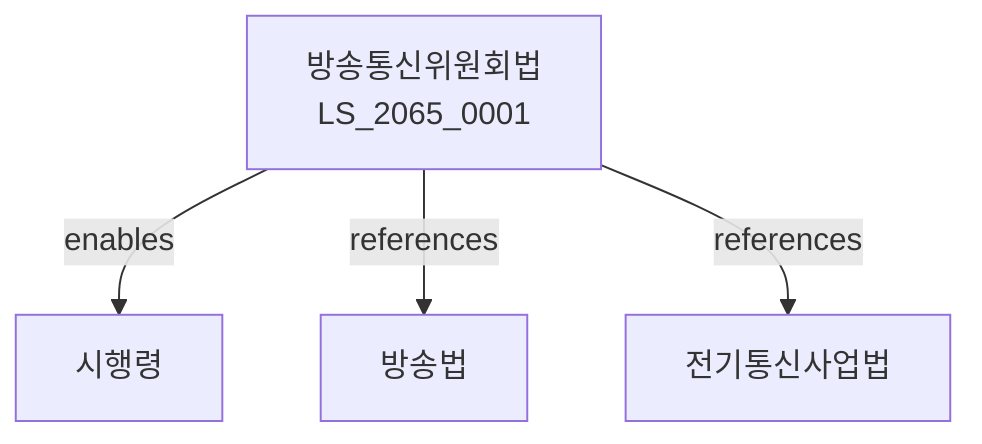

# 방송통신위원회의 설치 및 운영에 관한 법률

> [법률 제20136호, 2024. 1. 9., 일부개정]

---

---

## 제1장 총칙
### 제1조 (목적)
이 법은 방송통신위원회의 설치 및 운영에 관한 사항을 정함으로써 방송과 통신의 융합을 촉진하고 공정한 경쟁을 도모함을 목적으로 한다。

### 제2조 (정의)
이 법에서 사용하는 용어의 뜻은 다음과 같다。

1. "방송"이란 공중에게 정보를 전달하는 것을 말한다。
2. "통신"이란 정보를 송수신하는 것을 말한다。
3. "방송통신융합"이란 방송과 통신의 결합을 말한다。
4. "방송통신서비스"란 방송 또는 통신 서비스를 말한다。

---

## 제2장 방송통신위원회
### 第5条(설치)
방송과 통신에 관한 사무를 관장하기 위하여 방송통신위원회를 둔다。
### 第6条(지위)
방송통신위원회는 중앙행정기관으로 한다。
### 第7条(기능)
방송통신위원회는 다음 각 호의 사무를 관장한다。

1. 방송통신정책의 수립
2. 방송통신사업의 진흥
3. 전파자원의 관리
4. 방송통신시장의 경쟁 촉진
### 第8条(위원장)
방송통신위원회에 위원장을 둔다。

---

## 제3장 조직
### 第15条(위원)
방송통신위원회에 위원을 둔다。
### 第16条(위원의 임명)
위원은 대통령이 임명한다。
### 第17条(임기)
위원의 임기는 3년으로 한다。
### 第18条(직무독립)
위원은 직무를 독립적으로 수행한다。

---

## 제4장 소관사무
### 第22条(방송정책)
방송통신위원회는 방송정책을 수립한다。
### 第23条(통신정책)
방송통신위원회는 통신정책을 수립한다。
### 第24条(전파관리)
방송통신위원회는 전파자원을 관리한다。
### 第25条(요금조정)
방송통신서비스 요금을 조정할 수 있다。

---

## 제5장 심의절차
### 第28条(회의)
방송통신위원회는 회의를 개최한다。
### 第29条(의결)
의안은 재적위원 과반수의 찬성으로 의결한다。
### 第30条(공청회)
필요한 경우 공청회를 개최할 수 있다。
### 第31条(의견청취)
관계인의 의견을 들을 수 있다。

---

## 제6장 사무처
### 第32条(설치)
방송통신위원회에 사무처를 둔다。
### 第33条(사무처장)
사무처에 사무처장을 둔다。
### 第34条(직원)
사무처에 필요한 직원을 둔다。
### 第35条(사무분장)
사무처의 사무분장은 위원회규칙으로 정한다。

---

## 제7장 보칙
### 第36条(규칙)
이 법 시행에 필요한 사항은 위원회규칙으로 정한다。
### 第37条(보고)
관계 기관은 방송통신위원회에 보고하여야 한다。
### 第38条(협조)
관계 기관은 방송통신위원회에 협조하여야 한다。
### 第39条(예산)
방송통신위원회의 예산은 정부예산으로 한다。

---

## 제8장 벌칙
### 第40条(과태료)
다음 각 호의 어느 하나에 해당하는 자에게는 1천만원 이하의 과태료를 부과한다。

1. 보고를 하지 아니한 자
2. 허위로 보고한 자

---

## 관계 그래프

**상위 법령**
- [[헌법]] 제18조 (통신의 자유), 제21조 (언론의 자유)
- [[정부조직법]]

**관련 법령**
- [[방송법]]
- [[전기통신사업법]]
- [[전파법]]
- [[인터넷멀티미디어방송사업법]]

**하위 법령**
- [[방송통신위원회법 시행령]]
