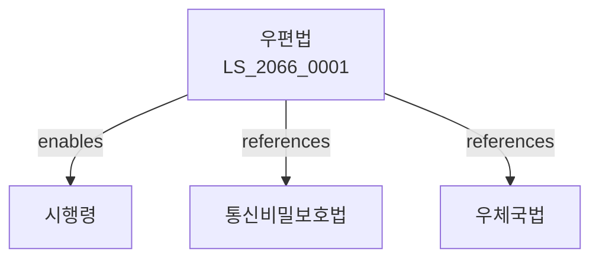

# 우편법

> [법률 제20135호, 2024. 1. 9., 일부개정]

---

---

## 제1장 총칙
### 제1조 (목적)
이 법은 우편사업의 원활한 운영과 우편물의 안전한 배달을 도모함으로써 공중복리의 증진에 이바지함을 목적으로 한다。

### 제2조 (정의)
이 법에서 사용하는 용어의 뜻은 다음과 같다。

1. "우편물"이란 편지, 소포 등 우편으로 보내는 물건을 말한다。
2. "우편사업"이란 우편물의 수집ㆍ운송ㆍ배달 업무를 말한다。
3. "우편요금"이란 우편물의 배달에 대한 대가를 말한다。
4. "우편번호"란 우편물의 배달 구역을 표시하는 번호를 말한다。

---

## 제2장 우편사업
### 第5条(우편사업의 주체)
국가는 우편사업을 운영한다。
### 第6条(우편사업의 위탁)
우편사업의 일부를 위탁할 수 있다。
### 第7条(우편요금)
우편요금은 대통령령으로 정한다。
### 第8条(요금의 감면)
국가는 우편요금을 감면할 수 있다。

---

## 제3장 우편물의 수집 및 배달
### 第15条(수집)
우편물은 수집함 등을 통하여 수집한다。
### 第16条(배달)
우편물은 수취인의 주소로 배달한다。
### 第17条(배달증명)
배달사실을 증명할 수 있다。
### 第18条(미배달 우편물)
배달할 수 없는 우편물은 반송한다。

---

## 제4장 우편물의 금지 및 제한
### 第22条(금지물)
다음 각 호의 물건은 우편으로 보낼 수 없다。

1. 폭발물
2. 인화물질
3. 부패성 물품
4. 마약류
### 第23条(제한물)
일정 물건은 포장 등의 조건을 갖추어야 한다。
### 第24条(검사)
우편물의 내용물을 확인할 수 있다。
### 第25条(압수)
범죄 관련 우편물은 압수할 수 있다。

---

## 제5장 우편물의 보호
### 第28条(비밀보호)
우편물의 비밀은 보호된다。
### 第29条(개봉금지)
우편물은 수취인의 동의 없이 개봉할 수 없다。
### 第30条(손해배상)
우편물의 분실ㆍ훼손에 대하여 배상한다。
### 第31条(배상한도)
배상한도는 대통령령으로 정한다。

---

## 제6장 우체국
### 第35条(우체국)
우편사업을 위하여 우체국을 둔다。
### 第36条(우체국장)
우체국에 우체국장을 둔다。
### 第37条(우편종사원)
우체국에 우편종사원을 둔다。
### 第38条(우편취급소)
우편사업의 편의를 위하여 우편취급소를 둘 수 있다。

---

## 제7장 벌칙
### 第45条(벌칙)
다음 각 호의 어느 하나에 해당하는 자는 3년 이하의 징역 또는 3천만원 이하의 벌금에 처한다。

1. 우편물을 불법 개봉한 자
2. 우편물을 도난한 자
### 第46条(과태료)
다음 각 호의 어느 하나에 해당하는 자에게는 500만원 이하의 과태료를 부과한다。

1. 금지물을 우편으로 보낸 자
2. 허위로 신고한 자

---

## 관계 그래프

**상위 법령**
- [[헌법]] 제18조 (통신의 자유)
- [[통신비밀보호법]]

**관련 법령**
- [[우체국법]]
- [[우체국예금법]]
- [[우체국보험법]]
- [[물류산업발전법]]

**하위 법령**
- [[우편법 시행령]]
