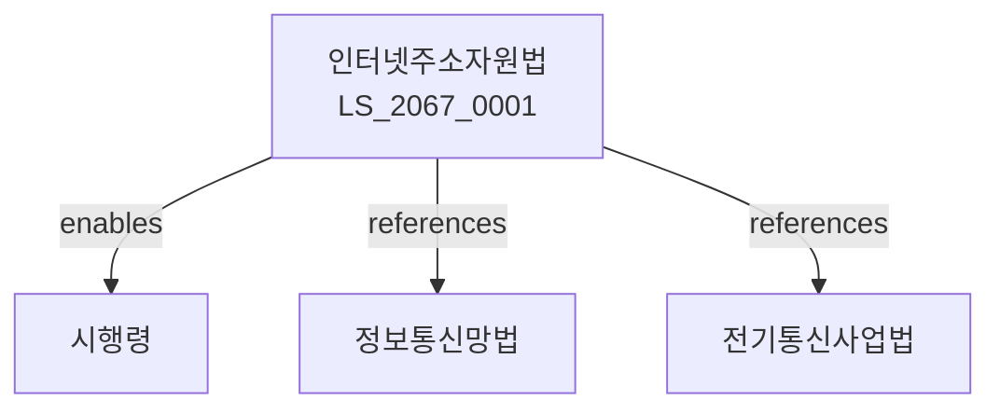

# 인터넷주소자원에 관한 법률

> [법률 제20134호, 2024. 1. 9., 일부개정]

---

---

## 제1장 총칙
### 제1조 (목적)
이 법은 인터넷주소자원의 효율적인 관리와 원활한 이용을 도모함으로써 인터넷의 안정적 운영과 정보사회 발전에 이바지함을 목적으로 한다。

### 제2조 (정의)
이 법에서 사용하는 용어의 뜻은 다음과 같다。

1. "인터넷주소"란 인터넷에서 통신 상대를 식별하기 위한 번호를 말한다。
2. "도메인이름"이란 인터넷주소를 문자로 표시한 것을 말한다。
3. "인터넷주소자원"이란 인터넷주소와 도메인이름을 말한다。
4. "등록기관"이란 도메인이름 등록 업무를 수행하는 기관을 말한다。

---

## 제2장 인터넷주소자원의 관리
### 第5条(주소자원의 관리)
국가는 인터넷주소자원을 효율적으로 관리한다。
### 第6条(주소배정)
인터넷주소는 필요한 자에게 배정한다。
### 第7条(주소이전)
인터넷주소의 이전은 등록하여야 한다。
### 第8条(주소반납)
불필요한 인터넷주소는 반납하여야 한다。

---

## 제3장 도메인이름의 등록
### 第12条(도메인이름의 등록)
도메인이름은 등록기관에 등록한다。
### 第13条(등록요건)
도메인이름 등록은 요건을 갖추어야 한다。
### 第14条(등록기간)
도메인이름 등록기간은 최대 10년으로 한다。
### 第15条(등록갱신)
등록기간 만료 전 갱신할 수 있다。

---

## 제4장 도메인이름의 분쟁
### 第18条(분쟁의 발생)
도메인이름에 관한 권리분쟁이 발생할 수 있다。
### 第19条(분쟁해결)
분쟁은 조정 또는 심판으로 해결한다。
### 第20条(심판기관)
도메인이름 분쟁 심판기관을 둔다。
### 第21条(심판절차)
심판절차는 과학기술정보통신부령으로 정한다。

---

## 제5장 한국인터넷진흥원
### 第25条(설립)
인터넷주소자원 관리를 위하여 한국인터넷진흥원을 둔다。
### 第26条(업무)
한국인터넷진흥원은 다음 각 호의 업무를 수행한다。

1. 인터넷주소자원의 관리
2. 도메인이름 등록
3. 분쟁 조정
4. 인터넷 안전 대책
### 第27条(임원)
한국인터넷진흥원에 임원을 둔다。
### 第28条(재원)
한국인터넷진흥원의 재원은 등록수수료 등으로 한다。

---

## 제6장 감독
### 第32条(감독)
과학기술정보통신부장관은 인터넷주소자원 관리사업을 감독한다。
### 第33条(보고 및 검사)
필요한 경우 보고를 명하거나 검사할 수 있다。
### 第34条(시정명령)
위법한 사항에 대하여는 시정을 명할 수 있다。
### 第35条(등록취소)
중대한 위반사유가 있는 경우 등록을 취소할 수 있다。

---

## 제7장 벌칙
### 第38条(벌칙)
다음 각 호의 어느 하나에 해당하는 자는 2년 이하의 징역 또는 2천만원 이하의 벌금에 처한다。

1. 허위로 도메인이름을 등록한 자
2. 부정한 방법으로 인터넷주소를 배정받은 자
### 第39条(과태료)
다음 각 호의 어느 하나에 해당하는 자에게는 1천만원 이하의 과태료를 부과한다。

1. 보고를 하지 아니한 자
2. 검사를 거부한 자

---

## 관계 그래프

**상위 법령**
- [[헌법]] 제18조 (통신의 자유)
- [[정보통신망법]]

**관련 법령**
- [[전기통신사업법]]
- [[정보통신망법]]
- [[개인정보 보호법]]
- [[전자거래법]]

**하위 법령**
- [[인터넷주소자원법 시행령]]
