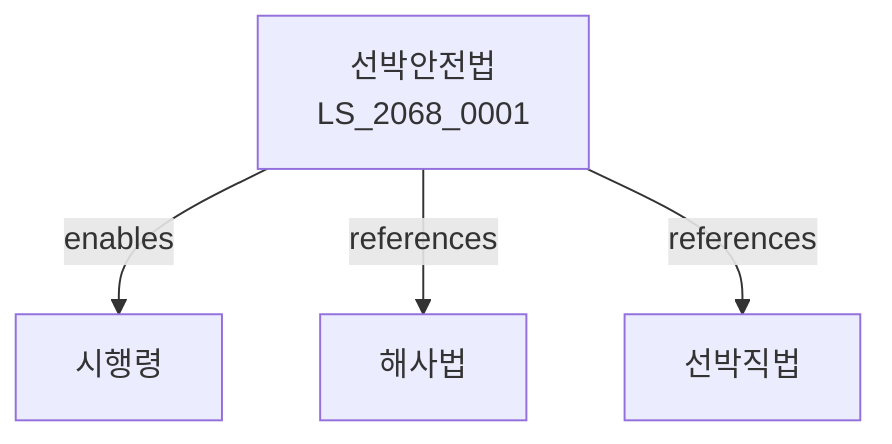

# 선박안전법

> [법률 제20133호, 2024. 1. 9., 일부개정]

---

---

## 제1장 총칙
### 제1조 (목적)
이 법은 선박의 안전운항을 확보하고 선박으로 인한 해양오염을 방지함으로써 인명안전과 해양환경보전에 이바지함을 목적으로 한다。

### 제2조 (정의)
이 법에서 사용하는 용어의 뜻은 다음과 같다。

1. "선박"이란 항해에 사용되는 모든 선체를 말한다。
2. "안전운항"이란 선박의 안전한 운항을 말한다。
3. "해양오염"이란 선박으로 인한 해양의 오염을 말한다。
4. "선장"이란 선박을 지휘하는 자를 말한다。

---

## 제2장 선박의 안전기준
### 第5条(구조기준)
선박은 구조기준에 적합하여야 한다。
### 第6条(설비기준)
선박은 설비기준에 적합하여야 한다。
### 第7条(안전장비)
선박에는 안전장비를 갖추어야 한다。
### 第8条(오염방지설비)
선박에는 해양오염방지설비를 갖추어야 한다。

---

## 제3장 선박검사
### 第15条(검사의무)
선박은 정기적으로 검사를 받아야 한다。
### 第16条(검사종류)
선박검사는 다음 각 호와 같다。

1. 정기검사
2. 중간검사
3. 특별검사
4. 임시검사
### 第17条(검사기관)
선박검사는 해양수산부령으로 정하는 기관이 실시한다。
### 第18条(검사증서)
검사에 합격한 선박에는 검사증서를 교부한다。

---

## 제4장 선박등록
### 第25条(등록)
선박은 등록하여야 한다。
### 第26条(등록절차)
선박등록은 관할 해양경찰서에 신청한다。
### 第27条(등록기관)
선박등록증을 교부한다。
### 第28条(등록변경)
등록사항 변경 시 변경등록을 하여야 한다。

---

## 제5장 선원
### 第35条(선원의 자격)
선원은 자격을 갖추어야 한다。
### 第36条(선원증)
선원에게는 선원증을 교부한다。
### 第37条(승선의무)
선원은 승선의무를 이행하여야 한다。
### 第38条(교육)
선원은 정기적으로 교육을 받아야 한다。

---

## 제6장 선장의 의무
### 第42条(안전운항의무)
선장은 선박을 안전하게 운항하여야 한다。
### 第43条(구조의무)
선장은 해난사고 시 구조의무를 갖는다。
### 第44条(오염방지의무)
선장은 해양오염을 방지하여야 한다。
### 第45条(신고의무)
해난사고 발생 시 신고하여야 한다。

---

## 제7장 해난구조
### 第48条(구조대)
해난구조를 위하여 구조대를 둔다。
### 第49条(구조활동)
해난사고 시 구조활동을 전개한다。
### 第50条(구조비용)
구조비용은 피구조자가 부담한다。
### 第51条(협조)
관계 기관은 구조활동에 협조하여야 한다。

---

## 제8장 감독
### 第55条(감독)
해양수산부장관은 선박안전사업을 감독한다。
### 第56条(보고 및 검사)
필요한 경우 보고를 명하거나 검사할 수 있다。
### 第57条(시정명령)
위법한 사항에 대하여는 시정을 명할 수 있다。
### 第58条(운항정지)
중대한 위반사유가 있는 경우 운항정지를 명할 수 있다。

---

## 제9장 벌칙
### 第65条(벌칙)
다음 각 호의 어느 하나에 해당하는 자는 3년 이하의 징역 또는 3천만원 이하의 벌금에 처한다。

1. 검사를 받지 아니하고 운항한 자
2. 안전기준을 위반한 자
### 第66条(과태료)
다음 각 호의 어느 하나에 해당하는 자에게는 2천만원 이하의 과태료를 부과한다。

1. 등록 없이 운항한 자
2. 보고를 하지 아니한 자

---

## 관계 그래프

**상위 법령**
- [[헌법]] 제120조 (국토의 보전)
- [[해사법]]

**관련 법령**
- [[선박직법]]
- [[해양환경관리법]]
- [[해운법]]
- [[항만법]]

**하위 법령**
- [[선박안전법 시행령]]
