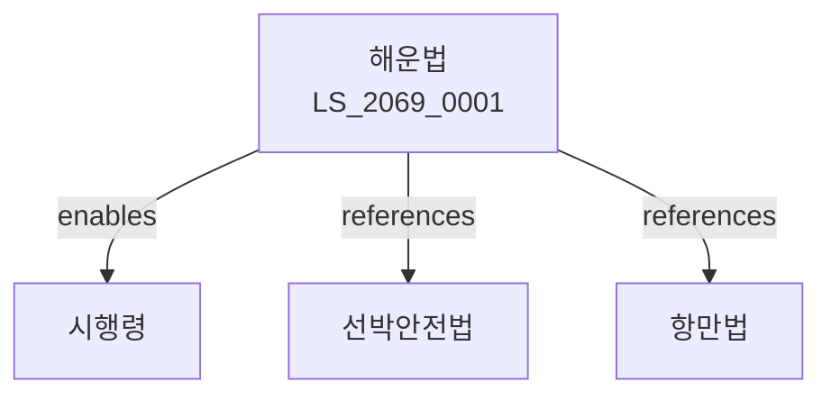

# 해운법

> [법률 제20132호, 2024. 1. 9., 일부개정]

---

---

## 제1장 총칙
### 제1조 (목적)
이 법은 해운사업의 건전한 발전을 도모하고 해운질서를 확립함으로써 국민경제의 발전에 이바지함을 목적으로 한다。

### 제2조 (정의)
이 법에서 사용하는 용어의 뜻은 다음과 같다。

1. "해운"이란 선박에 의한 화물 또는 여객의 운송을 말한다。
2. "해운사업"이란 해운을 업으로 하는 것을 말한다。
3. "해운사업자"란 해운사업을 경영하는 자를 말한다。
4. "정기항로"란 정기적으로 운항하는 항로를 말한다。

---

## 제2장 해운사업
### 第5条(등록)
해운사업은 등록하여야 한다。
### 第6条(등록요건)
해운사업자는 선박ㆍ자본금 등을 갖추어야 한다。
### 第7条(등록절차)
해운사업 등록은 해양수산부에 신청한다。
### 第8条(변경신고)
등록사항을 변경한 경우 신고하여야 한다。

---

## 제3장 정기항로사업
### 第15条(면허)
정기항로사업은 면허를 받아야 한다。
### 第16条(면허요건)
정기항로사업자는 운항능력 등을 갖추어야 한다。
### 第17条(면허기간)
면허기간은 5년으로 한다。
### 第18条(갱신)
면허기간 만료 전 갱신할 수 있다。

---

## 제4장 운임 및 요금
### 第25条(운임신고)
운임은 해양수산부장관에게 신고하여야 한다。
### 第26条(운임변경)
운임을 변경하려면 신고하여야 한다。
### 第27条(요금표시)
운임 등을 명확히 표시하여야 한다。
### 第28条(부당운임금지)
부당한 운임을 징수하여서는 아니 된다。

---

## 제5장 해운중개
### 第32条(해운중개업)
해운중개업은 등록하여야 한다。
### 第33条(중개업자의 의무)
해운중개업자는 성실히 업무를 수행하여야 한다。
### 第33条(보고)
해양수산부장관은 필요한 경우 보고를 명할 수 있다。
### 第34条(영업정지)
위법한 행위에 대하여는 영업정지를 명할 수 있다。

---

## 제6장 해운협회
### 第38条(설립)
해운업무의 개선을 위하여 해운협회를 둔다。
### 第39条(업무)
해운협회는 다음 각 호의 업무를 수행한다。

1. 해운사업의 조사ㆍ연구
2. 해운요금의 조정
3. 해운사업자의 지도
### 第40条(회원)
해운사업자는 해운협회에 가입할 수 있다。
### 第41条(규약)
해운협회의 규약은 해양수산부장관의 인가를 받아야 한다。

---

## 제7장 감독
### 第48条(감독)
해양수산부장관은 해운사업을 감독한다。
### 第49条(보고 및 검사)
필요한 경우 보고를 명하거나 검사할 수 있다。
### 第50条(시정명령)
위법한 사항에 대하여는 시정을 명할 수 있다。
### 第51条(영업정지)
중대한 위반사유가 있는 경우 영업정지를 명할 수 있다。

---

## 제8장 벌칙
### 第58条(벌칙)
다음 각 호의 어느 하나에 해당하는 자는 2년 이하의 징역 또는 2천만원 이하의 벌금에 처한다。

1. 등록 없이 해운사업을 영위한 자
2. 허위로 신고한 자
### 第59条(과태료)
다음 각 호의 어느 하나에 해당하는 자에게는 1천만원 이하의 과태료를 부과한다。

1. 보고를 하지 아니한 자
2. 검사를 거부한 자

---

## 관계 그래프

**상위 법령**
- [[헌법]] 제119조 (경제자유)
- [[해사법]]

**관련 법령**
- [[선박안전법]]
- [[항만법]]
- [[화물자동차운수사업법]]
- [[물류산업발전법]]

**하위 법령**
- [[해운법 시행령]]
