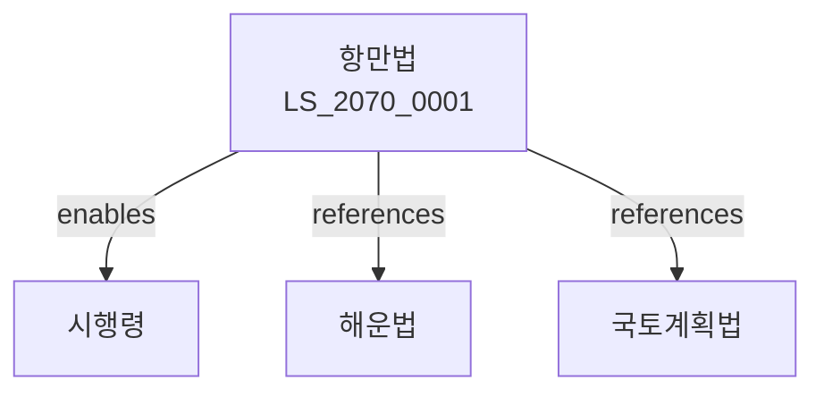

# 항만법

> [법률 제20131호, 2024. 1. 9., 일부개정]

---

---

## 제1장 총칙
### 제1조 (목적)
이 법은 항만의 개발ㆍ관리 및 운영에 관한 사항을 정함으로써 항만의 기능을 증진하고 국민경제의 발전에 이바지함을 목적으로 한다。

### 제2조 (정의)
이 법에서 사용하는 용어의 뜻은 다음과 같다。

1. "항만"이란 선박의 출입ㆍ정박 및 화물의 하역을 위한 시설을 말한다。
2. "항만구역"이란 항만을 위하여 지정된 구역을 말한다。
3. "항만시설"이란 항만의 기능을 위한 시설을 말한다。
4. "항만사업"이란 항만의 개발ㆍ관리 사업을 말한다。

---

## 제2장 항만의 지정
### 第5条(항만의 지정)
해양수산부장관은 항만을 지정할 수 있다。
### 第6条(항만구역)
항만구역은 해양수산부령으로 정한다。
### 第7条(항만의 종류)
항만은 다음 각 호와 같이 구분한다。

1. 국제항만
2. 국가항만
3. 지방항만
4. 어항
### 第8条(지정변경)
항만의 지정은 필요한 경우 변경할 수 있다。

---

## 제3장 항만시설
### 第15条(항만시설의 설치)
국가는 항만시설을 설치한다。
### 第16条(시설의 종류)
항만시설은 다음 각 호와 같다。

1. 접안시설
2. 하역시설
3. 보관시설
4. 여객시설
### 第17条(시설기준)
항만시설의 설치기준은 해양수산부령으로 정한다。
### 第18条(유지관리)
항만시설은 적절히 유지관리하여야 한다。

---

## 제4장 항만운영
### 第25条(항만운영사업)
항만운영사업은 등록하여야 한다。
### 第26条(등록요건)
항만운영사업자는 시설 등을 갖추어야 한다。
### 第27条(운영기준)
항만운영사업자는 운영기준을 준수하여야 한다。
### 第28条(수수료)
항만시설 이용에 대한 수수료를 징수할 수 있다。

---

## 제5장 항만배후단지
### 第35条(배후단지 지정)
항만배후단지를 지정할 수 있다。
### 第36条(배후단지 개발)
배후단지는 계획적으로 개발한다。
### 第37条(입주업체)
배후단지에 입주할 업체를 선정한다。
### 第38条(지원)
배후단지 입주업체를 지원할 수 있다。

---

## 제6장 항만환경
### 第42条(환경보전)
항만의 환경을 보전하여야 한다。
### 第43条(오염방지)
항만에서의 오염을 방지하여야 한다。
### 第44条(폐기물처리)
항만폐기물을 적정하게 처리하여야 한다。
### 第45条(환경영향평가)
항만개발사업은 환경영향평가를 받아야 한다。

---

## 제7장 감독
### 第52条(감독)
해양수산부장관은 항만사업을 감독한다。
### 第53条(보고 및 검사)
필요한 경우 보고를 명하거나 검사할 수 있다。
### 第54条(시정명령)
위법한 사항에 대하여는 시정을 명할 수 있다。
### 第55条(사업정지)
중대한 위반사유가 있는 경우 사업정지를 명할 수 있다。

---

## 제8장 벌칙
### 第62条(벌칙)
다음 각 호의 어느 하나에 해당하는 자는 2년 이하의 징역 또는 2천만원 이하의 벌금에 처한다。

1. 등록 없이 항만운영사업을 영위한 자
2. 항만시설을 손괴한 자
### 第63条(과태료)
다음 각 호의 어느 하나에 해당하는 자에게는 1천만원 이하의 과태료를 부과한다。

1. 보고를 하지 아니한 자
2. 검사를 거부한 자

---

## 관계 그래프

**상위 법령**
- [[헌법]] 제120조 (국토의 보전)
- [[해운법]]

**관련 법령**
- [[국토계획법]]
- [[해양환경관리법]]
- [[무역법]]
- [[자유무역지역법]]

**하위 법령**
- [[항만법 시행령]]
