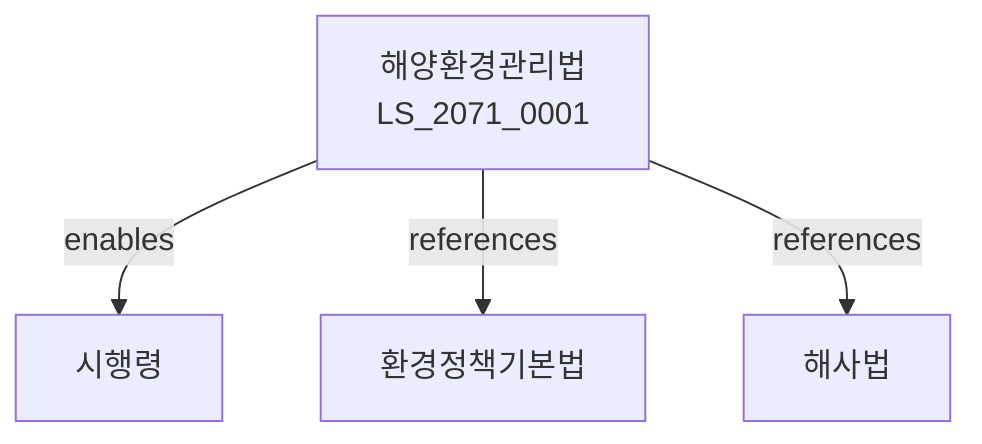

# 해양환경관리법

> [법률 제20130호, 2024. 1. 9., 일부개정]

---

---

## 제1장 총칙
### 제1조 (목적)
이 법은 해양오염을 방지하고 해양환경을 보전하여 국민건강과 해양생태계를 보호함을 목적으로 한다。

### 제2조 (정의)
이 법에서 사용하는 용어의 뜻은 다음과 같다。

1. "해양오염"이란 해양의 수질 또는 해양환경을 오염시키는 것을 말한다。
2. "배출원"이란 해양오염물질을 배출하는 시설을 말한다。
3. "오염물질"이란 해양을 오염시키는 물질을 말한다。
4. "해양보전구역"이란 해양환경보전을 위하여 지정하는 구역을 말한다。

---

## 제2장 해양환경기준
### 第5条(환경기준)
해양환경보전을 위한 기준을 정한다。
### 第6条(수질기준)
해양수질기준은 해양수산부령으로 정한다。
### 第7条(측정망)
해양환경측정망을 설치한다。
### 第8条(측정결과)
측정결과를 공개하여야 한다。

---

## 제3장 해양오염방지
### 第15条(배출규제)
오염물질의 해양배출을 규제한다。
### 第16条(기름오염방지)
선박으로 인한 기름오염을 방지한다。
### 第17条(폐기물투기금지)
해양에 폐기물을 투기하여서는 아니 된다。
### 第18条(오염방지시설)
오염배출시설에는 방지시설을 갖추어야 한다。

---

## 제4장 해양보전구역
### 第25条(지정)
해양보전구역을 지정할 수 있다。
### 第26条(행위제한)
해양보전구역 내에서의 행위를 제한할 수 있다。
### 第27条(관리계획)
해양보전구역관리계획을 수립한다。
### 第28条(보전조치)
해양보전을 위한 조치를 한다。

---

## 제5장 해양오염비상대응
### 第35条(비상계획)
해양오염비상대응계획을 수립한다。
### 第36条(오염신고)
해양오염 발생 시 신고하여야 한다。
### 第37条(방제조치)
해양오염 발생 시 방제조치를 한다。
### 第38条(방제비용)
방제비용은 오염원인자가 부담한다。

---

## 제6장 해양생태계보전
### 第42条(생태계조사)
해양생태계를 조사한다。
### 第43条(보전종)
해양생물 보전종을 지정할 수 있다。
### 第44条(서식지보호)
해양생물 서식지를 보호한다。
### 第45条(복원사업)
훼손된 해양생태계를 복원한다。

---

## 제7장 감독
### 第52条(감독)
해양수산부장관은 해양환경사업을 감독한다。
### 第53条(보고 및 검사)
필요한 경우 보고를 명하거나 검사할 수 있다。
### 第54条(시정명령)
위법한 사항에 대하여는 시정을 명할 수 있다。
### 第55条(조업정지)
중대한 위반사유가 있는 경우 조업정지를 명할 수 있다。

---

## 제8장 벌칙
### 第62条(벌칙)
다음 각 호의 어느 하나에 해당하는 자는 3년 이하의 징역 또는 3천만원 이하의 벌금에 처한다。

1. 해양에 유해물질을 배출한 자
2. 폐기물을 투기한 자
### 第63条(과태료)
다음 각 호의 어느 하나에 해당하는 자에게는 2천만원 이하의 과태료를 부과한다。

1. 보고를 하지 아니한 자
2. 검사를 거부한 자

---

## 관계 그래프

**상위 법령**
- [[헌법]] 제35조 (환경권)
- [[환경정책기본법]]

**관련 법령**
- [[해사법]]
- [[선박안전법]]
- [[자연환경보전법]]
- [[수질환경보전법]]

**하위 법령**
- [[해양환경관리법 시행령]]
