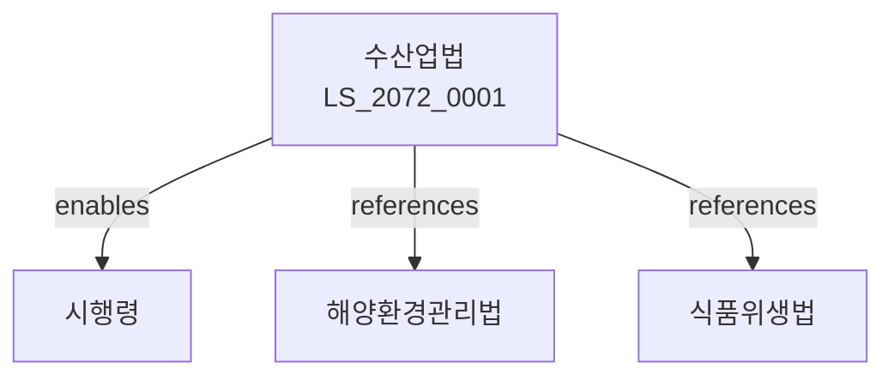

# 수산업법

> [법률 제20129호, 2024. 1. 9., 일부개정]

---

---

## 제1장 총칙
### 제1조 (목적)
이 법은 수산물의 안정적인 생산과 수산자원의 보호ㆍ육성을 도모함으로써 수산업의 건전한 발전과 국민영양의 향상에 이바지함을 목적으로 한다。

### 제2조 (정의)
이 법에서 사용하는 용어의 뜻은 다음과 같다。

1. "수산업"이란 어업 및 수산물의 가공ㆍ유통업을 말한다。
2. "어업"이란 수산동식물을 포획 또는 채취하는 사업을 말한다。
3. "수산물"이란 수산동식물 및 그 가공품을 말한다。
4. "어장"이란 어업을 영위하는 구역을 말한다。

---

## 제2장 어업의 종류
### 第5条(어업의 종류)
어업은 다음 각 호와 같이 구분한다。

1. 연근해어업
2. 원양어업
3. 내수면어업
4. 양식어업
### 第6条(연근해어업)
연근해어업은 면허를 받아야 한다。
### 第7条(원양어업)
원양어업은 허가를 받아야 한다。
### 第8条(양식어업)
양식어업은 신고 또는 면허를 받아야 한다。

---

## 제3장 어업면허
### 第15条(면허)
어업은 면허를 받아야 한다。
### 第16条(면허요건)
어업면허는 자격 등을 갖추어야 한다。
### 第17条(면허절차)
어업면허는 관할 시장ㆍ군수에게 신청한다。
### 第18条(면허기간)
어업면허기간은 5년으로 한다。

---

## 제4장 수산자원보호
### 第25条(자원보호)
수산자원을 보호하여야 한다。
### 第26条(체장제한)
일정 크기 이하의 수산동물을 포획하여서는 아니 된다。
### 第27条(포획금지기간)
수산자원보호를 위하여 포획을 금지하는 기간을 정할 수 있다。
### 第28条(포획금지구역)
수산자원보호를 위하여 포획을 금지하는 구역을 정할 수 있다。

---

## 제5장 수산물유통
### 第35条(유통구조)
수산물의 유통구조를 개선하여야 한다。
### 第36条(수산물시장)
수산물도매시장을 설치할 수 있다。
### 第37条(위탁판매)
수산물의 위탁판매를 할 수 있다。
### 第38条(가격안정)
수산물 가격을 안정시키기 위한 조치를 할 수 있다。

---

## 제6장 수산물품질
### 第42条(품질관리)
수산물의 품질을 관리한다。
### 第43条(품질인증)
수산물에 대한 품질인증을 할 수 있다。
### 第44条(표시)
수산물에는 품명 등을 표시하여야 한다。
### 第45条(위해수산물)
인체에 유해한 수산물을 판매하여서는 아니 된다。

---

## 제7장 수산업육성
### 第52条(육성시책)
국가는 수산업육성시책을 수립한다。
### 第53条(자금지원)
수산업에 대한 자금을 지원할 수 있다。
### 第54条(기술지도)
수산업에 대한 기술지도를 한다。
### 第55条(어촌계발)
어촌을 계발한다。

---

## 제8장 감독
### 第62条(감독)
해양수산부장관은 수산업사업을 감독한다。
### 第63条(보고 및 검사)
필요한 경우 보고를 명하거나 검사할 수 있다。
### 第64条(시정명령)
위법한 사항에 대하여는 시정을 명할 수 있다。
### 第65条(면허취소)
중대한 위반사유가 있는 경우 면허를 취소할 수 있다。

---

## 제9장 벌칙
### 第72条(벌칙)
다음 각 호의 어느 하나에 해당하는 자는 3년 이하의 징역 또는 3천만원 이하의 벌금에 처한다。

1. 면허 없이 어업을 영위한 자
2. 금지기간에 포획한 자
### 第73条(과태료)
다음 각 호의 어느 하나에 해당하는 자에게는 2천만원 이하의 과태료를 부과한다。

1. 보고를 하지 아니한 자
2. 검사를 거부한 자

---

## 관계 그래프

**상위 법령**
- [[헌법]] 제119조 (경제자유)
- [[해양환경관리법]]

**관련 법령**
- [[식품위생법]]
- [[해운법]]
- [[항만법]]
- [[농수산물품질관리법]]

**하위 법령**
- [[수산업법 시행령]]
