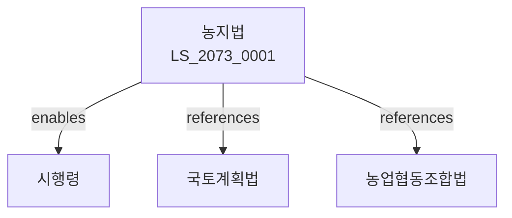

# 농지법

> [법률 제20133호, 2024. 1. 9., 일부개정]

---

---

## 제1장 총칙
### 제1조 (목적)
이 법은 농지의 소유ㆍ이용 및 보전에 관한 사항을 정함으로써 농업의 건전한 발전과 국민경제의 균형있는 성장에 이바지함을 목적으로 한다。

### 제2조 (정의)
이 법에서 사용하는 용어의 뜻은 다음과 같다.

1. "농지"란 농사를 짓는 토지를 말한다.
2. "농업인"이란 농업을 영위하는 자를 말한다.
3. "농업법인"이란 농업을 목적으로 설립된 법인을 말한다.
4. "농지전용"이란 농지를 농업 외의 용도로 사용하는 것을 말한다。

---

## 제2장 농지소유
### 第5条(농지소유)
농업인은 농지를 소유할 수 있다。
### 第6条(소유상한)
농지의 소유면적은 농업인의 영농규모를 고려하여 정한다。
### 第7条(소유이전)
농지의 소유권 이전은 신고하여야 한다。
### 第8条(공동소유)
농지는 공동으로 소유할 수 있다。

---

## 제3장 농지이용
### 第15条(농지이용계획)
농지의 효율적 이용을 위한 계획을 수립한다。
### 第16条(농지임대차)
농지를 임대하거나 차임할 수 있다。
### 第17条(농지위탁경영)
농지의 경영을 위탁할 수 있다。
### 第18条(농지교환)
농지를 교환할 수 있다。

---

## 제4장 농지보전
### 第25条(농지보전)
농지를 보전하여야 한다。
### 第26条(농업진흥지역)
농업진흥지역을 지정한다。
### 第27条(전용제한)
농업진흥지역 내 농지전용을 제한한다。
### 第28条(전용허가)
농지전용은 허가를 받아야 한다。

---

## 제5장 농지전용
### 第35条(전용신청)
농지전용을 신청할 수 있다。
### 第36条(전용심사)
농지전용 신청을 심사한다。
### 第37条(전용부과금)
농지전용에 대한 부과금을 징수한다。
### 第38条(대체농지)
농지전용 시 대체농지를 조성하여야 한다。

---

## 제6장 농지관리
### 第42条(관리대장)
농지관리대장을 작성한다。
### 第43条(조사)
농지의 실태를 조사한다。
### 第44条(통계)
농지관련 통계를 작성한다。
### 第45条(정보화)
농지정보화사업을 추진한다。

---

## 제7장 감독
### 第52条(감독)
농림축산식품부장관은 농지사업을 감독한다。
### 第53条(보고 및 검사)
필요한 경우 보고를 명하거나 검사할 수 있다。
### 第54条(시정명령)
위법한 사항에 대하여는 시정을 명할 수 있다。
### 第55条(원상회복)
불법전용 농지는 원상회복을 명할 수 있다。

---

## 제8장 벌칙
### 第62条(벌칙)
다음 각 호의 어느 하나에 해당하는 자는 3년 이하의 징역 또는 3천만원 이하의 벌금에 처한다.

1. 허가 없이 농지를 전용한 자
2. 허위로 농지소유이전신고를 한 자
### 第63条(과태료)
다음 각 호의 어느 하나에 해당하는 자에게는 2천만원 이하의 과태료를 부과한다.

1. 보고를 하지 아니한 자
2. 검사를 거부한 자

---

## 관계 그래프

**상위 법령**
- [[헌법]] 제121조 (농지의 소유)
- [[국토계획법]]

**관련 법령**
- [[농업협동조합법]]
- [[농어촌정비법]]
- [[농업기계화촉진법]]
- [[양곡관리법]]

**하위 법령**
- [[농지법 시행령]]
