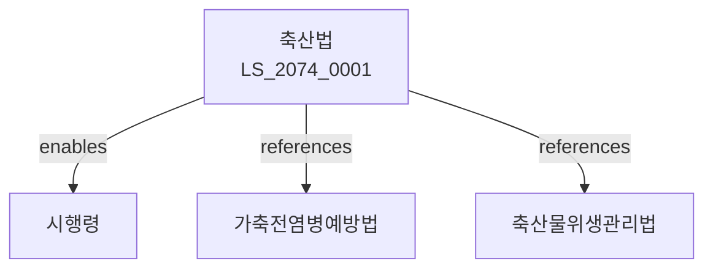

# 축산법

> [법률 제20134호, 2024. 1. 9., 일부개정]

---

---

## 제1장 총칙
### 제1조 (목적)
이 법은 축산물의 안정적인 생산과 축산의 건전한 발전을 도모함으로써 국민영양의 향상과 농촌경제의 발전에 이바지함을 목적으로 한다。

### 제2조 (정의)
이 법에서 사용하는 용어의 뜻은 다음과 같다。

1. "축산"이란 가축을 사육하는 사업을 말한다。
2. "가축"이란 소ㆍ돼지ㆍ닭 등 농가에서 사육하는 동물을 말한다。
3. "축산물"이란 가축 및 그 생산물을 말한다。
4. "축사"란 가축을 사육하는 시설을 말한다。

---

## 제2장 축산기본
### 第5条(축산진흥)
국가는 축산진흥시책을 수립한다。
### 第6条(축종)
가축의 종류는 대통령령으로 정한다。
### 第7条(사육기준)
가축의 사육기준을 정한다。
### 第8条(축산단지)
축산단지를 조성할 수 있다。

---

## 제3장 가축개량
### 第15条(개량목표)
가축개량목표를 설정한다。
### 第16条(종축등록)
종축을 등록한다。
### 第17条(인공수정)
인공수정사업을 실시한다。
### 第18条(정자은행)
가축정자은행을 설치할 수 있다。

---

## 제4장 사료관리
### 第25条(사료)
사료의 품질기준을 정한다。
### 第26条(사료제조)
사료제조업은 등록하여야 한다。
### 第27条(사료검사)
사료에 대한 검사를 실시한다。
### 第28条(유해사료)
유해한 사료를 제조ㆍ판매하여서는 아니 된다。

---

## 제5장 축산물유통
### 第35条(유통구조)
축산물의 유통구조를 개선한다。
### 第36条(축산물시장)
축산물시장을 설치할 수 있다。
### 第37条(위탁판매)
축산물의 위탁판매를 할 수 있다。
### 第38条(가격안정)
축산물 가격을 안정시키기 위한 조치를 한다。

---

## 제6장 축산환경
### 第42条(환경보전)
축산으로 인한 환경오염을 방지한다。
### 第43条(분뇨처리)
축산분뇨를 적정 처리하여야 한다。
### 第44条(악취방지)
축사에서의 악취를 방지하여야 한다。
### 第45条(환경영향평가)
대규모 축사는 환경영향평가를 받아야 한다。

---

## 제7장 감독
### 第52条(감독)
농림축산식품부장관은 축산사업을 감독한다。
### 第53条(보고 및 검사)
필요한 경우 보고를 명하거나 검사할 수 있다。
### 第54条(시정명령)
위법한 사항에 대하여는 시정을 명할 수 있다。
### 第55条(사업정지)
중대한 위반사유가 있는 경우 사업정지를 명할 수 있다。

---

## 제8장 벌칙
### 第62条(벌칙)
다음 각 호의 어느 하나에 해당하는 자는 3년 이하의 징역 또는 3천만원 이하의 벌금에 처한다。

1. 유해사료를 제조ㆍ판매한 자
2. 등록 없이 사료제조업을 영위한 자
### 第63条(과태료)
다음 각 호의 어느 하나에 해당하는 자에게는 2천만원 이하의 과태료를 부과한다。

1. 보고를 하지 아니한 자
2. 검사를 거부한 자

---

## 관계 그래프

**상위 법령**
- [[헌법]] 제119조 (경제자유)
- [[가축전염병예방법]]

**관련 법령**
- [[축산물위생관리법]]
- [[사료관리법]]
- [[농지법]]
- [[환경보전법]]

**하위 법령**
- [[축산법 시행령]]
