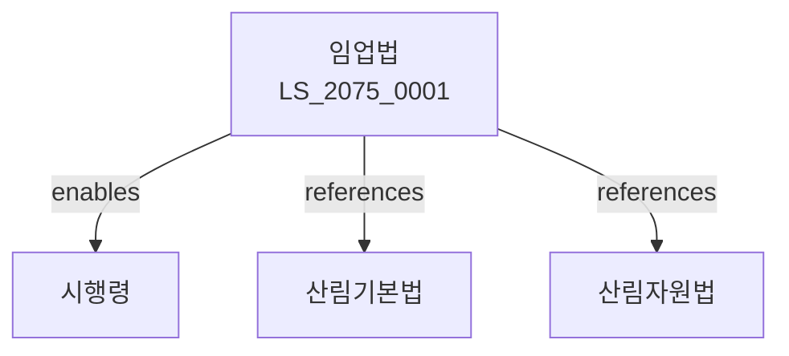

# 임업법

> [법률 제20135호, 2024. 1. 9., 일부개정]

---

---

## 제1장 총칙
### 제1조 (목적)
이 법은 산림자원의 육성과 임업의 건전한 발전을 도모함으로써 국토보전과 국민경제의 발전에 이바지함을 목적으로 한다。

### 제2조 (정의)
이 법에서 사용하는 용어의 뜻은 다음과 같다。

1. "임업"이란 산림을 경영하는 사업을 말한다。
2. "산림"이란 나무가 모여 있는 땅을 말한다。
3. "임산물"이란 산림에서 생산되는 물품을 말한다。
4. "조림"이란 나무를 심는 것을 말한다。

---

## 제2장 산림자원
### 第5条(산림육성)
산림자원을 육성한다。
### 第6条(조림사업)
조림사업을 실시한다。
### 第7条(벌채)
벌채는 허가를 받아야 한다。
### 第8条(보호림)
보호림을 지정할 수 있다。

---

## 제3장 임산물유통
### 第15条(유통구조)
임산물의 유통구조를 개선한다。
### 第16条(임산물시장)
임산물시장을 설치할 수 있다。
### 第17条(품질인증)
임산물에 대한 품질인증을 할 수 있다。
### 第18条(가격안정)
임산물 가격을 안정시키기 위한 조치를 한다。

---

## 제4장 임도
### 第25条(임도설치)
임도를 설치할 수 있다。
### 第26条(임도기준)
임도의 설치기준을 정한다。
### 第27条(유지관리)
임도를 유지관리하여야 한다。
### 第28条(임도이용)
임도를 공용할 수 있다。

---

## 제5장 산림보호
### 第35条(산불방지)
산불을 예방하고 진화한다。
### 第36条(병해충방제)
산림병해충을 방제한다。
### 第37条(산림훼손방지)
산림훼손을 방지한다。
### 第38条(휴양림)
휴양림을 조성할 수 있다。

---

## 제6장 임업육성
### 第42条(육성시책)
임업육성시책을 수립한다。
### 第43条(자금지원)
임업에 대한 자금을 지원할 수 있다。
### 第44条(기술지도)
임업에 대한 기술지도를 한다。
### 第45条(산림조합)
산림조합을 육성한다。

---

## 제7장 감독
### 第52条(감독)
산림청장은 임업사업을 감독한다。
### 第53条(보고 및 검사)
필요한 경우 보고를 명하거나 검사할 수 있다。
### 第54条(시정명령)
위법한 사항에 대하여는 시정을 명할 수 있다。
### 第55条(복구명령)
산림훼손 시 복구를 명할 수 있다。

---

## 제8장 벌칙
### 第62条(벌칙)
다음 각 호의 어느 하나에 해당하는 자는 3년 이하의 징역 또는 3천만원 이하의 벌금에 처한다。

1. 허가 없이 벌채한 자
2. 산림을 훼손한 자
### 第63条(과태료)
다음 각 호의 어느 하나에 해당하는 자에게는 2천만원 이하의 과태료를 부과한다。

1. 보고를 하지 아니한 자
2. 검사를 거부한 자

---

## 관계 그래프

**상위 법령**
- [[헌법]] 제120조 (국토의 보전)
- [[산림기본법]]

**관련 법령**
- [[산림자원법]]
- [[산림보호법]]
- [[자연환경보전법]]
- [[국토계획법]]

**하위 법령**
- [[임업법 시행령]]
