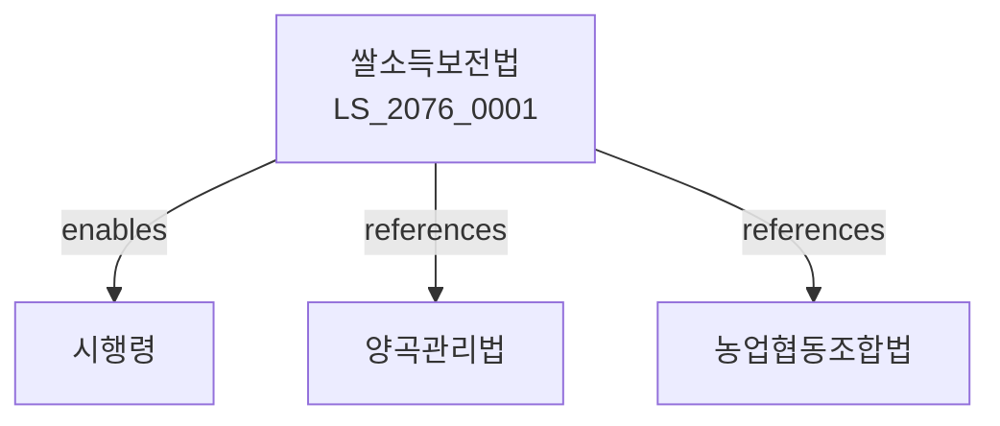

# 쌀소득보전 등에 관한 법률

> [법률 제20136호, 2024. 1. 9., 일부개정]

---

---

## 제1장 총칙
### 제1조 (목적)
이 법은 쌀 농가의 소득안정을 도모하고 쌀 산업의 건전한 발전에 이바지함을 목적으로 한다。

### 제2조 (정의)
이 법에서 사용하는 용어의 뜻은 다음과 같다。

1. "쌀"이란 벼를 탈곡ㆍ도정한 것을 말한다。
2. "쌀 농가"란 쌀을 생산하는 농가를 말한다。
3. "소득보전"이란 쌀 농가의 소득감소를 보전하는 것을 말한다。
4. "기준가격"이란 소득보전의 기준이 되는 가격을 말한다。

---

## 제2장 소득보전
### 第5条(소득보전)
쌀 농가의 소득감소를 보전한다。
### 第6条(보전대상)
소득보전의 대상은 쌀 농가로 한다。
### 第7条(보전기준)
소득보전의 기준은 기준가격과 산출가격의 차액으로 한다。
### 第8条(보전한도)
소득보전의 한도를 정한다。

---

## 제3장 기준가격
### 第15条(기준가격)
기준가격은 농림축산식품부령으로 정한다。
### 第16条(산출가격)
산출가격은 조사ㆍ산출한다。
### 第17条(가격공표)
기준가격 및 산출가격을 공표한다。
### 第18条(가격조사)
쌀 가격을 조사한다。

---

## 제4장 보전금지급
### 第25条(보전금)
소득보전금을 지급한다。
### 第26条(신청)
보전금 지급을 신청한다。
### 第27条(심사)
보전금 지급을 심사한다。
### 第28条(지급)
보전금을 지급한다。

---

## 제5장 재원조달
### 第35条(재원)
소득보전재원을 확보한다。
### 第36条(예산)
소득보전예산을 편성한다。
### 第37条(기금)
쌀소득보전기금을 설치할 수 있다。
### 第38条(운용)
기금을 적정하게 운용한다。

---

## 제6장 감독
### 第42条(감독)
농림축산식품부장관은 소득보전사업을 감독한다。
### 第43条(보고 및 검사)
필요한 경우 보고를 명하거나 검사할 수 있다。
### 第44条(시정명령)
위법한 사항에 대하여는 시정을 명할 수 있다。
### 第45条(환수)
부당하게 지급된 보전금을 환수할 수 있다。

---

## 제7장 벌칙
### 第52条(벌칙)
다음 각 호의 어느 하나에 해당하는 자는 2년 이하의 징역 또는 2천만원 이하의 벌금에 처한다。

1. 허위로 보전금을 지급받은 자
2. 보전금을 부당하게 사용한 자
### 第63条(과태료)
다음 각 호의 어느 하나에 해당하는 자에게는 1천만원 이하의 과태료를 부과한다。

1. 보고를 하지 아니한 자
2. 검사를 거부한 자

---

## 관계 그래프

**상위 법령**
- [[헌법]] 제119조 (경제자유)
- [[양곡관리법]]

**관련 법령**
- [[농업협동조합법]]
- [[농어촌구조개선특별조치법]]
- [[농지법]]
- [[농업기본법]]

**하위 법령**
- [[쌀소득보전법 시행령]]
