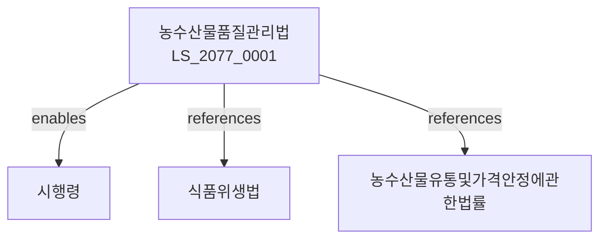

# 농수산물품질관리법

> [법률 제20137호, 2024. 1. 9., 일부개정]

---

---

## 제1장 총칙
### 제1조 (목적)
이 법은 농수산물의 품질향상과 유통질서 확립을 도모함으로써 농어업인의 소득증대와 소비자 보호에 이바지함을 목적으로 한다。

### 제2조 (정의)
이 법에서 사용하는 용어의 뜻은 다음과 같다。

1. "농수산물"이란 농산물ㆍ임산물ㆍ축산물 및 수산물을 말한다。
2. "품질인증"이란 농수산물의 품질을 인증하는 것을 말한다。
3. "표시"이란 농수산물의 품명 등을 표시하는 것을 말한다。
4. "유기농산물"이란 유기합성농약을 사용하지 아니하고 생산한 농산물을 말한다。

---

## 제2장 품질기준
### 第5条(품질기준)
농수산물의 품질기준을 정한다。
### 第6条(등급구분)
농수산물의 등급을 구분한다。
### 第7条(규격포장)
농수산물의 규격포장을 권장한다。
### 第8条(품질검사)
농수산물에 대한 품질검사를 실시한다。

---

## 제3장 품질인증
### 第15条(인증제도)
농수산물품질인증제도를 운영한다。
### 第16条(인증신청)
품질인증을 신청할 수 있다。
### 第17条(인증심사)
품질인증신청을 심사한다。
### 第18条(인증마크)
인증받은 농수산물에 인증마크를 부착한다。

---

## 제4장 유기농업
### 第25条(유기농산물)
유기농산물의 인증을 한다。
### 第26条(친환경농산물)
친환경농산물의 인증을 한다。
### 第27条(재배기준)
유기농산물의 재배기준을 정한다。
### 第28条(유통관리)
유기농산물의 유통을 관리한다。

---

## 제5장 원산지표시
### 第35条(원산지표시)
농수산물의 원산지를 표시하여야 한다。
### 第36条(표시방법)
원산지표시의 방법을 정한다。
### 第37条(표시검사)
원산지표시에 대한 검사를 실시한다。
### 第38条(위반조치)
원산지표시 위반 시 조치를 한다。

---

## 제6장 감독
### 第45条(감독)
농림축산식품부장관은 품질관리사업을 감독한다。
### 第46条(보고 및 검사)
필요한 경우 보고를 명하거나 검사할 수 있다。
### 第47条(시정명령)
위법한 사항에 대하여는 시정을 명할 수 있다。
### 第48条(인증취소)
중대한 위반사유가 있는 경우 인증을 취소할 수 있다。

---

## 제7장 벌칙
### 第52条(벌칙)
다음 각 호의 어느 하나에 해당하는 자는 3년 이하의 징역 또는 3천만원 이하의 벌금에 처한다.

1. 원산지를 허위로 표시한 자
2. 인증마크를 부정하게 사용한 자
### 第53条(과태료)
다음 각 호의 어느 하나에 해당하는 자에게는 2천만원 이하의 과태료를 부과한다.

1. 보고를 하지 아니한 자
2. 검사를 거부한 자

---

## 관계 그래프

**상위 법령**
- [[헌법]] 제119조 (경제자유)
- [[식품위생법]]

**관련 법령**
- [[농수산물유통및가격안정에관한법률]]
- [[축산물위생관리법]]
- [[수산업법]]
- [[농약관리법]]

**하위 법령**
- [[농수산물품질관리법 시행령]]
