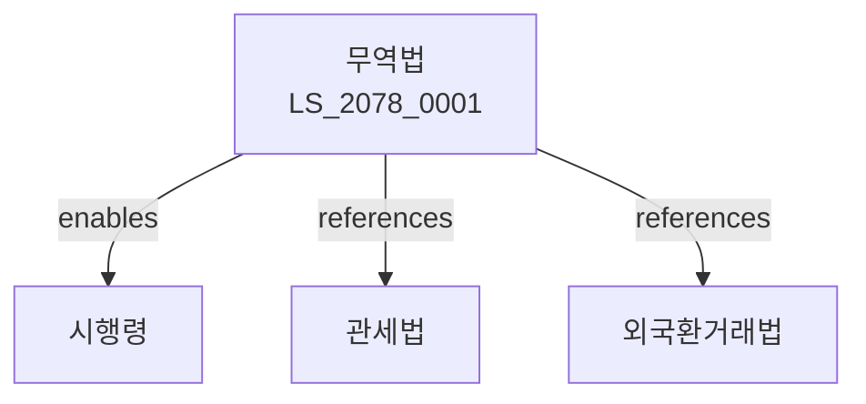

# 무역법

> [법률 제20138호, 2024. 1. 9., 일부개정]

---

---

## 제1장 총칙
### 제1조 (목적)
이 법은 무역을 자유롭고 공정하게 함으로써 국제무역의 질서를 확립하고 대외무역의 건전한 발전에 이바지함을 목적으로 한다。

### 제2조 (정의)
이 법에서 사용하는 용어의 뜻은 다음과 같다。

1. "무역"이란 물품의 수출ㆍ수입을 말한다。
2. "수출"이란 물품을 외국으로 반출하는 것을 말한다。
3. "수입"이란 물품을 외국으로부터 반입하는 것을 말한다。
4. "무역업"이란 무역을 업으로 하는 것을 말한다。

---

## 제2장 무역업
### 第5条(무역업신고)
무역업을 하려는 자는 신고하여야 한다。
### 第6条(신고요건)
무역업신고요건은 산업통상자원부령으로 정한다。
### 第7条(신고절차)
무역업신고는 산업통상자원부에 신청한다。
### 第8条(변경신고)
신고사항을 변경한 경우 신고하여야 한다。

---

## 제3장 수출입관리
### 第15条(수출입승인)
전략물자의 수출은 승인을 받아야 한다。
### 第16条(수출입제한)
국가안보 등을 위하여 수출입을 제한할 수 있다。
### 第17条(원산지표시)
수입물품의 원산지를 표시하여야 한다。
### 第18条(통계)
무역통계를 작성한다。

---

## 제4장 무역보안
### 第25条(전략물자)
전략물자의 수출을 관리한다。
### 第26条(수출허가)
전략물자의 수출은 허가를 받아야 한다。
### 第27条(수출심사)
전략물자 수출을 심사한다。
### 第28条(위해물자)
국가안보에 유해한 물자의 수출을 금지한다。

---

## 제5장 무역분쟁
### 第35条(분쟁조정)
무역분쟁을 조정할 수 있다。
### 第36条(분쟁신청)
무역분쟁조정을 신청할 수 있다。
### 第37条(조정절차)
무역분쟁조정절차를 정한다。
### 第38条(조정결과)
조정결과를 통보한다。

---

## 제6장 무역진흥
### 第42条(진흥시책)
무역진흥시책을 수립한다。
### 第43条(수출지원)
수출기업을 지원할 수 있다。
### 第44条(해외시장)
해외시장을 개척한다。
### 第45条(무역금융)
무역금융을 지원할 수 있다。

---

## 제7장 감독
### 第52条(감독)
산업통상자원부장관은 무역사업을 감독한다。
### 第53条(보고 및 검사)
필요한 경우 보고를 명하거나 검사할 수 있다。
### 第54条(시정명령)
위법한 사항에 대하여는 시정을 명할 수 있다。
### 第55条(업무정지)
중대한 위반사유가 있는 경우 업무정지를 명할 수 있다。

---

## 제8장 벌칙
### 第62条(벌칙)
다음 각 호의 어느 하나에 해당하는 자는 3년 이하의 징역 또는 3천만원 이하의 벌금에 처한다。

1. 허가 없이 전략물자를 수출한 자
2. 무역업신고 없이 무역업을 영위한 자
### 第63条(과태료)
다음 각 호의 어느 하나에 해당하는 자에게는 2천만원 이하의 과태료를 부과한다。

1. 보고를 하지 아니한 자
2. 검사를 거부한 자

---

## 관계 그래프

**상위 법령**
- [[헌법]] 제119조 (경제자유)
- [[대외무역법]]

**관련 법령**
- [[관세법]]
- [[외국환거래법]]
- [[외국인투자촉진법]]
- [[자유무역지역법]]

**하위 법령**
- [[무역법 시행령]]
