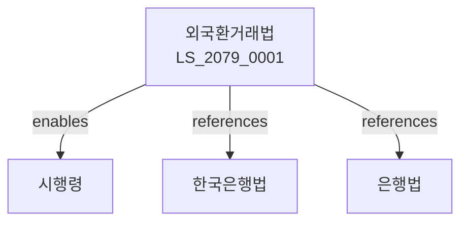

# 외국환거래법

> [법률 제20139호, 2024. 1. 9., 일부개정]

---

---

## 제1장 총칙
### 제1조 (목적)
이 법은 외국환거래 및 대외지급수단의 자유화를 도모하고 국제수지의 균형과 원화가치의 안정에 이바지함을 목적으로 한다。

### 제2조 (정의)
이 법에서 사용하는 용어의 뜻은 다음과 같다。

1. "외국환"이란 대외지급수단을 말한다。
2. "외국환거래"란 외국환의 매매ㆍ교환 등을 말한다。
3. "대외지급수단"이란 외국통화ㆍ외화증권 등을 말한다。
4. "자본거래"란 외국환의 매매ㆍ예치 등을 말한다。

---

## 제2장 외국환업무
### 第5条(외국환업무)
외국환업무는 등록한 자가 할 수 있다。
### 第6条(등록)
외국환업무 등록은 기획재정부에 신청한다。
### 第7条(등록요건)
외국환업무 등록요건을 정한다。
### 第8条(영업기준)
외국환업무 영업기준을 준수하여야 한다。

---

## 제3장 외국환거래
### 第15条(거래자유)
외국환거래는 자유로이 할 수 있다。
### 第16条(거래신고)
일정 외국환거래는 신고하여야 한다。
### 第17条(거래승인)
자본거래는 승인을 받아야 한다。
### 第18条(거래제한)
국가안보 등을 위하여 거래를 제한할 수 있다。

---

## 제4장 자본거래
### 第25条(자본거래)
자본거래는 신고 또는 승인을 받아야 한다。
### 第26条(해외투자)
해외투자는 신고하여야 한다。
### 第27条(외화채권)
외화채권의 회수를 관리한다。
### 第28条(외화채무)
외화채무의 상환을 관리한다。

---

## 제5장 국제수지
### 第35条(국제수지)
국제수지통계를 작성한다。
### 第36条(외환보유고)
외환보유고를 관리한다。
### 第37条(환율안정)
환율을 안정시키기 위한 조치를 한다。
### 第38条(긴급조치)
국제수지 악화 시 긴급조치를 할 수 있다。

---

## 제6장 감독
### 第45条(감독)
기획재정부장관은 외국환사업을 감독한다。
### 第46条(보고 및 검사)
필요한 경우 보고를 명하거나 검사할 수 있다。
### 第47条(시정명령)
위법한 사항에 대하여는 시정을 명할 수 있다。
### 第48条(업무정지)
중대한 위반사유가 있는 경우 업무정지를 명할 수 있다。

---

## 제7장 보칙
### 第52条(한국은행)
한국은행은 외국환업무를 수행할 수 있다。
### 第53条(외국환중개)
외국환중개업무를 할 수 있다。
### 第54条(보호)
외국환거래의 비밀을 보호한다。
### 第55条(협력)
관련기관과 협력한다。

---

## 제8장 벌칙
### 第62条(벌칙)
다음 각 호의 어느 하나에 해당하는 자는 3년 이하의 징역 또는 3천만원 이하의 벌금에 처한다。

1. 등록 없이 외국환업무를 영위한 자
2. 허위로 신고 또는 승인을 받은 자
### 第63条(과태료)
다음 각 호의 어느 하나에 해당하는 자에게는 2천만원 이하의 과태료를 부과한다。

1. 보고를 하지 아니한 자
2. 검사를 거부한 자

---

## 관계 그래프

**상위 법령**
- [[헌법]] 제119조 (경제자유)
- [[한국은행법]]

**관련 법령**
- [[은행법]]
- [[무역법]]
- [[자본시장법]]
- [[외국인투자촉진법]]

**하위 법령**
- [[외국환거래법 시행령]]
