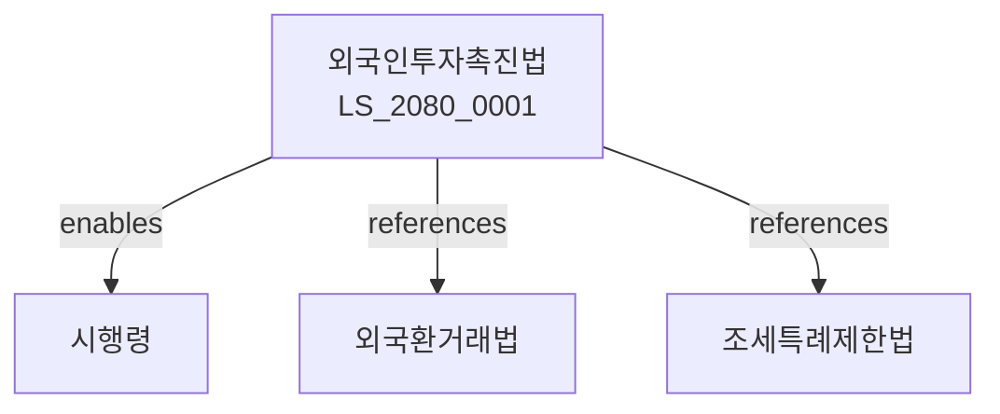

# 외국인투자촉진법

> [법률 제20140호, 2024. 1. 9., 일부개정]

---

---

## 제1장 총칙
### 제1조 (목적)
이 법은 외국인의 대한투자를 촉진하고 외국인투자기업의 경영활동을 지원함으로써 국민경제의 건전한 발전에 이바지함을 목적으로 한다。

### 제2조 (정의)
이 법에서 사용하는 용어의 뜻은 다음과 같다。

1. "외국인"이란 외국국적을 가진 자를 말한다。
2. "외국인투자"란 외국인이 대한투자를 하는 것을 말한다。
3. "외국인투자기업"이란 외국인이 투자한 기업을 말한다。
4. "출자"란 현금ㆍ현물 등으로 투자하는 것을 말한다。

---

## 제2장 외국인투자
### 第5条(외국인투자)
외국인은 대한투자를 할 수 있다。
### 第6条(투자신고)
외국인투자는 신고하여야 한다。
### 第7条(투자등록)
외국인투자를 등록한다。
### 第8条(투자변경)
투자내용을 변경한 경우 신고하여야 한다。

---

## 제3장 투자절차
### 第15条(투자신청)
외국인투자신청을 할 수 있다。
### 第16条(투자승인)
외국인투자를 승인한다。
### 第17条(투자완료)
투자완료를 신고하여야 한다。
### 第18条(투자철회)
투자를 철회할 수 있다。

---

## 제4장 투자지원
### 第25条(조세지원)
외국인투자기업에 조세지원을 할 수 있다。
### 第26条(임대지원)
국유지를 임대할 수 있다。
### 第27条(인력지원)
인력을 지원할 수 있다。
### 第28条(자금지원)
자금을 지원할 수 있다。

---

## 제5장 외국인투자지역
### 第35条(지정)
외국인투자지역을 지정할 수 있다。
### 第36条(입주)
외국인투자지역에 입주할 수 있다。
### 第37条(지원)
입주기업을 지원한다。
### 第38条(관리)
외국인투자지역을 관리한다。

---

## 제6장 기술도입
### 第42条(기술도입)
외국인투자와 관련된 기술을 도입할 수 있다。
### 第43条(기술계약)
기술도입계약을 체결할 수 있다。
### 第44条(기술료)
기술사용료를 지급할 수 있다。
### 第45条(기술이전)
기술이전을 촉진한다。

---

## 제7장 감독
### 第52条(감독)
산업통상자원부장관은 외국인투자사업을 감독한다。
### 第53条(보고 및 검사)
필요한 경우 보고를 명하거나 검사할 수 있다。
### 第54条(시정명령)
위법한 사항에 대하여는 시정을 명할 수 있다。
### 第55条(등록취소)
중대한 위반사유가 있는 경우 등록을 취소할 수 있다。

---

## 제8장 벌칙
### 第62条(벌칙)
다음 각 호의 어느 하나에 해당하는 자는 2년 이하의 징역 또는 2천만원 이하의 벌금에 처한다。

1. 허위로 외국인투자신고를 한 자
2. 지원금을 부당하게 사용한 자
### 第63条(과태료)
다음 각 호의 어느 하나에 해당하는 자에게는 1천만원 이하의 과태료를 부과한다。

1. 보고를 하지 아니한 자
2. 검사를 거부한 자

---

## 관계 그래프

**상위 법령**
- [[헌법]] 제119조 (경제자유)
- [[외국환거래법]]

**관련 법령**
- [[조세특례제한법]]
- [[자유무역지역법]]
- [[무역법]]
- [[상법]]

**하위 법령**
- [[외국인투자촉진법 시행령]]
