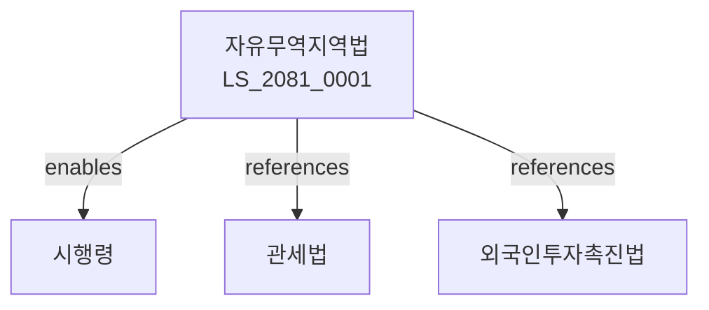

# 자유무역지역의 지정 및 운영에 관한 법률

> [법률 제20141호, 2024. 1. 9., 일부개정]

---

---

## 제1장 총칙
### 제1조 (목적)
이 법은 자유무역지역을 지정ㆍ운영함으로써 수출진흥과 외국인투자 유치에 이바지함을 목적으로 한다。

### 제2조 (정의)
이 법에서 사용하는 용어의 뜻은 다음과 같다。

1. "자유무역지역"이란 관세 등이 면제되는 특수지역을 말한다。
2. "입주기업"이란 자유무역지역에 입주한 기업을 말한다。
3. "지역관리기관"이란 자유무역지역을 관리하는 기관을 말한다。
4. "반입물품"이란 자유무역지역에 반입되는 물품을 말한다。

---

## 제2장 지정 및 운영
### 第5条(지정)
자유무역지역을 지정할 수 있다。
### 第6条(지정요건)
자유무역지역의 지정요건을 정한다。
### 第7条(지정절차)
자유무역지역 지정절차를 정한다。
### 第8条(지정해제)
자유무역지역을 해제할 수 있다。

---

## 제3장 입주 및 운영
### 第15条(입주신청)
자유무역지역에 입주를 신청할 수 있다。
### 第16条(입주승인)
입주신청을 승인한다。
### 第17条(입주계약)
입주계약을 체결한다。
### 第18条(임대료)
임대료를 납부하여야 한다。

---

## 제4장 관세등면제
### 第25条(관세면제)
반입물품에 관세를 면제한다。
### 第26条(부가세면제)
반입물품에 부가가치세를 면제한다。
### 第27条(특소세면제)
반입물품에 개별소비세를 면제한다。
### 第28条(반출신고)
국내로 반출 시 신고하여야 한다。

---

## 제5장 행정지원
### 第35条(원스톱서비스)
행정서비스를 원스톱으로 제공한다。
### 第36条(인허가)
입주기업의 인허가를 간소화한다。
### 第37条(기술지원)
입주기업에 기술지원을 한다。
### 第38条(자금지원)
입주기업에 자금지원을 할 수 있다。

---

## 제6장 관리
### 第42条(관리기관)
자유무역지역관리기관을 둔다。
### 第43条(관리업무)
관리기관의 업무를 정한다。
### 第44条(관리비)
관리비를 징수할 수 있다。
### 第45条(시설유지)
시설을 유지관리하여야 한다。

---

## 제7장 감독
### 第52条(감독)
산업통상자원부장관은 자유무역지역사업을 감독한다。
### 第53条(보고 및 검사)
필요한 경우 보고를 명하거나 검사할 수 있다。
### 第54条(시정명령)
위법한 사항에 대하여는 시정을 명할 수 있다。
### 第55条(입주취소)
중대한 위반사유가 있는 경우 입주승인을 취소할 수 있다。

---

## 제8장 벌칙
### 第62条(벌칙)
다음 각 호의 어느 하나에 해당하는 자는 3년 이하의 징역 또는 3천만원 이하의 벌금에 처한다。

1. 허위로 입주승인을 받은 자
2. 면제물품을 부당하게 반출한 자
### 第63条(과태료)
다음 각 호의 어느 하나에 해당하는 자에게는 2천만원 이하의 과태료를 부과한다。

1. 보고를 하지 아니한 자
2. 검사를 거부한 자

---

## 관계 그래프

**상위 법령**
- [[헌법]] 제119조 (경제자유)
- [[관세법]]

**관련 법령**
- [[외국인투자촉진법]]
- [[무역법]]
- [[항만법]]
- [[공업단지법]]

**하위 법령**
- [[자유무역지역법 시행령]]
