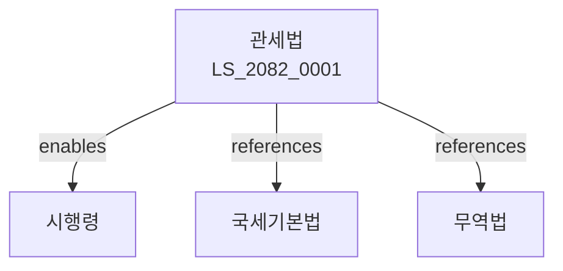

# 관세법

> [법률 제20142호, 2024. 1. 9., 일부개정]

---

---

## 제1장 총칙
### 제1조 (목적)
이 법은 관세의 부과ㆍ징수 및 통관에 관한 사항을 정함으로써 국가재정수입에 이바지함을 목적으로 한다。

### 제2조 (정의)
이 법에서 사용하는 용어의 뜻은 다음과 같다。

1. "관세"란 수입물품에 부과하는 세금을 말한다。
2. "통관"이란 수출입물품에 대한 세관절차를 말한다。
3. "수입자"란 물품을 수입하는 자를 말한다。
4. "과세가격"이란 관세부과의 기준이 되는 가격을 말한다。

---

## 제2장 과세표준
### 第5条(과세가격)
관세의 과세가격은 수입물품의 거래가격으로 한다。
### 第6条(거래가격)
거래가격은 실제 지급된 가격으로 한다。
### 第7条(가산요소)
과세가격에 포함할 요소를 정한다。
### 第8条(감액요소)
과세가격에서 공제할 요소를 정한다。

---

## 제3장 관세율
### 第15条(관세율)
관세율은 관세법에 따른다。
### 第16条(기본관세율)
기본관세율을 정한다。
### 第17条(협정관세율)
협정관세율을 적용할 수 있다。
### 第18条(특혜관세율)
특혜관세율을 적용할 수 있다。

---

## 제4장 관세부과
### 第25条(부과)
관세를 부과한다。
### 第26条(신고납부)
관세는 신고납부하여야 한다。
### 第27条(수정신고)
관세신고를 수정할 수 있다。
### 第28条(경정)
관세를 경정할 수 있다。

---

## 제5장 통관
### 第35条(수입신고)
수입물품은 신고하여야 한다。
### 第36条(수출신고)
수출물품은 신고하여야 한다。
### 第37条(심사)
통관심사를 실시한다。
### 第38条(방적)
통관방적을 실시한다。

---

## 제6장 관세감면
### 第45条(감면)
관세를 감면할 수 있다。
### 第46条(면제)
관세를 면제할 수 있다。
### 第47条(환급)
관세를 환급할 수 있다。
### 第48条(분할납부)
관세를 분할납부할 수 있다。

---

## 제7장 보안관리
### 第55条(보안)
통관보안을 관리한다。
### 第56条(마약단속)
마약밀수를 단속한다。
### 第57条(지적재산권)
지적재산권 침해물품을 단속한다。
### 第58条(환경범죄)
환경범죄 관련물품을 단속한다。

---

## 제8장 감독
### 第65条(감독)
관세청장은 관세사업을 감독한다。
### 第66条(보고 및 검사)
필요한 경우 보고를 명하거나 검사할 수 있다。
### 第67条(시정명령)
위법한 사항에 대하여는 시정을 명할 수 있다。
### 第68条(운영정지)
중대한 위반사유가 있는 경우 운영정지를 명할 수 있다。

---

## 제9장 벌칙
### 第75条(벌칙)
다음 각 호의 어느 하나에 해당하는 자는 3년 이하의 징역 또는 관세액의 5배, 원가 중 높은 금액 이하의 벌금에 처한다。

1. 허위로 통관신고를 한 자
2. 밀수를 한 자
### 第76条(과태료)
다음 각 호의 어느 하나에 해당하는 자에게는 2천만원 이하의 과태료를 부과한다。

1. 보고를 하지 아니한 자
2. 검사를 거부한 자

---

## 관계 그래프

**상위 법령**
- [[헌법]] 제119조 (경제자유)
- [[국세기본법]]

**관련 법령**
- [[무역법]]
- [[자유무역지역법]]
- [[부가가치세법]]
- [[항만법]]

**하위 법령**
- [[관세법 시행령]]
