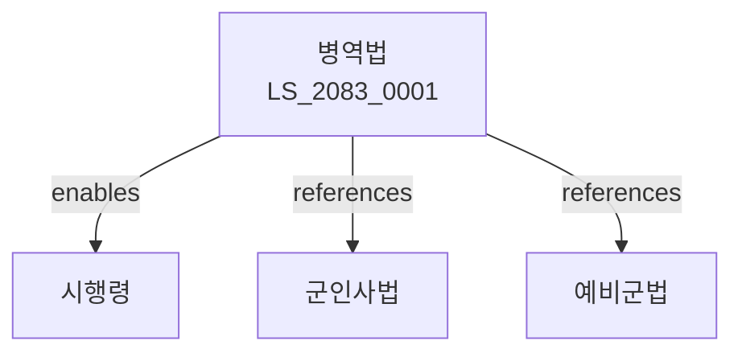

# 병역법

> [법률 제20143호, 2024. 1. 9., 일부개정]

---

---

## 제1장 총칙
### 제1조 (목적)
이 법은 국민의 병역의무와 그 이행에 관한 사항을 정함으로써 국방의 의무를 수행함을 목적으로 한다。

### 제2조 (정의)
이 법에서 사용하는 용어의 뜻은 다음과 같다。

1. "병역의무"란 국방을 위하여 국민이 부담하는 의무를 말한다。
2. "현역"이란 군에 복무하는 자를 말한다。
3. "예비역"이란 현역을 마친 자를 말한다。
4. "보충역"이란 현역에 이어 보충하는 병역을 말한다。

---

## 제2장 병역의무
### 第5条(병역의무)
대한민국 국민은 병역의무를 진다。
### 第6条(병역판정)
병역판정검사를 실시한다。
### 第7条(징병검사)
징병검사를 실시한다。
### 第8条(병역처분)
병역처분을 한다。

---

## 제3장 현역병
### 第15条(현역입영)
현역병으로 입영한다。
### 第16条(복무기간)
현역병의 복무기간은 법률로 정한다。
### 第17条(복무의무)
현역병은 성실히 복무하여야 한다。
### 第18条(전역)
복무기간이 만료되면 전역한다。

---

## 제4장 전환복무
### 第25条(사회복무요원)
사회복무요원으로 복무할 수 있다。
### 第26条(예술체육요원)
예술체육요원으로 복무할 수 있다。
### 第27条(공중보건의)
공중보건의사로 복무할 수 있다。
### 第28条(전문연구요원)
전문연구요원으로 복무할 수 있다。

---

## 제5장 병역면제
### 第35条(면제)
병역의무를 면제할 수 있다。
### 第36条(면제사유)
면제사유를 정한다。
### 第37条(면제처분)
면제처분을 한다。
### 第38条(면제취소)
면제를 취소할 수 있다。

---

## 제6장 병역처분변경
### 第42条(처분변경)
병역처분을 변경할 수 있다。
### 第43条(신청)
병역처분변경을 신청할 수 있다。
### 第44条(심사)
병역처분변경을 심사한다。
### 第45条(결정)
병역처분변경을 결정한다。

---

## 제7장 감독
### 第52条(감독)
병무청장은 병역사업을 감독한다。
### 第53条(보고 및 검사)
필요한 경우 보고를 명하거나 검사할 수 있다。
### 第54条(시정명령)
위법한 사항에 대하여는 시정을 명할 수 있다。
### 第55条(병역처분취소)
중대한 위반사유가 있는 경우 처분을 취소할 수 있다。

---

## 제8장 벌칙
### 第62条(벌칙)
다음 각 호의 어느 하나에 해당하는 자는 3년 이하의 징역에 처한다。

1. 병역의무를 기피한 자
2. 허위로 병역판정을 받은 자
### 第63条(과태료)
다음 각 호의 어느 하나에 해당하는 자에게는 2천만원 이하의 과태료를 부과한다。

1. 보고를 하지 아니한 자
2. 검사를 거부한 자

---

## 관계 그래프

**상위 법령**
- [[헌법]] 제39조 (병역의무)
- [[국방법]]

**관련 법령**
- [[군인사법]]
- [[예비군법]]
- [[군복무기본법]]
- [[병무행정법]]

**하위 법령**
- [[병역법 시행령]]
