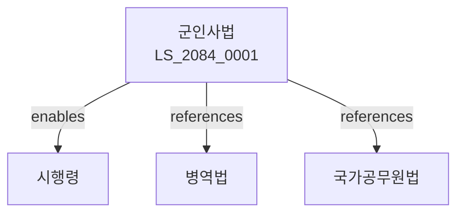

# 군인사법

> [법률 제20144호, 2024. 1. 9., 일부개정]

---

---

## 제1장 총칙
### 제1조 (목적)
이 법은 군인의 임용ㆍ복무ㆍ보수 등에 관한 사항을 정함으로써 군인사의 공정성과 효율성을 기함을 목적으로 한다。

### 제2조 (정의)
이 법에서 사용하는 용어의 뜻은 다음과 같다。

1. "군인"이란 육군ㆍ해군ㆍ공군의 장교ㆍ준사관ㆍ부사관 및 병을 말한다。
2. "장교"이란 위관급 이상의 군인을 말한다。
3. "부사관"이란 하사관급 군인을 말한다。
4. "병"이란 사병급 군인을 말한다。

---

## 제2장 임용
### 第5条(임용)
군인은 임용된다。
### 第6条(임용자격)
군인의 임용자격을 정한다。
### 第7条(임용시험)
임용시험을 실시한다。
### 第8条(임용절차)
임용절차를 정한다。

---

## 제3장 복무
### 第15条(복무)
군인은 복무한다。
### 第16条(복무기간)
군인의 복무기간을 정한다。
### 第17条(복무규율)
군인의 복무규율을 정한다。
### 第18条(복무평가)
복무평가를 실시한다。

---

## 제4장 보수
### 第25条(보수)
군인에게 보수를 지급한다。
### 第26条(봉급)
봉급을 지급한다。
### 第27条(수당)
수당을 지급할 수 있다。
### 第28条(보상)
보상을 지급할 수 있다。

---

## 제5장 진급
### 第35条(진급)
군인은 진급할 수 있다。
### 第36条(진급요건)
진급요건을 정한다。
### 第37条(진급심사)
진급심사를 실시한다。
### 第38条(진급처분)
진급처분을 한다。

---

## 제6장 전역
### 第42条(전역)
군인은 전역한다。
### 第43条(전역사유)
전역사유를 정한다。
### 第44条(전역처분)
전역처분을 한다。
### 第45条(전역급여)
전역급여를 지급할 수 있다。

---

## 제7장 감독
### 第52条(감독)
국방부장관은 군인사사업을 감독한다。
### 第53条(보고 및 검사)
필요한 경우 보고를 명하거나 검사할 수 있다。
### 第54条(시정명령)
위법한 사항에 대하여는 시정을 명할 수 있다。
### 第55条(징계)
징계처분을 할 수 있다。

---

## 제8장 벌칙
### 第62条(벌칙)
다음 각 호의 어느 하나에 해당하는 자는 3년 이하의 징역 또는 3천만원 이하의 벌금에 처한다。

1. 허위로 임용된 자
2. 임용자격을 위조한 자
### 第63条(과태료)
다음 각 호의 어느 하나에 해당하는 자에게는 2천만원 이하의 과태료를 부과한다。

1. 보고를 하지 아니한 자
2. 검사를 거부한 자

---

## 관계 그래프

**상위 법령**
- [[헌법]] 제39조 (병역의무)
- [[국가공무원법]]

**관련 법령**
- [[병역법]]
- [[군복무기본법]]
- [[군인연금법]]
- [[국방법]]

**하위 법령**
- [[군인사법 시행령]]
