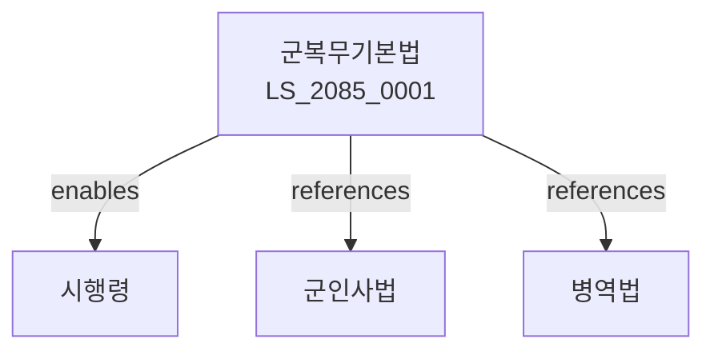

# 군복무기본법

> [법률 제20145호, 2024. 1. 9., 일부개정]

---

---

## 제1장 총칙
### 제1조 (목적)
이 법은 군복무의 기본원칙과 복무환경을 정함으로써 군인의 기본권 보장과 전투력 향상에 이바지함을 목적으로 한다。

### 제2조 (정의)
이 법에서 사용하는 용어의 뜻은 다음과 같다。

1. "군복무"란 군인으로서 복무하는 것을 말한다。
2. "복무환경"이란 군복무를 위한 생활환경을 말한다。
3. "복무규율"이란 군복무 중 준수하여야 할 규율을 말한다。
4. "복무권익"이란 군복무와 관련된 권익을 말한다。

---

## 제2장 복무기본원칙
### 第5条(복무원칙)
군인은 국가와 국민을 위하여 복무한다。
### 第6条(충성의무)
군인은 국가에 충성할 의무를 진다。
### 第7条(복종의무)
군인은 상관의 명령에 복종하여야 한다。
### 第8条(품위유지)
군인은 품위를 유지하여야 한다。

---

## 제3장 복무환경
### 第15条(주거환경)
주거환경을 개선한다。
### 第16条(급양)
급양을 제공한다。
### 第17条(의료지원)
의료지원을 제공한다。
### 第18条(휴가)
휴가를 부여한다。

---

## 제4장 복무권익
### 第25条(권익보호)
군인의 권익을 보호한다。
### 第26条(신고제도)
권익침해 시 신고할 수 있다。
### 第27条(조사)
신고사항을 조사한다。
### 第28条(구제)
권익침해에 대한 구제를 한다。

---

## 제5장 복무규율
### 第35条(규율준수)
군인은 복무규율을 준수하여야 한다。
### 第36条(금지행위)
금지되는 행위를 정한다。
### 第37条(징계)
규율위반 시 징계할 수 있다。
### 第38条(형사처벌)
범죄행위에 대하여는 형사처벌한다。

---

## 제6장 감독
### 第42条(감독)
국방부장관은 군복무사업을 감독한다。
### 第43条(보고 및 검사)
필요한 경우 보고를 명하거나 검사할 수 있다。
### 第44条(시정명령)
위법한 사항에 대하여는 시정을 명할 수 있다。
### 第45条(개선조치)
복무환경 개선을 명할 수 있다。

---

## 제7장 벌칙
### 第52条(벌칙)
다음 각 호의 어느 하나에 해당하는 자는 2년 이하의 징역 또는 2천만원 이하의 벌금에 처한다。

1. 권익침해를 신고한 자를 보복한 자
2. 허위로 신고한 자
### 第53条(과태료)
다음 각 호의 어느 하나에 해당하는 자에게는 1천만원 이하의 과태료를 부과한다。

1. 보고를 하지 아니한 자
2. 검사를 거부한 자

---

## 관계 그래프

**상위 법령**
- [[헌법]] 제39조 (병역의무)
- [[군인사법]]

**관련 법령**
- [[병역법]]
- [[군인연금법]]
- [[국가보훈기본법]]
- [[군무원법]]

**하위 법령**
- [[군복무기본법 시행령]]
