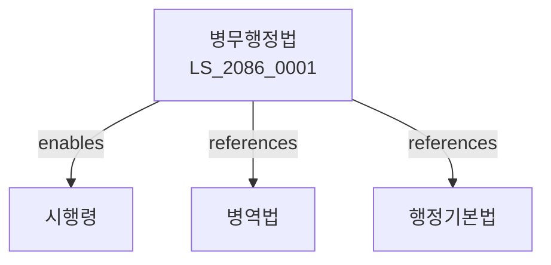

# 병무행정법

> [법률 제20146호, 2024. 1. 9., 일부개정]

---

---

## 제1장 총칙
### 제1조 (목적)
이 법은 병무행정의 효율적 수행을 위한 사항을 정함으로써 병역행정의 공정성과 투명성을 기함을 목적으로 한다。

### 제2조 (정의)
이 법에서 사용하는 용어의 뜻은 다음과 같다。

1. "병무행정"이란 병역관련 행정사무를 말한다。
2. "병무청"이란 병무행정을 담당하는 기관을 말한다。
3. "병적"이란 병역관련 신상정보를 말한다。
4. "병무민원"이란 병역관련 민원을 말한다。

---

## 제2장 병무행정기관
### 第5条(병무청)
병무청을 둔다。
### 第6条(조직)
병무청의 조직을 정한다。
### 第7条(직원)
병무청의 직원을 둔다。
### 第8条(지방병무청)
지방병무청을 둔다。

---

## 제3장 병적관리
### 第15条(병적)
병적을 관리한다。
### 第16条(병적기록)
병적기록을 작성한다。
### 第17条(병적정리)
병적을 정리한다。
### 第18条(병적증명)
병적증명을 발급한다。

---

## 제4장 병무민원
### 第25条(민원접수)
병무민원을 접수한다。
### 第26条(민원처리)
병무민원을 처리한다。
### 第27条(민원기간)
민원처리기간을 정한다。
### 第28条(민원결과)
민원처리결과를 통지한다。

---

## 제5장 정보화
### 第35条(정보화)
병무행정정보화를 추진한다。
### 第36条(정보시스템)
병무정보시스템을 구축한다。
### 第37条(정보보호)
병무정보를 보호한다。
### 第38条(정보제공)
병무정보를 제공한다。

---

## 제6장 감독
### 第42条(감독)
병무청장은 병무행정사업을 감독한다。
### 第43条(보고 및 검사)
필요한 경우 보고를 명하거나 검사할 수 있다。
### 第44条(시정명령)
위법한 사항에 대하여는 시정을 명할 수 있다。
### 第45条(행정조치)
중대한 위반사유가 있는 경우 행정조치를 할 수 있다。

---

## 제7장 벌칙
### 第52条(과태료)
다음 각 호의 어느 하나에 해당하는 자에게는 1천만원 이하의 과태료를 부과한다。

1. 보고를 하지 아니한 자
2. 검사를 거부한 자

---

## 관계 그래프

**상위 법령**
- [[헌법]] 제39조 (병역의무)
- [[행정기본법]]

**관련 법령**
- [[병역법]]
- [[군인사법]]
- [[주민등록법]]
- [[전자정부법]]

**하위 법령**
- [[병무행정법 시행령]]
