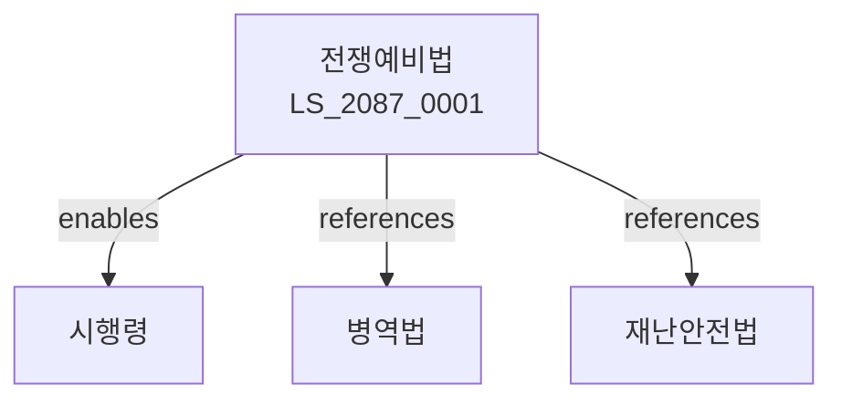

# 전쟁예비 및 민방위 기본법

> [법률 제20147호, 2024. 1. 9., 일부개정]

---

---

## 제1장 총칙
### 제1조 (목적)
이 법은 전쟁예비 및 민방위에 관한 사항을 정함으로써 국가안전과 국민보호에 이바지함을 목적으로 한다。

### 제2조 (정의)
이 법에서 사용하는 용어의 뜻은 다음과 같다。

1. "전쟁예비"란 전쟁에 대비하는 활동을 말한다。
2. "민방위"란 적의 침공으로부터 국민을 보호하는 활동을 말한다。
3. "민방위대"란 민방위업무를 수행하는 조직을 말한다。
4. "비상대비"란 비상사태에 대비하는 활동을 말한다。

---

## 제2장 전쟁예비
### 第5条(전쟁예비)
전쟁에 대비한다。
### 第6条(대비계획)
전쟁예비계획을 수립한다。
### 第7条(대비훈련)
전쟁예비훈련을 실시한다。
### 第8条(대비시설)
전쟁예비시설을 확보한다。

---

## 제3장 민방위
### 第15条(민방위)
민방위를 실시한다。
### 第16条(민방위대)
민방위대를 조직한다。
### 第17条(민방위훈련)
민방위훈련을 실시한다。
### 第18条(민방위경보)
민방위경보를 발령한다。

---

## 제4장 비상대비
### 第25条(비상대비)
비상사태에 대비한다。
### 第26条(비상계획)
비상대비계획을 수립한다。
### 第27条(비상훈련)
비상대비훈련을 실시한다。
### 第28条(비상물자)
비상물자를 비축한다。

---

## 제5장 민방위대원
### 第35条(대원편성)
민방위대원을 편성한다。
### 第36条(대원교육)
민방위대원교육을 실시한다。
### 第37条(대원복무)
민방위대원의 복무를 정한다。
### 第38条(대원보상)
민방위대원에게 보상한다。

---

## 제6장 감독
### 第42条(감독)
행정안전부장관은 민방위사업을 감독한다。
### 第43条(보고 및 검사)
필요한 경우 보고를 명하거나 검사할 수 있다。
### 第44条(시정명령)
위법한 사항에 대하여는 시정을 명할 수 있다。
### 第45条(행정조치)
중대한 위반사유가 있는 경우 행정조치를 할 수 있다。

---

## 제7장 벌칙
### 第52条(벌칙)
다음 각 호의 어느 하나에 해당하는 자는 1년 이하의 징역 또는 1천만원 이하의 벌금에 처한다。

1. 민방위훈련에 무단으로 불참한 자
2. 민방위경보를 위반한 자
### 第53条(과태료)
다음 각 호의 어느 하나에 해당하는 자에게는 500만원 이하의 과태료를 부과한다。

1. 보고를 하지 아니한 자
2. 검사를 거부한 자

---

## 관계 그래프

**상위 법령**
- [[헌법]] 제39조 (국방의무)
- [[재난안전법]]

**관련 법령**
- [[병역법]]
- [[군복무기본법]]
- [[소방기본법]]
- [[경찰법]]

**하위 법령**
- [[전쟁예비법 시행령]]
