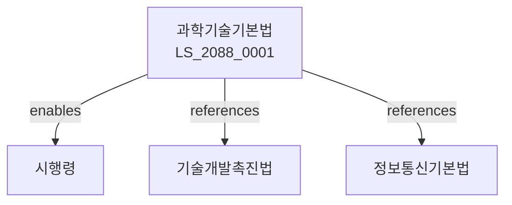

# 과학기술기본법

> [법률 제20148호, 2024. 1. 9., 일부개정]

---

---

## 제1장 총칙
### 제1조 (목적)
이 법은 과학기술혁신을 통하여 국가경쟁력을 제고하고 국민삶의 질을 향상함을 목적으로 한다。

### 제2조 (정의)
이 법에서 사용하는 용어의 뜻은 다음과 같다。

1. "과학기술"이란 자연과학 및 이를 응용한 기술을 말한다。
2. "과학기술혁신"이란 과학기술의 창출ㆍ활용을 말한다。
3. "연구개발"이란 과학기술의 연구 및 개발을 말한다。
4. "과학기술인"이란 과학기술 분야에 종사하는 자를 말한다。

---

## 제2장 과학기술정책
### 第5条(기본계획)
과학기술기본계획을 수립한다。
### 第6条(시행계획)
과학기술시행계획을 수립한다。
### 第7条(평가)
과학기술정책을 평가한다。
### 第8条(조정)
과학기술정책을 조정한다。

---

## 제3장 연구개발
### 第15条(연구개발)
과학기술연구개발사업을 추진한다。
### 第16条(연구기관)
과학기술연구기관을 육성한다。
### 第17条(연구인력)
과학기술연구인력을 양성한다。
### 第18条(연구지원)
과학기술연구를 지원한다。

---

## 제4장 기술이전
### 第25条(기술이전)
과학기술을 이전한다。
### 第26条(기술사업화)
과학기술을 사업화한다。
### 第27条(기술협력)
과학기술협력을 추진한다。
### 第28条(기술수출)
과학기술을 수출한다。

---

## 제5장 과학기술인
### 第35条(인력양성)
과학기술인력을 양성한다。
### 第36条(인력확보)
과학기술인력을 확보한다。
### 第37条(인력지원)
과학기술인력을 지원한다。
### 第38条(인력보상)
과학기술인력에게 보상한다。

---

## 제6장 국제협력
### 第42条(국제협력)
과학기술국제협력을 추진한다。
### 第43条(협력기관)
과학기술협력기관을 둔다。
### 第44条(협력사업)
과학기술협력사업을 추진한다。
### 第45条(협력지원)
과학기술협력을 지원한다。

---

## 제7장 감독
### 第52条(감독)
과학기술정보통신부장관은 과학기술사업을 감독한다。
### 第53条(보고 및 검사)
필요한 경우 보고를 명하거나 검사할 수 있다。
### 第54条(시정명령)
위법한 사항에 대하여는 시정을 명할 수 있다。
### 第55条(지원중단)
중대한 위반사유가 있는 경우 지원을 중단할 수 있다。

---

## 제8장 벌칙
### 第62条(과태료)
다음 각 호의 어느 하나에 해당하는 자에게는 2천만원 이하의 과태료를 부과한다。

1. 보고를 하지 아니한 자
2. 검사를 거부한 자

---

## 관계 그래프

**상위 법령**
- [[헌법]] 제127조 (과학기술진흥)
- [[국가균형발전법]]

**관련 법령**
- [[기술개발촉진법]]
- [[정보통신기본법]]
- [[산업교육법]]
- [[중소기업기본법]]

**하위 법령**
- [[과학기술기본법 시행령]]
