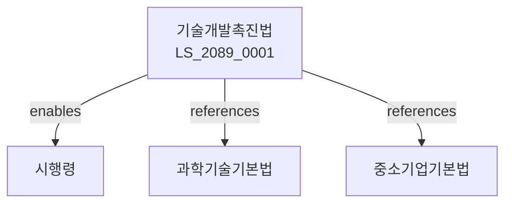

# 기술개발촉진법

> [법률 제20149호, 2024. 1. 9., 일부개정]

---

---

## 제1장 총칙
### 제1조 (목적)
이 법은 산업기술의 개발을 촉진함으로써 산업경쟁력 강화와 국민경제 발전에 이바지함을 목적으로 한다。

### 제2조 (정의)
이 법에서 사용하는 용어의 뜻은 다음과 같다。

1. "기술개발"이란 산업기술의 연구 및 개발을 말한다。
2. "산업기술"이란 산업에 활용되는 기술을 말한다。
3. "기술개발사업"이란 기술개발을 위한 사업을 말한다。
4. "기술지원"이란 기술개발을 위한 지원을 말한다。

---

## 제2장 기술개발
### 第5条(기술개발사업)
기술개발사업을 추진한다。
### 第6条(개발계획)
기술개발계획을 수립한다。
### 第7条(개발과제)
기술개발과제를 선정한다。
### 第8条(개발평가)
기술개발을 평가한다。

---

## 제3장 기술지원
### 第15条(자금지원)
기술개발에 자금을 지원한다。
### 第16条(세제지원)
기술개발에 세제지원을 한다。
### 第17条(인력지원)
기술개발에 인력을 지원한다。
### 第18条(시설지원)
기술개발에 시설을 지원한다。

---

## 제4장 기술혁신
### 第25条(기술혁신)
기술혁신을 촉진한다。
### 第26条(혁신형기업)
혁신형기업을 육성한다。
### 第27条(혁신사업)
기술혁신사업을 추진한다。
### 第28条(혁신지원)
기술혁신을 지원한다。

---

## 제5장 기술인프라
### 第35条(기술인프라)
기술개발인프라를 구축한다。
### 第36条(연구시설)
기술연구시설을 확충한다。
### 第37条(시험평가)
기술시험평가를 지원한다。
### 第38条(기술정보)
기술정보를 제공한다。

---

## 제6장 감독
### 第42条(감독)
산업통상자원부장관은 기술개발사업을 감독한다。
### 第43条(보고 및 검사)
필요한 경우 보고를 명하거나 검사할 수 있다。
### 第44条(시정명령)
위법한 사항에 대하여는 시정을 명할 수 있다。
### 第45条(지원중단)
중대한 위반사유가 있는 경우 지원을 중단할 수 있다。

---

## 제7장 벌칙
### 第52条(과태료)
다음 각 호의 어느 하나에 해당하는 자에게는 2천만원 이하의 과태료를 부과한다。

1. 보고를 하지 아니한 자
2. 검사를 거부한 자

---

## 관계 그래프

**상위 법령**
- [[헌법]] 제127조 (과학기술진흥)
- [[과학기술기본법]]

**관련 법령**
- [[중소기업기본법]]
- [[산업집적활성화법]]
- [[특정연구기관육성법]]
- [[산업교육법]]

**하위 법령**
- [[기술개발촉진법 시행령]]
