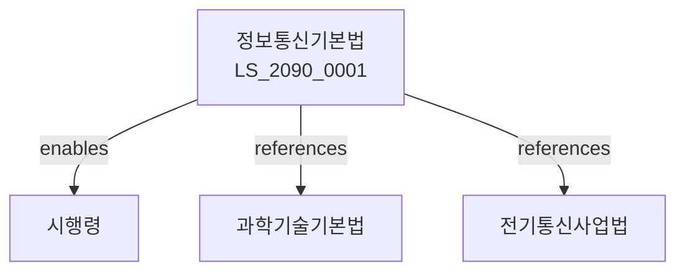

# 정보통신기본법

> [법률 제20150호, 2024. 1. 9., 일부개정]

---

---

## 제1장 총칙
### 제1조 (목적)
이 법은 정보통신의 발전을 도모함으로써 국민경제의 발전과 국민생활의 편익에 이바지함을 목적으로 한다。

### 제2조 (정의)
이 법에서 사용하는 용어의 뜻은 다음과 같다。

1. "정보통신"이란 정보의 처리ㆍ전송을 말한다。
2. "정보통신망"이란 정보통신을 위한 망을 말한다。
3. "정보통신서비스"란 정보통신을 이용한 서비스를 말한다。
4. "정보통신기술"이란 정보통신에 활용되는 기술을 말한다。

---

## 제2장 정보통신정책
### 第5条(기본계획)
정보통신기본계획을 수립한다。
### 第6条(시행계획)
정보통신시행계획을 수립한다。
### 第7条(평가)
정보통신정책을 평가한다。
### 第8条(조정)
정보통신정책을 조정한다。

---

## 제3장 정보통신망
### 第15条(망구축)
정보통신망을 구축한다。
### 第16条(망고도화)
정보통신망을 고도화한다。
### 第17条(망보안)
정보통신망을 보호한다。
### 第18条(망운용)
정보통신망을 운용한다。

---

## 제4장 정보통신서비스
### 第25条(서비스제공)
정보통신서비스를 제공한다。
### 第26条(서비스이용)
정보통신서비스를 이용한다。
### 第27条(서비스품질)
정보통신서비스의 품질을 관리한다。
### 第28条(서비스보편)
정보통신서비스의 보편적 제공을 도모한다。

---

## 제5장 정보보호
### 第35条(정보보호)
정보통신의 보호를 도모한다。
### 第36条(개인정보보호)
개인정보를 보호한다。
### 第37条(정보보안)
정보보안을 강화한다。
### 第38条(침해대응)
정보침해에 대응한다。

---

## 제6장 감독
### 第42条(감독)
과학기술정보통신부장관은 정보통신사업을 감독한다。
### 第43条(보고 및 검사)
필요한 경우 보고를 명하거나 검사할 수 있다。
### 第44条(시정명령)
위법한 사항에 대하여는 시정을 명할 수 있다。
### 第45条(업무정지)
중대한 위반사유가 있는 경우 업무정지를 명할 수 있다。

---

## 제7장 벌칙
### 第52条(과태료)
다음 각 호의 어느 하나에 해당하는 자에게는 2천만원 이하의 과태료를 부과한다。

1. 보고를 하지 아니한 자
2. 검사를 거부한 자

---

## 관계 그래프

**상위 법령**
- [[헌법]] 제127조 (과학기술진흥)
- [[과학기술기본법]]

**관련 법령**
- [[전기통신사업법]]
- [[정보통신망법]]
- [[개인정보보호법]]
- [[방송법]]

**하위 법령**
- [[정보통신기본법 시행령]]
