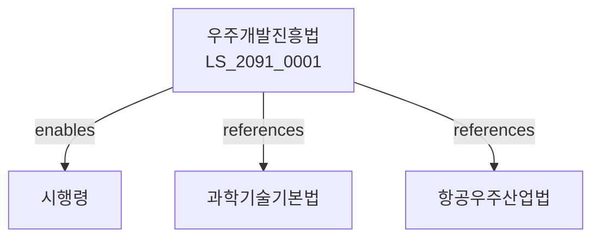

# 우주개발진흥법

> [법률 제20151호, 2024. 1. 9., 일부개정]

---

---

## 제1장 총칙
### 제1조 (목적)
이 법은 우주개발을 진흥함으로써 국가경쟁력 강화와 인류문화 발전에 이바지함을 목적으로 한다。

### 제2조 (정의)
이 법에서 사용하는 용어의 뜻은 다음과 같다。

1. "우주"란 지구 대기권 밖의 공간을 말한다。
2. "우주개발"이란 우주의 탐사 및 활용을 말한다。
3. "우주물체"란 우주에 존재하는 물체를 말한다。
4. "우주발사체"란 우주물체를 발사하는 체계를 말한다。

---

## 제2장 우주개발정책
### 第5条(기본계획)
우주개발기본계획을 수립한다。
### 第6条(시행계획)
우주개발시행계획을 수립한다。
### 第7条(평가)
우주개발정책을 평가한다。
### 第8条(조정)
우주개발정책을 조정한다。

---

## 제3장 우주개발사업
### 第15条(개발사업)
우주개발사업을 추진한다。
### 第16条(위성개발)
인공위성을 개발한다。
### 第17条(발사체개발)
우주발사체를 개발한다。
### 第18条(우주탐사)
우주탐사를 추진한다。

---

## 제4장 우주산업
### 第25条(우주산업)
우주산업을 육성한다。
### 第26条(기술개발)
우주기술을 개발한다。
### 第27条(인력양성)
우주인력을 양성한다。
### 第28条(국제협력)
우주분야 국제협력을 추진한다。

---

## 제5장 우주안전
### 第35条(우주안전)
우주활동의 안전을 확보한다。
### 第36条(발사안전)
발사안전을 확보한다。
### 第37条(우주물체관리)
우주물체를 관리한다。
### 第38条(우주쓰레기)
우주쓰레기를 관리한다。

---

## 제6장 감독
### 第42条(감독)
과학기술정보통신부장관은 우주개발사업을 감독한다。
### 第43条(보고 및 검사)
필요한 경우 보고를 명하거나 검사할 수 있다。
### 第44条(시정명령)
위법한 사항에 대하여는 시정을 명할 수 있다。
### 第45条(사업중단)
중대한 위반사유가 있는 경우 사업중단을 명할 수 있다。

---

## 제7장 벌칙
### 第52条(과태료)
다음 각 호의 어느 하나에 해당하는 자에게는 2천만원 이하의 과태료를 부과한다。

1. 보고를 하지 아니한 자
2. 검사를 거부한 자

---

## 관계 그래프

**상위 법령**
- [[헌법]] 제127조 (과학기술진흥)
- [[과학기술기본법]]

**관련 법령**
- [[항공우주산업법]]
- [[국방법]]
- [[방위사업법]]
- [[기상법]]

**하위 법령**
- [[우주개발진흥법 시행령]]
