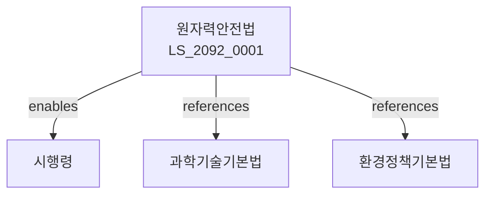

# 원자력안전법

> [법률 제20152호, 2024. 1. 9., 일부개정]

---

---

## 제1장 총칙
### 제1조 (목적)
이 법은 원자력의 이용에 있어 안전을 확보함으로써 공중의 안전과 환경보호에 이바지함을 목적으로 한다。

### 제2조 (정의)
이 법에서 사용하는 용어의 뜻은 다음과 같다。

1. "원자력"이란 원자핵분열 및 핵변환에 의한 에너지를 말한다。
2. "원자력시설"이란 원자력을 이용하는 시설을 말한다。
3. "핵물질"이란 원자력의 원료가 되는 물질을 말한다。
4. "방사선"이란 원자력에서 발생하는 방사선을 말한다。

---

## 제2장 원자력안전정책
### 第5条(안전정책)
원자력안전정책을 수립한다。
### 第6条(안전기준)
원자력안전기준을 정한다。
### 第7条(안전평가)
원자력안전을 평가한다。
### 第8条(안전관리)
원자력안전을 관리한다。

---

## 제3장 원자력시설안전
### 第15条(시설안전)
원자력시설의 안전을 확보한다。
### 第16条(건설허가)
원자력시설 건설은 허가를 받아야 한다。
### 第17条(운영허가)
원자력시설 운영은 허가를 받아야 한다。
### 第18条(정기검사)
원자력시설 정기검사를 실시한다。

---

## 제4장 핵물질관리
### 第25条(핵물질관리)
핵물질을 관리한다。
### 第26条(사용신고)
핵물질 사용을 신고하여야 한다。
### 第27条(운반)
핵물질 운반은 허가를 받아야 한다。
### 第28条(저장)
핵물질 저장은 허가를 받아야 한다。

---

## 제5장 방사선방호
### 第35条(방사선방호)
방사선으로부터 방호한다。
### 第36条(피폭관리)
방사선 피폭을 관리한다。
### 第37条(환경감시)
방사선 환경감시를 실시한다。
### 第38条(비상대응)
방사선 비상대응체계를 구축한다。

---

## 제6장 방사성폐기물
### 第42条(폐기물관리)
방사성폐기물을 관리한다。
### 第43条(처분)
방사성폐기물 처분은 허가를 받아야 한다。
### 第44条(운반)
방사성폐기물 운반을 관리한다。
### 第45条(처분장)
방사성폐기물 처분장을 관리한다。

---

## 제7장 감독
### 第52条(감독)
원자력안전위원회는 원자력안전사업을 감독한다。
### 第53条(보고 및 검사)
필요한 경우 보고를 명하거나 검사할 수 있다。
### 第54条(시정명령)
위법한 사항에 대하여는 시정을 명할 수 있다。
### 第55条(운영정지)
중대한 위반사유가 있는 경우 운영정지를 명할 수 있다。

---

## 제8장 벌칙
### 第62条(벌칙)
다음 각 호의 어느 하나에 해당하는 자는 5년 이하의 징역 또는 5천만원 이하의 벌금에 처한다。

1. 허가 없이 원자력시설을 운영한 자
2. 핵물질을 부당하게 사용한 자
### 第63条(과태료)
다음 각 호의 어느 하나에 해당하는 자에게는 3천만원 이하의 과태료를 부과한다。

1. 보고를 하지 아니한 자
2. 검사를 거부한 자

---

## 관계 그래프

**상위 법령**
- [[헌법]] 제35조 (환경권)
- [[과학기술기본법]]

**관련 법령**
- [[환경정책기본법]]
- [[전기사업법]]
- [[재난안전법]]
- [[에너지법]]

**하위 법령**
- [[원자력안전법 시행령]]
