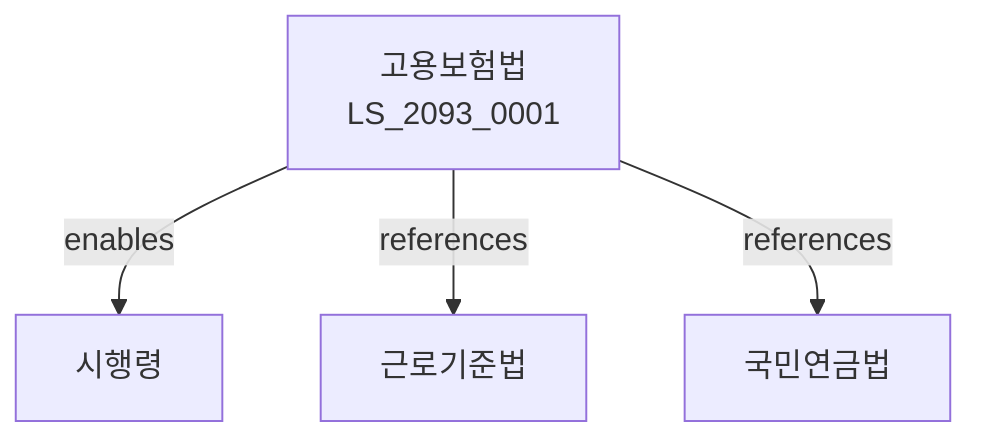

# 고용보험법

> [법률 제20153호, 2024. 1. 9., 일부개정]

---

---

## 제1장 총칙
### 제1조 (목적)
이 법은 고용보험사업을 실시함으로써 실업의 예방ㆍ고용의 안정 및 직업능력의 개발ㆍ향상을 도모하고 국민의 고용안정과 복지증진에 이바지함을 목적으로 한다。

### 제2조 (정의)
이 법에서 사용하는 용어의 뜻은 다음과 같다。

1. "고용보험"이란 실업에 대비한 보험을 말한다。
2. "피보험자"란 고용보험의 적용을 받는 근로자를 말한다。
3. "사업주"란 피보험자를 고용하는 자를 말한다。
4. "실업급여"란 실업 시 지급되는 급여를 말한다。

---

## 제2장 적용범위
### 第5条(적용범위)
고용보험은 모든 사업에 적용한다。
### 第6条(피보험자)
피보험자는 근로자로 한다。
### 第7条(적용제외)
일부 사업은 적용에서 제외할 수 있다。
### 第8条(임의가입)
일정 요건의 자는 임의로 가입할 수 있다。

---

## 제3장 보험가입
### 第15条(가입)
사업주는 보험에 가입하여야 한다。
### 第16条(가입신고)
보험가입신고를 하여야 한다。
### 第17条(자격취득)
피보험자격을 취득한다。
### 第18条(자격상실)
피보험자격을 상실한다。

---

## 제4장 보험료
### 第25条(보험료)
보험료를 납부하여야 한다。
### 第26条(보험료율)
보험료율을 정한다。
### 第27条(보험료납부)
보험료를 납부한다。
### 第28条(체납처리)
보험료 체납 시 처리한다。

---

## 제5장 실업급여
### 第35条(실업급여)
실업급여를 지급한다。
### 第36条(구직급여)
구직급여를 지급한다。
### 第37条(취업촉진수당)
취업촉진수당을 지급할 수 있다。
### 第38条(상병급여)
상병급여를 지급할 수 있다。

---

## 제6장 고용안정사업
### 第45条(고용안정)
고용안정사업을 실시한다。
### 第46条(고용유지)
고용유지지원을 한다。
### 第47条(직업전환)
직업전환지원을 한다。
### 第48条(지역고용)
지역고용촉진을 한다。

---

## 제7장 직업능력개발
### 第52条(능력개발)
직업능력개발사업을 실시한다。
### 第53条(훈련지원)
직업훈련을 지원한다。
### 第54条(수당지급)
훈련수당을 지급할 수 있다。
### 第55条(우선지원)
우선지원대상자를 지원한다。

---

## 제8장 감독
### 第62条(감독)
고용노동부장관은 고용보험사업을 감독한다。
### 第63条(보고 및 검사)
필요한 경우 보고를 명하거나 검사할 수 있다。
### 第64条(시정명령)
위법한 사항에 대하여는 시정을 명할 수 있다。
### 第65条(징수)
부당하게 지급된 급여를 징수할 수 있다。

---

## 제9장 벌칙
### 第72条(벌칙)
다음 각 호의 어느 하나에 해당하는 자는 3년 이하의 징역 또는 3천만원 이하의 벌금에 처한다。

1. 허위로 보험급여를 받은 자
2. 보험료를 부당하게 탈루한 자
### 第73条(과태료)
다음 각 호의 어느 하나에 해당하는 자에게는 2천만원 이하의 과태료를 부과한다。

1. 보고를 하지 아니한 자
2. 검사를 거부한 자

---

## 관계 그래프

**상위 법령**
- [[헌법]] 제32조 (근로의권리)
- [[근로기준법]]

**관련 법령**
- [[국민연금법]]
- [[산업재해보상보험법]]
- [[고용정책기본법]]
- [[직업안정법]]

**하위 법령**
- [[고용보험법 시행령]]
