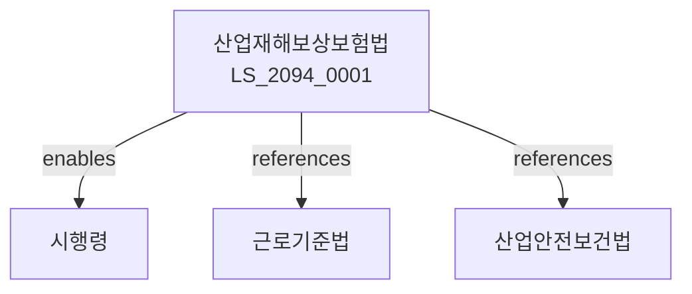

# 산업재해보상보험법

> [법률 제20154호, 2024. 1. 9., 일부개정]

---

---

## 제1장 총칙
### 제1조 (목적)
이 법은 업무상 재해를 당한 근로자를 신속하게 보상하고 재해예방과 근로자의 재활에 이바지함을 목적으로 한다。

### 제2조 (정의)
이 법에서 사용하는 용어의 뜻은 다음과 같다。

1. "산업재해"란 업무상 발생한 재해를 말한다。
2. "업무상재해"란 업무로 인한 재해를 말한다。
3. "요양급여"란 재해요양에 대한 급여를 말한다。
4. "유족급여"란 사망 시 유족에게 지급되는 급여를 말한다。

---

## 제2장 적용범위
### 第5条(적용범위)
산업재해보험은 모든 사업에 적용한다。
### 第6条(피보험자)
피보험자는 근로자로 한다。
### 第7条(적용제외)
일부 사업은 적용에서 제외할 수 있다。
### 第8条(특례)
특수형태근로종사자는 특례를 적용한다。

---

## 제3장 보험가입
### 第15条(가입)
사업주는 보험에 가입하여야 한다。
### 第16条(가입신고)
보험가입신고를 하여야 한다。
### 第17条(자격취득)
피보험자격을 취득한다。
### 第18条(자격상실)
피보험자격을 상실한다。

---

## 제4장 보험급여
### 第25条(보험급여)
보험급여를 지급한다。
### 第26条(요양급여)
요양급여를 지급한다。
### 第27条(휴업급여)
휴업급여를 지급한다。
### 第28条(장애급여)
장애급여를 지급한다。

---

## 제5장 유족급여
### 第35条(유족급여)
유족급여를 지급한다。
### 第36条(유족범위)
유족의 범위를 정한다。
### 第37条(지급순위)
유족급여 지급순위를 정한다。
### 第38条(지급정지)
유족급여 지급을 정지할 수 있다。

---

## 제6장 재해예방
### 第42条(재해예방)
산업재해예방사업을 실시한다。
### 第43条(안전점검)
안전점검을 실시한다。
### 第44条(예방지원)
재해예방을 지원한다。
### 第45条(안전교육)
안전교육을 실시한다。

---

## 제7장 재활
### 第52条(재활)
근로자재활사업을 실시한다。
### 第53条(의료재활)
의료재활을 지원한다。
### 第54条(직업재활)
직업재활을 지원한다。
### 第55条(사회재활)
사회재활을 지원한다。

---

## 제8장 감독
### 第62条(감독)
고용노동부장관은 산업재해보험사업을 감독한다。
### 第63条(보고 및 검사)
필요한 경우 보고를 명하거나 검사할 수 있다。
### 第64条(시정명령)
위법한 사항에 대하여는 시정을 명할 수 있다。
### 第65条(징수)
부당하게 지급된 급여를 징수할 수 있다。

---

## 제9장 벌칙
### 第72条(벌칙)
다음 각 호의 어느 하나에 해당하는 자는 5년 이하의 징역 또는 5천만원 이하의 벌금에 처한다。

1. 허위로 보험급여를 받은 자
2. 보험료를 부당하게 탈루한 자
### 第73条(과태료)
다음 각 호의 어느 하나에 해당하는 자에게는 2천만원 이하의 과태료를 부과한다。

1. 보고를 하지 아니한 자
2. 검사를 거부한 자

---

## 관계 그래프

**상위 법령**
- [[헌법]] 제32조 (근로의권리)
- [[근로기준법]]

**관련 법령**
- [[산업안전보건법]]
- [[고용보험법]]
- [[장애인복지법]]
- [[국민연금법]]

**하위 법령**
- [[산업재해보상보험법 시행령]]
