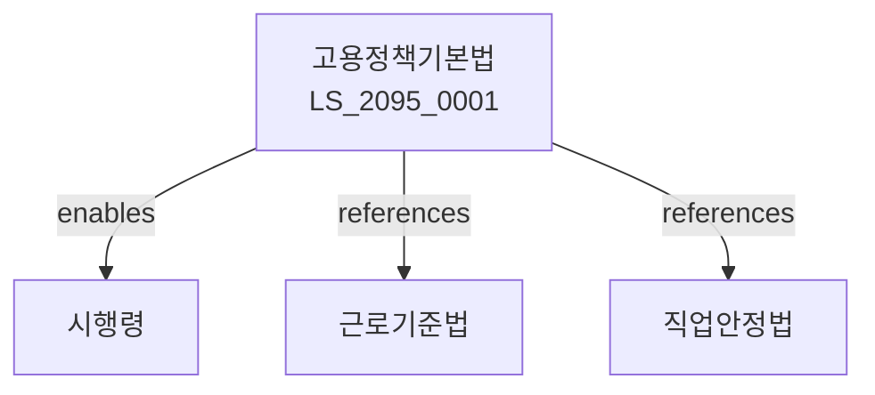

# 고용정책기본법

> [법률 제20155호, 2024. 1. 9., 일부개정]

---

---

## 제1장 총칙
### 제1조 (목적)
이 법은 고용정책의 기본방향을 정하고 고용대책을 종합적으로 추진함으로써 국민의 고용안정과 경제사회발전에 이바지함을 목적으로 한다。

### 제2조 (정의)
이 법에서 사용하는 용어의 뜻은 다음과 같다。

1. "고용정책"이란 고용에 관한 국가정책을 말한다。
2. "고용대책"이란 고용안정을 위한 대책을 말한다。
3. "실업"이란 일할 능력과 의사가 있음에도 취업하지 못한 상태를 말한다。
4. "취업"이란 근로를 제공하는 상태를 말한다。

---

## 제2장 고용정책기본계획
### 第5条(기본계획)
고용정책기본계획을 수립한다。
### 第6条(시행계획)
고용정책시행계획을 수립한다。
### 第7条(평가)
고용정책을 평가한다。
### 第8条(조정)
고용정책을 조정한다。

---

## 제3장 고용대책
### 第15条(고용대책)
고용대책을 수립한다。
### 第16条(실업대책)
실업대책을 수립한다。
### 第17条(청년고용)
청년고용대책을 수립한다。
### 第18条(중장년고용)
중장년고용대책을 수립한다。

---

## 제4장 고용서비스
### 第25条(고용서비스)
고용서비스를 제공한다。
### 第26条(취업알선)
취업알선서비스를 제공한다。
### 第27条(직업상담)
직업상담서비스를 제공한다。
### 第28条(고용정보)
고용정보를 제공한다。

---

## 제5장 직업훈련
### 第35条(직업훈련)
직업훈련을 실시한다。
### 第36条(훈련기관)
직업훈련기관을 지정한다。
### 第37条(훈련과정)
직업훈련과정을 개발한다。
### 第38条(훈련지원)
직업훈련을 지원한다。

---

## 제6장 감독
### 第42条(감독)
고용노동부장관은 고용정책사업을 감독한다。
### 第43条(보고 및 검사)
필요한 경우 보고를 명하거나 검사할 수 있다。
### 第44条(시정명령)
위법한 사항에 대하여는 시정을 명할 수 있다。
### 第45条(조정)
고용분쟁을 조정할 수 있다。

---

## 제7장 벌칙
### 第52条(과태료)
다음 각 호의 어느 하나에 해당하는 자에게는 2천만원 이하의 과태료를 부과한다。

1. 보고를 하지 아니한 자
2. 검사를 거부한 자

---

## 관계 그래프

**상위 법령**
- [[헌법]] 제32조 (근로의권리)
- [[근로기준법]]

**관련 법령**
- [[직업안정법]]
- [[고용보험법]]
- [[직업교육훈련촉진법]]
- [[중소기업기본법]]

**하위 법령**
- [[고용정책기본법 시행령]]
