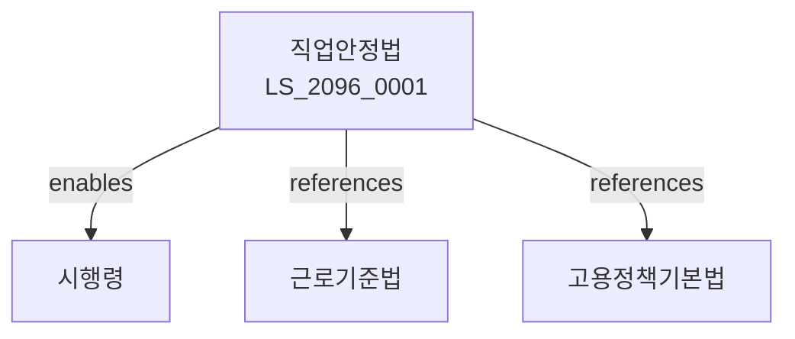

# 직업안정법

> [법률 제20156호, 2024. 1. 9., 일부개정]

---

---

## 제1장 총칙
### 제1조 (목적)
이 법은 직업안정사업을 통하여 근로자의 직업안정과 산업의 인력수급에 이바지함을 목적으로 한다。

### 제2조 (정의)
이 법에서 사용하는 용어의 뜻은 다음과 같다。

1. "직업안정사업"이란 직업소개 및 직업지도사업을 말한다。
2. "직업소개"란 구인ㆍ구직의 알선을 말한다。
3. "직업지도"란 직업선택에 관한 지도를 말한다。
4. "유료직업소개업"이란 수수료를 받고 직업소개를 하는 업을 말한다。

---

## 제2장 직업안정기관
### 第5条(직업안정기관)
직업안정기관을 설치한다。
### 第6条(고용센터)
고용센터를 설치한다。
### 第7条(직원)
직업안정기관의 직원을 둔다。
### 第8条(협력기관)
협력기관을 지정할 수 있다。

---

## 제3장 직업소개
### 第15条(직업소개)
직업소개를 실시한다。
### 第16条(구인등록)
구인등록을 받는다。
### 第17条(구직등록)
구직등록을 받는다。
### 第18条(알선)
취업을 알선한다。

---

## 제4장 유료직업소개업
### 第25条(유료직업소개업)
유료직업소개업은 신고하여야 한다。
### 第26条(신고요건)
유료직업소개업 신고요건을 정한다。
### 第27条(영업기준)
유료직업소개업 영업기준을 준수하여야 한다。
### 第28条(수수료)
수수료를 정한다。

---

## 제5장 파견근로
### 第35条(파견근로)
근로자파견사업은 허가를 받아야 한다。
### 第36条(파견대상)
파견대상업무를 정한다。
### 第37条(파견기간)
파견기간을 정한다。
### 第38条(파견근로자보호)
파견근로자를 보호한다。

---

## 제6장 외국인근로자
### 第42条(외국인근로자)
외국인근로자의 고용을 관리한다。
### 第43条(고용허가)
외국인근로자 고용은 허가를 받아야 한다。
### 第44条(보호)
외국인근로자를 보호한다。
### 第45条(사업주의무)
외국인근로자 고용사업주의 의무를 정한다。

---

## 제7장 감독
### 第52条(감독)
고용노동부장관은 직업안정사업을 감독한다。
### 第53条(보고 및 검사)
필요한 경우 보고를 명하거나 검사할 수 있다。
### 第54条(시정명령)
위법한 사항에 대하여는 시정을 명할 수 있다。
### 第55条(영업정지)
중대한 위반사유가 있는 경우 영업정지를 명할 수 있다。

---

## 제8장 벌칙
### 第62条(벌칙)
다음 각 호의 어느 하나에 해당하는 자는 3년 이하의 징역 또는 3천만원 이하의 벌금에 처한다。

1. 신고 없이 유료직업소개업을 영위한 자
2. 허가 없이 근로자파견사업을 영위한 자
### 第63条(과태료)
다음 각 호의 어느 하나에 해당하는 자에게는 2천만원 이하의 과태료를 부과한다。

1. 보고를 하지 아니한 자
2. 검사를 거부한 자

---

## 관계 그래프

**상위 법령**
- [[헌법]] 제32조 (근로의권리)
- [[근로기준법]]

**관련 법령**
- [[고용정책기본법]]
- [[고용보험법]]
- [[외국인근로자고용법]]
- [[근로자파견법]]

**하위 법령**
- [[직업안정법 시행령]]
