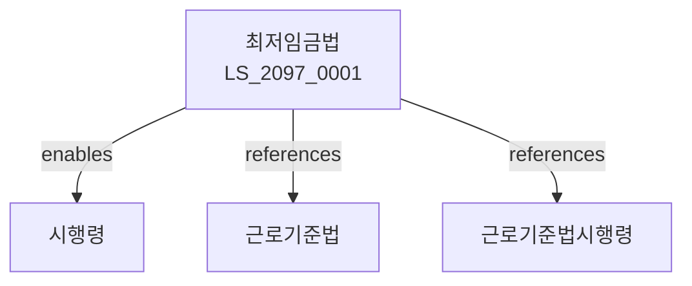

# 최저임금법

> [법률 제20157호, 2024. 1. 9., 일부개정]

---

---

## 제1장 총칙
### 제1조 (목적)
이 법은 최저임금제도를 확립하여 근로자의 생활안정과 노동력의 질적향상에 기여함을 목적으로 한다。

### 제2조 (정의)
이 법에서 사용하는 용어의 뜻은 다음과 같다。

1. "최저임금"이란 근로자에게 지급되어야 하는 최저임금을 말한다。
2. "근로자"란 근로기준법에 따른 근로자를 말한다。
3. "사업주"란 근로자를 고용하는 자를 말한다。
4. "최저임금위원회"란 최저임금을 심의하는 기관을 말한다。

---

## 제2장 최저임금위원회
### 第5条(최저임금위원회)
최저임금위원회를 둔다。
### 第6条(구성)
최저임금위원회의 구성을 정한다。
### 第7条(직능)
최저임금위원회의 직능을 정한다。
### 第8条(회의)
최저임금위원회의 회의를 정한다。

---

## 제3장 최저임금결정
### 第15条(최저임금결정)
최저임금을 결정한다。
### 第16条(결정요소)
최저임금결정요소를 정한다。
### 第17条(결정절차)
최저임금결정절차를 정한다。
### 第18条(결정고시)
최저임금결정을 고시한다。

---

## 제4장 최저임금적용
### 第25条(적용범위)
최저임금은 모든 근로자에게 적용한다。
### 第26条(적용제외)
일부 근로자는 적용에서 제외할 수 있다。
### 第27条(적용특례)
일부 사업에 특례를 적용할 수 있다。
### 第28条(계약의무)
최저임금 이상의 임금을 지급하여야 한다。

---

## 제5장 감독
### 第29条(감독)
고용노동부장관은 최저임금사업을 감독한다。
### 第30条(보고 및 검사)
필요한 경우 보고를 명하거나 검사할 수 있다。
### 第31条(시정명령)
위법한 사항에 대하여는 시정을 명할 수 있다。
### 第32条(이행강제금)
최저임금 위반 시 이행강제금을 부과한다。

---

## 제6장 벌칙
### 第33条(벌칙)
다음 각 호의 어느 하나에 해당하는 자는 3년 이하의 징역 또는 2천만원 이하의 벌금에 처한다。

1. 최저임금 미만의 임금을 지급한 자
2. 최저임금 관련 서류를 위조한 자
### 第34条(과태료)
다음 각 호의 어느 하나에 해당하는 자에게는 1천만원 이하의 과태료를 부과한다。

1. 보고를 하지 아니한 자
2. 검사를 거부한 자

---

## 관계 그래프

**상위 법령**
- [[헌법]] 제32조 (근로의권리)
- [[근로기준법]]

**관련 법령**
- [[근로기준법시행령]]
- [[기간제법]]
- [[파견근로자보호법]]
- [[임금채권보장법]]

**하위 법령**
- [[최저임금법 시행령]]
