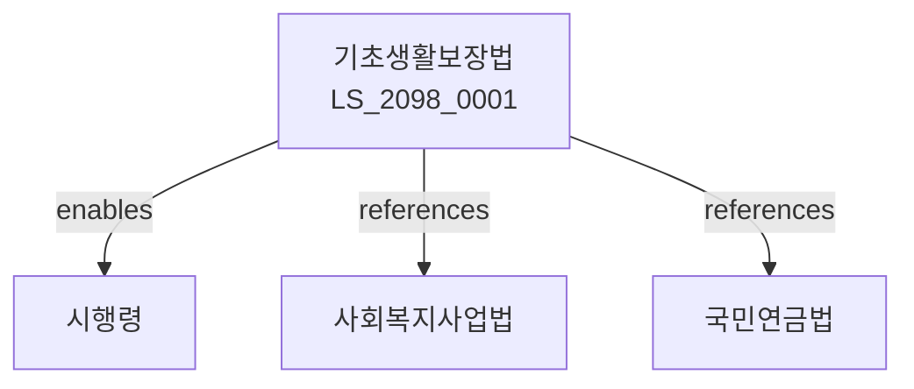

# 국민기초생활 보장법

> [법률 제20158호, 2024. 1. 9., 일부개정]

---

---

## 제1장 총칙
### 제1조 (목적)
이 법은 생활이 어려운 사람에게 필요한 급여를 실시하여 자립을 조성하고 국민의 기초생활을 보장함을 목적으로 한다。

### 제2조 (정의)
이 법에서 사용하는 용어의 뜻은 다음과 같다。

1. "수급자"란 이 법에 따른 급여를 받는 자를 말한다。
2. "생계급여"란 생활유지를 위한 급여를 말한다。
3. "의료급여"란 의료를 위한 급여를 말한다。
4. "주거급여"란 주거를 위한 급여를 말한다。

---

## 제2장 수급자
### 第5条(수급자)
수급자를 선정한다。
### 第6条(선정기준)
수급자선정기준을 정한다。
### 第7条(조사)
수급자조사를 실시한다。
### 第8条(등록)
수급자등록을 한다。

---

## 제3장 급여의 종류
### 第15条(생계급여)
생계급여를 지급한다。
### 第16条(의료급여)
의료급여를 지급한다。
### 第17条(주거급여)
주거급여를 지급한다。
### 第18条(교육급여)
교육급여를 지급한다。

---

## 제4장 급여의 실시
### 第25条(급여실시)
급여를 실시한다。
### 第26条(급여방법)
급여방법을 정한다。
### 第27条(급여기간)
급여기간을 정한다。
### 第28条(급여변경)
급여를 변경할 수 있다。

---

## 제5장 자립조성
### 第35条(자립조성)
자립을 조성한다。
### 第36条(자활사업)
자활사업을 실시한다。
### 第37条(근로연계)
근로와 연계한다。
### 第38条(교육훈련)
교육훈련을 지원한다。

---

## 제6장 시설
### 第42条(시설)
생활시설을 설치할 수 있다。
### 第43条(시설기준)
시설기준을 정한다。
### 第44条(시설운영)
시설을 운영한다。
### 第45条(시설입소)
시설입소를 실시한다。

---

## 제7장 감독
### 第52条(감독)
보건복지부장관은 기초생활보장사업을 감독한다。
### 第53条(보고 및 검사)
필요한 경우 보고를 명하거나 검사할 수 있다。
### 第54条(시정명령)
위법한 사항에 대하여는 시정을 명할 수 있다。
### 第55条(급여중지)
중대한 위반사유가 있는 경우 급여를 중지할 수 있다。

---

## 제8장 벌칙
### 第62条(벌칙)
다음 각 호의 어느 하나에 해당하는 자는 2년 이하의 징역 또는 2천만원 이하의 벌금에 처한다。

1. 허위로 급여를 받은 자
2. 부정하게 급여를 받은 자
### 第63条(과태료)
다음 각 호의 어느 하나에 해당하는 자에게는 1천만원 이하의 과태료를 부과한다。

1. 보고를 하지 아니한 자
2. 검사를 거부한 자

---

## 관계 그래프

**상위 법령**
- [[헌법]] 제34조 (사회보장)
- [[사회보장기본법]]

**관련 법령**
- [[사회복지사업법]]
- [[국민연금법]]
- [[장애인복지법]]
- [[노인복지법]]

**하위 법령**
- [[기초생활보장법 시행령]]
