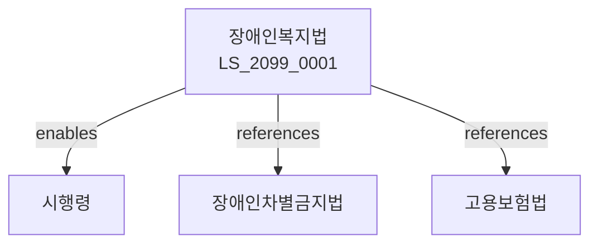

# 장애인복지법

> [법률 제20159호, 2024. 1. 9., 일부개정]

---

---

## 제1장 총칙
### 제1조 (목적)
이 법은 장애인의 인간다운 생활을 보장하고 사회참여를 증진하여 장애인의 복지에 이바지함을 목적으로 한다。

### 제2조 (정의)
이 법에서 사용하는 용어의 뜻은 다음과 같다。

1. "장애인"이란 신체적ㆍ정신적 장애로 일상생활에 제약이 있는 자를 말한다。
2. "장애인복지시설"이란 장애인을 위한 시설을 말한다。
3. "재활"이란 장애인의 기능회복을 말한다。
4. "장애인고용"이란 장애인의 고용을 말한다。

---

## 제2장 장애인등록
### 第5条(장애인등록)
장애인등록을 한다。
### 第6条(장애진단)
장애진단을 실시한다。
### 第7条(장애등급)
장애등급을 정한다。
### 第8条(등록증)
장애인등록증을 발급한다。

---

## 제3장 복지서비스
### 第15条(복지서비스)
장애인복지서비스를 제공한다。
### 第16条(활동지원)
활동지원서비스를 제공한다。
### 第17条(방문요양)
방문요양서비스를 제공한다。
### 第18条(주야간보호)
주야간보호서비스를 제공한다。

---

## 제4장 재활
### 第25条(재활)
재활서비스를 제공한다。
### 第26条(의료재활)
의료재활을 제공한다。
### 第27条(직업재활)
직업재활을 제공한다。
### 第28条(사회재활)
사회재활을 제공한다。

---

## 제5장 장애인고용
### 第35条(장애인고용)
장애인고용을 촉진한다。
### 第36条(의무고용률)
장애인의무고용률을 정한다。
### 第37条(고용장려금)
장애인고용장려금을 지급한다。
### 第38条(직업훈련)
장애인직업훈련을 실시한다。

---

## 제6장 편의증진
### 第42条(편의증진)
장애인편의를 증진한다。
### 第43条(편의시설)
편의시설을 설치한다。
### 第44条(정보접근)
정보접근성을 확보한다。
### 第45条(이동권)
이동권을 보장한다。

---

## 제7장 감독
### 第52条(감독)
보건복지부장관은 장애인복지사업을 감독한다。
### 第53条(보고 및 검사)
필요한 경우 보고를 명하거나 검사할 수 있다。
### 第54条(시정명령)
위법한 사항에 대하여는 시정을 명할 수 있다。
### 第55条(시설개선)
시설기준 위반 시 개선을 명할 수 있다。

---

## 제8장 벌칙
### 第62条(벌칙)
다음 각 호의 어느 하나에 해당하는 자는 3년 이하의 징역 또는 3천만원 이하의 벌금에 처한다。

1. 장애인을 학대한 자
2. 장애인복지시설을 무단 운영한 자
### 第63条(과태료)
다음 각 호의 어느 하나에 해당하는 자에게는 2천만원 이하의 과태료를 부과한다。

1. 보고를 하지 아니한 자
2. 검사를 거부한 자

---

## 관계 그래프

**상위 법령**
- [[헌법]] 제34조 (사회보장)
- [[장애인차별금지및권리구제등에관한법률]]

**관련 법령**
- [[고용보험법]]
- [[기초생활보장법]]
- [[특수교육법]]
- [[건축법]]

**하위 법령**
- [[장애인복지법 시행령]]
