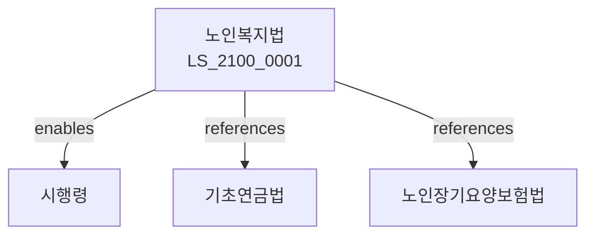

# 노인복지법

> [법률 제20160호, 2024. 1. 9., 일부개정]

---

---

## 제1장 총칙
### 제1조 (목적)
이 법은 노인의 복지를 증진하고 경로사상을 함양하여 노인의 건전한 생활에 이바지함을 목적으로 한다。

### 제2조 (정의)
이 법에서 사용하는 용어의 뜻은 다음과 같다。

1. "노인"이란 65세 이상의 자를 말한다。
2. "노인복지시설"이란 노인을 위한 시설을 말한다。
3. "노인요양"이란 노인의 요양을 말한다。
4. "재가노인"이란 시설에 있지 아니한 노인을 말한다。

---

## 제2장 노인복지시설
### 第5条(노인복지시설)
노인복지시설을 설치한다。
### 第6条(양로시설)
양로시설을 설치한다。
### 第7条(노인요양시설)
노인요양시설을 설치한다。
### 第8条(노인복지회관)
노인복지회관을 설치한다。

---

## 제3장 재가복지
### 第15条(재가복지)
재가복지서비스를 제공한다。
### 第16条(방문요양)
방문요양서비스를 제공한다。
### 第17条(방문목욕)
방문목욕서비스를 제공한다。
### 第18条(주야간보호)
주야간보호서비스를 제공한다。

---

## 제4장 노인보건
### 第25条(노인보건)
노인보건사업을 실시한다。
### 第26条(건강검진)
노인건강검진을 실시한다。
### 第27条(보건교육)
노인보건교육을 실시한다。
### 第28条(예방접종)
노인예방접종을 실시한다。

---

## 제5장 노인취업
### 第35条(노인취업)
노인취업을 지원한다。
### 第36条(노인일자리)
노인일자리를 제공한다。
### 第37条(사회활동)
노인사회활동을 지원한다。
### 第38条(봉사활동)
노인봉사활동을 지원한다。

---

## 제6장 경로우대
### 第42条(경로우대)
노인을 우대한다。
### 第43条(요금감면)
요금감면을 실시한다。
### 第44条(교통우대)
교통우대를 실시한다。
### 第45条(문화우대)
문화우대를 실시한다。

---

## 제7장 감독
### 第52条(감독)
보건복지부장관은 노인복지사업을 감독한다。
### 第53条(보고 및 검사)
필요한 경우 보고를 명하거나 검사할 수 있다。
### 第54条(시정명령)
위법한 사항에 대하여는 시정을 명할 수 있다。
### 第55条(시설개선)
시설기준 위반 시 개선을 명할 수 있다。

---

## 제8장 벌칙
### 第62条(벌칙)
다음 각 호의 어느 하나에 해당하는 자는 3년 이하의 징역 또는 3천만원 이하의 벌금에 처한다。

1. 노인을 학대한 자
2. 노인복지시설을 무단 운영한 자
### 第63条(과태료)
다음 각 호의 어느 하나에 해당하는 자에게는 2천만원 이하의 과태료를 부과한다。

1. 보고를 하지 아니한 자
2. 검사를 거부한 자

---

## 관계 그래프

**상위 법령**
- [[헌법]] 제34조 (사회보장)
- [[기초연금법]]

**관련 법령**
- [[노인장기요양보험법]]
- [[국민건강보험법]]
- [[기초생활보장법]]
- [[의료법]]

**하위 법령**
- [[노인복지법 시행령]]
