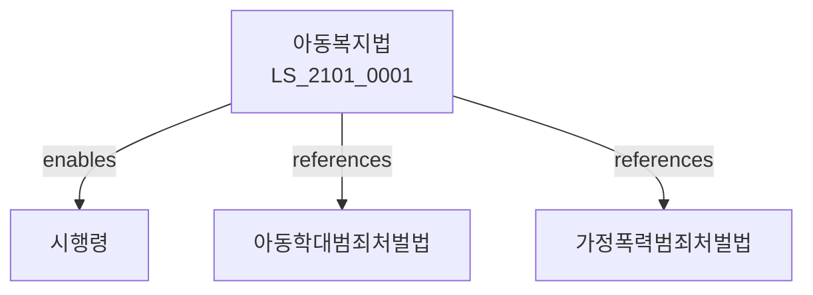

# 아동복지법

> [법률 제20161호, 2024. 1. 9., 일부개정]

---

---

## 제1장 총칙
### 제1조 (목적)
이 법은 아동이 건전하게 출생하여 행복하게 성장하도록 아동의 복지를 보장함을 목적으로 한다。

### 제2조 (정의)
이 법에서 사용하는 용어의 뜻은 다음과 같다。

1. "아동"이란 18세 미만의 자를 말한다。
2. "아동복지시설"이란 아동을 위한 시설을 말한다。
3. "보호자"란 아동을 보호하는 자를 말한다。
4. "아동학대"란 아동에 대한 학대를 말한다。

---

## 제2장 아동복지시설
### 第5条(아동복지시설)
아동복지시설을 설치한다。
### 第6条(아동양육시설)
아동양육시설을 설치한다。
### 第7条(영아보호시설)
영아보호시설을 설치한다。
### 第8条(아동상담소)
아동상담소를 설치한다。

---

## 제3장 아동보호
### 第15条(아동보호)
아동을 보호한다。
### 第16条(보호조치)
아동보호조치를 한다。
### 第17条(친권상실)
친권상실을 청구할 수 있다。
### 第18条(후견인)
후견인을 선임할 수 있다。

---

## 제4장 아동학대
### 第25条(아동학대방지)
아동학대를 방지한다。
### 第26条(신고의무)
아동학대 신고의무를 진다。
### 第27条(조사)
아동학대 조사를 실시한다。
### 第28条(보호조치)
학대아동 보호조치를 한다。

---

## 제5장 입양
### 第35条(입양)
입양을 제도화한다。
### 第36条(입양기관)
입양기관을 지정한다。
### 第37条(입양절차)
입양절차를 정한다。
### 第38条(입양후관리)
입양후관리를 실시한다。

---

## 제6장 아동안전
### 第42条(아동안전)
아동안전을 확보한다。
### 第43条(안전교육)
아동안전교육을 실시한다。
### 第44条(안전점검)
아동안전점검을 실시한다。
### 第45条(안전시설)
아동안전시설을 확보한다。

---

## 제7장 감독
### 第52条(감독)
보건복지부장관은 아동복지사업을 감독한다。
### 第53条(보고 및 검사)
필요한 경우 보고를 명하거나 검사할 수 있다。
### 第54条(시정명령)
위법한 사항에 대하여는 시정을 명할 수 있다。
### 第55条(시설개선)
시설기준 위반 시 개선을 명할 수 있다。

---

## 제8장 벌칙
### 第62条(벌칙)
다음 각 호의 어느 하나에 해당하는 자는 5년 이하의 징역 또는 5천만원 이하의 벌금에 처한다。

1. 아동을 학대한 자
2. 아동복지시설을 무단 운영한 자
### 第63条(과태료)
다음 각 호의 어느 하나에 해당하는 자에게는 2천만원 이하의 과태료를 부과한다。

1. 보고를 하지 아니한 자
2. 검사를 거부한 자

---

## 관계 그래프

**상위 법령**
- [[헌법]] 제36조 (혼인가족제도)
- [[아동학대범죄처벌법]]

**관련 법령**
- [[가정폭력범죄처벌법]]
- [[민법]]
- [[입양특례법]]
- [[영유아보육법]]

**하위 법령**
- [[아동복지법 시행령]]
